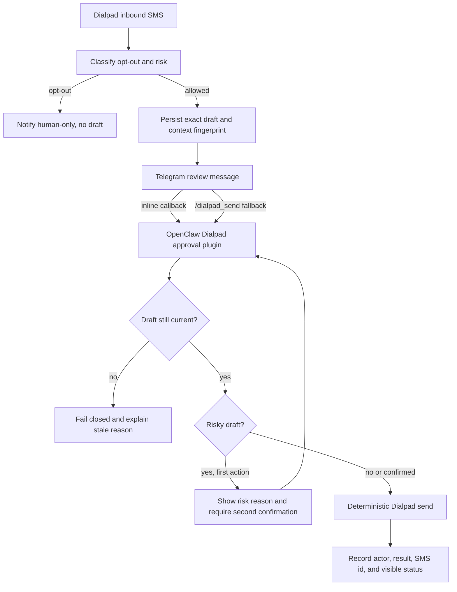

# fix: Gate Dialpad SMS Sends Behind Human Approval

## Overview

Dialpad inbound SMS handling must stay useful without allowing an agent turn to send customer SMS on its own. This plan adds a deterministic approval layer around outbound SMS: inbound events can create reviewable exact-text drafts, Telegram operators can approve or reject them, and the send path checks freshness, risk, opt-out, and audit state before calling Dialpad.

The core design is to keep send authority outside the LLM. OpenClaw may draft and enrich, but the only live send path is a deterministic approval command or Telegram inline callback handled by plugin/runtime code.

## Problem Frame

The incident captured in the origin document showed the unsafe failure mode: an OpenClaw hook-delivered inbound SMS became an agent session that issued a Dialpad `send_sms.py` command without a fresh human send approval. Existing docs already say `approval_required` should be the safe default, and the current hotfix disabled hooks and auto-replies by default. The permanent fix should make that default enforceable in code instead of relying on prompt discipline.

## Requirements Trace

- R1. Inbound Dialpad SMS must never cause outbound SMS without explicit human approval.
- R2. Inbound SMS defaults to notification plus draft generation, not sending.
- R3. Telegram inline approval is preferred when supported; deterministic command approval is the fallback.
- R4. Approval sends the exact draft text shown to the operator; edits create a new draft.
- R5. Pending approvals are invalidated by newer inbound messages, manual outbound messages, or material context changes.
- R6. Risky messages require two-step confirmation before sending.
- R7. The second confirmation must show the risk reason before send.
- R8. Any real Telegram group member may confirm; the agent or bot may not confirm itself.
- R9. Approval logging must record actor, timestamp, draft id, risk reason when present, and resulting Dialpad SMS id.
- R10. Explicit opt-out language hard-stops automation with no draft, button, or override.
- R11. Review messages distinguish draft text from sent text.
- R12. Review messages show normal, risky two-step, or blocked opt-out state.
- R13. Blocked opt-out/human-only cases notify the group that automation cannot send.
- R14. Stale approval attempts fail closed with a clear reason.
- R15. Failed Dialpad sends remain visibly unsent and cannot be described as sent without a fresh Dialpad success result.

## Scope Boundaries

- This does not re-enable autonomous SMS.
- This does not depend on prompt obedience for send authority.
- This does not solve all CRM identity ambiguity; `docs/brainstorms/2026-03-26-dialpad-contact-ambiguity-guard-requirements.md` remains the identity contract.
- This does not require rebuilding the OpenClaw hook receiver. The Dialpad skill can keep hook forwarding disabled until this approval path is deployed and verified.
- This does not require a second Telegram bot poller or a separate Telegram webhook. Callback handling must go through OpenClaw's existing Telegram plugin runtime.

## Context & Research

### Relevant Code and Patterns

- `scripts/webhook_server.py` owns inbound Dialpad webhook handling, Telegram notifications, OpenClaw hook forwarding, and the current disabled-by-default `DIALPAD_AUTO_REPLY_ENABLED` path.
- `scripts/send_sms.py` is the deterministic Dialpad API wrapper that should remain the only low-level SMS send primitive.
- `scripts/sms_sqlite.py` and `scripts/webhook_sqlite.py` already provide SQLite persistence for Dialpad SMS events and are the natural place to share connection/path conventions.
- `tests/test_webhook_hooks.py`, `tests/test_webhook_server.py`, and `tests/test_sender_enrichment.py` already cover webhook classification, hook payloads, and degraded forwarding behavior.
- `tests/test_openclaw_integration_docs.py` already locks current-turn verification and draft/send authority documentation.
- `references/openclaw-integration.md` already documents `approval_required`, human review, current-turn verification, and separation of draft generation from send authority.
- OpenClaw's Telegram runtime supports inline buttons and callback dispatch through plugin interactive handlers. The relevant pattern is a plugin registering `api.registerInteractiveHandler({ channel: "telegram", namespace: ... })`, with callback data shaped as `<namespace>:<payload>`.
- The Dialpad skill is currently a Python skill, not a native OpenClaw plugin. Inline buttons therefore need a small plugin bridge or the first version must use a deterministic plugin command fallback.

### Institutional Learnings

- `docs/plans/2026-03-26-003-bug-stale-already-sent-replies-plan.md` shows that stale success claims are a known class of bug; this plan must require fresh Dialpad success evidence before any "sent" state.
- `docs/plans/2026-03-26-002-feat-first-contact-enrichment-replies-beta-plan.md` already covers enrichment and draft generation. This plan should not duplicate enrichment logic; it gates the send action after a draft exists.

### External References

- None used. Local OpenClaw runtime artifacts were sufficient to verify inline callback support.

## Key Technical Decisions

- Deterministic approval ledger: SMS drafts, approval state, invalidation state, and send results live in persistent storage, not in agent memory or Telegram message text.
- Same send primitive, stricter caller: keep `scripts/send_sms.py` as the low-level Dialpad sender, but only call it from an approval-confirmed deterministic path.
- Plugin-mediated Telegram actions: use OpenClaw plugin interactive handlers and plugin commands for Telegram actor identity. Do not add an independent Telegram poller to `scripts/webhook_server.py`.
- Exact draft snapshot: the approval ledger stores the exact draft text, from number, to number, line display, source inbound id, and context fingerprint used for approval.
- Fail closed on freshness: if any invalidating event occurred after draft creation, approval returns stale/blocked and does not send.
- Two-step risky confirmation: risky messages can be sent only after the second action confirms the risk reason. Opt-out is not risky; it is blocked.
- Keep emergency defaults: `OPENCLAW_HOOKS_SMS_ENABLED`, `OPENCLAW_HOOKS_CALL_ENABLED`, and `DIALPAD_AUTO_REPLY_ENABLED` remain default-off until the approval workflow is deployed and verified.

## Open Questions

### Resolved During Planning

- Does OpenClaw support Telegram inline callbacks? Yes. The installed Telegram runtime includes inline button construction, `callback_query` handling, and plugin interactive dispatch.
- Should raw buttons be sent directly from `webhook_server.py`? No. Without a callback handler registered in OpenClaw, raw button callbacks would not provide a safe deterministic send path.
- Should command fallback be LLM-mediated? No. The fallback command must be a plugin command so it receives Telegram sender identity and bypasses agent reasoning.
- Where should the native plugin live? In a `plugin/` package directory inside this repo so the existing Python skill root does not become an ambiguous mixed-runtime package root.

### Deferred to Implementation

- Exact approval DB placement: reuse `sms.db` if migration risk is low, otherwise use a sibling `sms_approvals.db` under the same log root.
- Exact initial risk phrase list: start from origin requirements and tests, then adjust based on fixtures discovered during implementation.
- Material CRM/calendar state change detection: implement the local event hooks available in this repo first, and leave deeper CRM/calendar invalidation behind explicit integration seams.

## High-Level Technical Design

> This illustrates the intended approach and is directional guidance for review, not implementation specification. The implementing agent should treat it as context, not code to reproduce.

## Implementation Units

- [x] **Unit 1: Approval Ledger and Deterministic Send Core**

**Goal:** Add persistent approval state and a deterministic exact-draft send function that can be called by webhook code, plugin code, or tests without involving an LLM.

**Requirements:** R1, R4, R5, R9, R14, R15

**Dependencies:** None.

**Files:**
- Create: `scripts/sms_approval.py`
- Create: `scripts/create_sms_draft.py`
- Create: `scripts/approve_sms_draft.py`
- Create: `bin/create_sms_draft.py`
- Create: `bin/approve_sms_draft.py`
- Test: `tests/test_sms_approval.py`

**Approach:**
- Store approval drafts with draft id, conversation/thread key, inbound Dialpad id, customer number, sender line, exact text, status, risk state, risk reason, context fingerprint, created timestamp, invalidated timestamp/reason, approving actor, and Dialpad send result.
- Add helpers for creating a draft, invalidating current drafts for a thread/customer, confirming a normal draft, recording the first risky approval step, confirming the second risky step, marking send success, and marking send failure.
- Make `scripts/create_sms_draft.py` the deterministic write path for both webhook-created boilerplate drafts and future agent-created AI drafts. It creates reviewable drafts but never sends.
- Make `scripts/approve_sms_draft.py` return a JSON envelope for every outcome: sent, blocked_opt_out, stale, risky_confirmation_required, failed, not_found, or already_resolved.
- Call the existing `scripts/send_sms.py` send function only after the approval state machine permits sending.
- Preserve exact-draft behavior by sending only the stored text, not caller-supplied replacement text.

**Execution note:** Implement the approval state machine test-first because it is the safety boundary.

**Patterns to follow:**
- SQLite connection/path style in `scripts/sms_sqlite.py`
- JSON success/error envelope expectations from existing CLI tests in `tests/test_json_contract.py`
- Fresh success wording from `docs/plans/2026-03-26-003-bug-stale-already-sent-replies-plan.md`

**Test scenarios:**
- Happy path: pending normal draft plus real actor confirmation calls the mocked Dialpad sender with the stored exact text and records the SMS id.
- Edge case: caller supplies edited text or mismatched draft id; stored draft text is still the only sendable text.
- Edge case: newer inbound invalidates the draft; confirmation returns stale and does not call the sender.
- Error path: Dialpad sender raises; draft remains unsent with failed status and no success claim.
- Error path: bot/agent actor id is rejected before send.
- Integration: create-draft CLI persists exact text and returns draft id without calling Dialpad send.
- Integration: CLI returns machine-readable JSON for sent, stale, failed, and risky-confirmation-required outcomes.

**Verification:**
- Approval state transitions are deterministic and covered without needing Telegram or Dialpad network access.

- [x] **Unit 2: Inbound Policy Classification and Draft Creation**

**Goal:** Convert inbound SMS handling from "possibly send" to "classify, draft or block, notify, and invalidate old approvals."

**Requirements:** R1, R2, R5, R6, R10, R12, R13, R14

**Dependencies:** Unit 1.

**Files:**
- Modify: `scripts/webhook_server.py`
- Test: `tests/test_webhook_server.py`
- Test: `tests/test_sender_enrichment.py`
- Test: `tests/test_webhook_hooks.py`

**Approach:**
- Add opt-out detection before draft creation. Explicit opt-out phrases create a human-only notification and no draft record.
- Add risk classification for anger, confusion, real-person request, legal/compliance concern, and similar elevated-risk phrases.
- Invalidate prior pending drafts for the same customer/thread when a newer inbound SMS arrives.
- Treat outbound webhook events from Dialpad as invalidation events for pending drafts in that same thread/customer.
- Replace the direct `send_proactive_reply()` behavior for inbound events with draft creation when a proactive reply would otherwise have been eligible.
- When OpenClaw/agent-generated text is introduced later, require it to enter through `scripts/create_sms_draft.py` so AI drafts and deterministic boilerplate drafts share one approval ledger.
- Keep `DIALPAD_AUTO_REPLY_ENABLED` default-off and do not let it bypass approval.
- Preserve sensitive-message and short-code filtering before any draft or hook forwarding.

**Execution note:** Add characterization tests around current inbound filtering before changing the send/draft behavior.

**Patterns to follow:**
- `assess_inbound_sms_alert_eligibility()` for centralized fan-out decisions
- `should_send_proactive_reply()` for eligibility rules that can become draft-eligibility rules
- Existing response metadata style in `handle_webhook()`

**Test scenarios:**
- Happy path: low-risk inbound SMS creates a pending draft and Telegram review notification but does not call Dialpad send.
- Edge case: explicit "don't bother me" creates no draft and returns/prints human-only state.
- Edge case: "I need a real person" creates a risky draft requiring two-step approval.
- Edge case: short-code or OTP-like SMS creates no draft and no approval controls.
- Integration: second inbound from the same customer invalidates the earlier pending draft.
- Integration: outbound Dialpad webhook event invalidates pending drafts for the same customer/thread.

**Verification:**
- Inbound webhook responses expose draft/review state, but no inbound path sends an SMS directly.

- [ ] **Unit 3: Telegram Review Surface and Plugin Approval Bridge**

**Status:** Deferred after the hotfix. The webhook now adds Telegram review text with the draft id, exact text, and deterministic shell approval command, but native OpenClaw inline callbacks/commands are not implemented in this patch.

**Goal:** Add the operator approval UX with inline buttons when available and a deterministic command fallback when not.

**Requirements:** R3, R7, R8, R9, R11, R12, R14

**Dependencies:** Units 1 and 2.

**Files:**
- Create: `plugin/openclaw.plugin.json`
- Create: `plugin/package.json`
- Create: `plugin/tsconfig.json`
- Create: `plugin/index.ts`
- Create: `plugin/src/approval-client.ts`
- Create: `plugin/src/approval-plugin.ts`
- Test: `plugin/src/approval-plugin.test.ts`
- Modify: `scripts/webhook_server.py`
- Test: `tests/test_webhook_server.py`

**Approach:**
- Add a minimal OpenClaw native plugin that registers a Telegram interactive handler under a short namespace such as `dialpadsms`.
- Use callback data shaped like `dialpadsms:<draft-id>:approve` and `dialpadsms:<draft-id>:confirm-risk` so it fits Telegram's callback data limit.
- Register plugin commands such as `/dialpad_send <draft-id>` and `/dialpad_confirm <draft-id>` as the non-inline fallback. These commands must be handled by plugin command handlers, not by the agent.
- Have the plugin pass Telegram `senderId`, username when available, account id, chat/thread context, draft id, and action to the deterministic approval core.
- Use OpenClaw's existing Telegram outbound runtime to edit buttons, clear resolved buttons, and reply with sent/stale/blocked/failure status.
- Require the webhook sender and OpenClaw Telegram runtime to use the same Telegram bot account for callback delivery; otherwise render command fallback only.
- Keep `scripts/webhook_server.py` responsible for the review message content; it can include inline buttons only when plugin support is configured, otherwise it includes deterministic command instructions.

**Patterns to follow:**
- `openclaw-codex-app-server/index.ts` for `api.registerInteractiveHandler(...)` and `api.registerCommand(...)`
- OpenClaw Telegram callback namespace behavior where callback data before the first colon selects the plugin namespace
- Existing Telegram send helper shape in `scripts/webhook_server.py`

**Test scenarios:**
- Happy path: inline approve callback from a Telegram user sends a normal pending draft and clears buttons.
- Happy path: `/dialpad_send <draft-id>` command from a Telegram user reaches the same approval path.
- Edge case: risky draft first action edits/replies with risk reason and does not send.
- Edge case: risky draft second confirmation sends only after the risk reason was presented.
- Error path: callback from bot/agent actor is rejected.
- Error path: stale draft callback replies with stale reason and does not call the sender.
- Integration: review message clearly labels draft text, current state, and available action.

**Verification:**
- Telegram actions can approve sends without invoking an LLM turn, and the audit record contains the real Telegram actor.

- [ ] **Unit 4: OpenClaw Runtime Policy and Hook Re-Enable Guardrails**

**Goal:** Align runtime config and docs so hooks can be re-enabled only with approval-required behavior and no direct auto-send path.

**Requirements:** R1, R2, R8, R10, R15

**Dependencies:** Units 1-3.

**Files:**
- Modify: `README.md`
- Modify: `SKILL.md`
- Modify: `references/openclaw-integration.md`
- Modify: `references/api-reference.md`
- Test: `tests/test_openclaw_integration_docs.py`

**Approach:**
- Document that `OPENCLAW_HOOKS_SMS_ENABLED` and `OPENCLAW_HOOKS_CALL_ENABLED` are default-off until the approval plugin is installed and verified.
- Remove or clearly deprecate any guidance that suggests enabling `DIALPAD_AUTO_REPLY_ENABLED=1` as a live send path.
- Document the approval states, opt-out hard stop, stale invalidation, risky two-step confirmation, and failed-send visibility.
- Update the `niemand-work` runtime prompt guidance so it may draft but must not call `send_sms.py` directly for Dialpad SMS replies.
- Point AI-generated reply drafting at the create-draft path instead of the send path, so the prompt can improve draft quality without acquiring send authority.
- Require OpenClaw exec approvals to remain on for any residual manual `send_sms.py` use.

**Patterns to follow:**
- Current-turn verification assertions in `tests/test_openclaw_integration_docs.py`
- Human-in-the-loop workflow in `references/openclaw-integration.md`
- Existing README env-var documentation

**Test scenarios:**
- Docs state that inbound SMS defaults to draft/review, not send.
- Docs state that opt-out language creates no automation send path.
- Docs state that failed sends remain unsent without a fresh Dialpad success result.
- Docs no longer present auto-reply as a safe live-send toggle.

**Verification:**
- Repo docs and runtime policy describe one consistent approval-required contract.

- [ ] **Unit 5: Rollout and Regression Verification**

**Goal:** Re-enable only the safe pieces in a controlled order and prove the incident path cannot recur.

**Requirements:** R1-R15

**Dependencies:** Units 1-4.

**Files:**
- Modify: `systemd/dialpad-webhook.service` if environment wiring needs durable service-level flags
- Modify: `README.md`
- Test: `tests/test_sms_approval.py`
- Test: `tests/test_webhook_server.py`
- Test: `plugin/src/approval-plugin.test.ts`

**Approach:**
- Keep Dialpad hook forwarding disabled until approval tests and a manual Telegram approval smoke test pass.
- Add a fixture for the Clelia-style sequence: time confusion, real-person request, opt-out-like anger, then another scheduling clarification. The expected result is no auto-send and risky/human-only handling where appropriate.
- Add a smoke checklist for service state, port state, OpenClaw config, Telegram callback delivery, and Dialpad mocked send result.
- Make rollout reversible by documenting the disable levers for webhook service, hooks, approval plugin, and auto-reply.

**Patterns to follow:**
- Existing webhook tests with mocked network calls
- Existing service file in `systemd/dialpad-webhook.service`
- Incident evidence summarized in the origin requirements doc

**Test scenarios:**
- Regression: the incident sequence never calls Dialpad send without approval.
- Regression: an opt-out phrase suppresses draft/buttons even if an agent would have drafted a reply.
- Regression: a risky real-person request requires two separate human actions.
- Integration: Telegram callback approval records actor id and SMS id on success.
- Integration: approval after a newer inbound fails stale.

**Verification:**
- The full approval path is test-covered with mocked Dialpad/Telegram dependencies before any production re-enable.

## System-Wide Impact

- **Interaction graph:** Dialpad webhook -> approval ledger -> Telegram review -> OpenClaw plugin callback/command -> deterministic Dialpad send.
- **Error propagation:** Webhooks still return 200 after local storage succeeds; approval/send failures are surfaced in review state and audit logs, not hidden as webhook failures.
- **State lifecycle risks:** Drafts must handle duplicate inbound webhooks, repeated callback clicks, stale context, failed sends, and already-resolved approvals idempotently.
- **API surface parity:** Inline buttons and command fallback must call the same approval core so behavior does not drift.
- **Integration coverage:** Unit tests must mock Telegram and Dialpad, and one manual smoke test should verify callback delivery through the installed OpenClaw Telegram runtime.
- **Unchanged invariants:** Sensitive/short-code filtering, current-turn verification, contact ambiguity rules, and default-off hook/auto-reply posture remain in force.

## Risks & Dependencies

| Risk | Mitigation |
|------|------------|
| Inline callbacks require plugin infrastructure that the Dialpad skill does not currently have | Build a minimal OpenClaw plugin bridge and keep command fallback deterministic through the same plugin |
| A second Telegram poller would conflict with OpenClaw's bot runtime | Do not add one; route callbacks through OpenClaw interactive handlers |
| Approval state can go stale after thread context changes | Store context fingerprints and invalidate on inbound/outbound events; defer deeper CRM/calendar invalidation behind explicit seams |
| Operators may treat risky two-step approval as routine | Show the risk reason on the second confirmation and audit the actor |
| Auto-reply code could become a bypass | Keep default-off, convert eligible auto-replies into drafts, and document deprecation of direct live auto-reply |
| Failed Dialpad sends could be misreported | Store sent only after a fresh Dialpad success result with SMS id; otherwise keep failed/unsent |

## Documentation / Operational Notes

- The emergency containment changes should remain until this plan is implemented and smoke-tested: disabled Dialpad webhook service, hooks default-off, group mention requirement, exec approvals on, and empty `niemand-work` exec allowlist.
- Re-enabling should be staged: plugin installed, approval tests passing, webhook service running, hook forwarding still off, Telegram callback smoke test, then selective hook forwarding.
- If inline callbacks are blocked in the live OpenClaw version, ship the plugin command fallback first and keep inline buttons disabled until callback support is verified in that runtime.

## Sources & References

- **Origin document:** [docs/brainstorms/2026-04-24-dialpad-one-click-sms-approval-requirements.md](docs/brainstorms/2026-04-24-dialpad-one-click-sms-approval-requirements.md)
- Related requirements: [docs/brainstorms/2026-03-26-dialpad-contact-ambiguity-guard-requirements.md](docs/brainstorms/2026-03-26-dialpad-contact-ambiguity-guard-requirements.md)
- Related plan: [docs/plans/2026-03-26-003-bug-stale-already-sent-replies-plan.md](docs/plans/2026-03-26-003-bug-stale-already-sent-replies-plan.md)
- Related code: [scripts/webhook_server.py](scripts/webhook_server.py)
- Related code: [scripts/send_sms.py](scripts/send_sms.py)
- Related code: [scripts/sms_sqlite.py](scripts/sms_sqlite.py)
- Related docs: [references/openclaw-integration.md](references/openclaw-integration.md)
- Related tests: [tests/test_webhook_server.py](tests/test_webhook_server.py)
- Related tests: [tests/test_webhook_hooks.py](tests/test_webhook_hooks.py)
