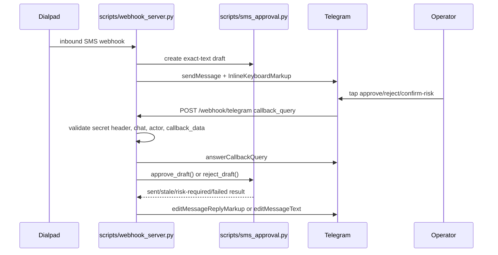

# feat: Add Telegram Inline Buttons for SMS Approval Drafts

## Overview

The current hotfix correctly prevents autonomous Dialpad SMS sends by creating durable approval drafts and showing a deterministic shell approval command in Telegram. That is safe but operationally clumsy. The missing piece is native Telegram inline buttons attached to the same review message so a real operator can approve, confirm risk, or reject a draft without opening a shell.

The core safety decision does not change: Telegram buttons are only a human approval surface over `scripts/sms_approval.py`. Button callbacks must never carry draft text, approval tokens, or send authority by themselves. They identify a stored draft, prove the callback came from Telegram and the configured chat, record the human actor, and then call the existing deterministic approval state machine.

## Problem Frame

The April 27 smoke test showed the deployed flow creating a draft and posting this fallback instruction:

```text
Approve from an operator shell: bin/approve_sms_draft.py ...
```

That proves the safety gate is working, but it does not meet the preferred UX from the origin requirements: "Telegram inline button when callback support exists" (see origin: `docs/brainstorms/2026-04-24-dialpad-one-click-sms-approval-requirements.md`). The plan is to add that preferred UX without reopening the original incident class where an agent could send a customer SMS without a fresh human approval.

## Requirements Trace

- R1. Inbound Dialpad SMS must never cause outbound SMS without explicit human approval.
- R2. Inbound SMS remains notification plus draft generation, not sending.
- R3. Preferred approval UX is Telegram inline buttons; shell approval remains the fallback.
- R4. Approval sends the exact stored draft text shown to the operator.
- R5. Pending approvals stay invalidated by newer inbound, manual outbound, or material context change.
- R6. Risky messages still require two-step confirmation.
- R7. Risk confirmation must show the risk reason before sending.
- R8. A real Telegram group member may approve; bot/agent actors may not.
- R9. Audit logging must retain actor, timestamp, draft id, risk reason, and Dialpad SMS result.
- R10. Opt-out/human-only cases must show no send button and no override.
- R11. Review messages distinguish draft text from sent text.
- R12. Review messages show normal, risky, blocked, stale, sent, or failed state.
- R13. Blocked opt-out/human-only cases notify the group that automation cannot send.
- R14. Stale button clicks fail closed with a visible reason.
- R15. Dialpad failures remain visibly unsent and cannot be described as sent.
- R16. Telegram callback HTTP requests must be authenticated with Telegram webhook secret-token validation and scoped to the configured chat.
- R17. Telegram bot update delivery must not break any existing OpenClaw or operator workflow already using the same bot.

## Scope Boundaries

- This does not re-enable autonomous SMS or OpenClaw hook auto-send behavior.
- This does not replace `scripts/sms_approval.py`; it reuses that ledger and state machine.
- This does not expose `DIALPAD_SMS_APPROVAL_TOKEN` in Telegram callback payloads.
- This does not implement free-text editing in Telegram. Edited replies must create a new draft in a later feature.
- This does not add buttons for opt-out, blocked, sensitive, shortcode, or human-only cases.
- This does not require moving the webhook into a native OpenClaw plugin before shipping buttons. A plugin bridge can be revisited later if OpenClaw owns all Telegram delivery.

## Context & Research

### Local Code and Patterns

- `scripts/webhook_server.py` owns inbound Dialpad handling, Telegram posting, draft creation, and the current approval review suffix.
- `send_to_telegram()` currently sends text only. It needs optional `reply_markup` support for inline buttons.
- `build_approval_review_suffix()` currently appends the shell approval command. It should produce button-friendly copy when buttons are enabled and keep the command fallback when not.
- `scripts/sms_approval.py` already provides durable draft creation, stale invalidation, opt-out fail-closed behavior, risky two-step state, bot actor rejection, actor allowlisting, and exact-text sends.
- `bin/approve_sms_draft.py` remains the emergency/operator-shell fallback.
- `tests/test_webhook_server.py` and `tests/test_sms_approval.py` are the primary unit-test surfaces for webhook payloads and approval state.

### External References

- Telegram `sendMessage` accepts `reply_markup` as an `InlineKeyboardMarkup` object; inline buttons carry `callback_data`.
- Telegram limits `callback_data` to 1-64 bytes, so callback payloads must be short and reference a stored draft id instead of embedding draft text.
- Telegram sends a `CallbackQuery` when a callback button is pressed, and clients show a progress bar until the bot calls `answerCallbackQuery`.
- Telegram `editMessageReplyMarkup` can remove or replace the inline keyboard after approval, rejection, stale detection, or failure.
- Telegram `setWebhook` supports `allowed_updates` including `callback_query`, `drop_pending_updates`, and `secret_token`; webhook requests then include `X-Telegram-Bot-Api-Secret-Token`, which should be validated before processing.
- Telegram notes that a bot cannot receive updates through `getUpdates` while an outgoing webhook is configured, so implementation must confirm current bot ownership before calling `setWebhook`.

References:
- <https://core.telegram.org/bots/api#inlinekeyboardmarkup>
- <https://core.telegram.org/bots/api#inlinekeyboardbutton>
- <https://core.telegram.org/bots/api#callbackquery>
- <https://core.telegram.org/bots/api#answercallbackquery>
- <https://core.telegram.org/bots/api#editmessagereplymarkup>
- <https://core.telegram.org/bots/api#setwebhook>

## Key Technical Decisions

- Add buttons in `scripts/webhook_server.py`, not by letting an agent send or interpret Telegram commands. The Python webhook is already the deterministic system creating the draft and sending the Telegram alert, so it should also own the callback endpoint for the button UX.
- Do not blindly overwrite Telegram update delivery. If `getWebhookInfo` or local OpenClaw runtime inspection shows the same bot already uses another webhook or polling consumer, pause and choose one of two safe paths: route callbacks through that existing Telegram runtime, or provision a separate approval bot for Dialpad approvals.
- Keep the approval token out of button callbacks. Webhook authenticity comes from Telegram's secret-token header, configured chat id, and actor checks in the approval ledger.
- Use compact callback data. A safe shape is `smsa:<action>:<draft_id>` where action is `a`, `r`, or `c` for approve, reject, or confirm-risk. The implementation must assert the encoded value is at most 64 bytes.
- Store no sendable text in Telegram callback data. The callback only selects the durable draft row; `approve_draft()` sends the stored exact text.
- Make risky approval visibly two-step. The first click records risk acknowledgement and edits the message to show the risk reason plus a `Confirm send` button. The second click sends.
- Remove or replace buttons immediately after any terminal result. Sent, stale, rejected, failed, actor-blocked, and opt-out-blocked states should not leave active approve buttons visible.
- Keep shell approval fallback. If `DIALPAD_TELEGRAM_APPROVAL_BUTTONS_ENABLED` is off, the Telegram webhook secret is missing, or Telegram button posting fails, the existing CLI approval text remains available.

## High-Level Technical Design



## Implementation Units

- [x] **Unit 0: Telegram Bot Ownership and Delivery Preflight**

**Goal:** Verify that enabling a Telegram webhook for callback queries will not break an existing consumer of the same bot.

**Requirements:** R3, R16, R17

**Dependencies:** None.

**Files:**
- Modify: `README.md`
- Test: `tests/test_openclaw_integration_docs.py`

**Approach:**
- Check `getWebhookInfo` for the configured bot before deployment and document the expected empty or owned-by-Dialpad state.
- Inspect the local OpenClaw/Telegram runtime configuration enough to determine whether it uses this bot with `getUpdates`, its own webhook, or no update receiver.
- If another consumer owns updates for the same bot, do not call `setWebhook` from this skill. Either add the callback handler inside that owner or use a separate Dialpad approval bot.
- Document the decision in the rollout notes so future deploys do not accidentally replace another webhook.

**Test Scenarios:**
- Docs require bot-delivery preflight before `setWebhook`.
- Docs mention that `getUpdates` polling and outgoing webhook delivery are mutually exclusive for the same bot.
- Rollout instructions include a stop condition when another webhook or polling owner is detected.

- [x] **Unit 1: Telegram Send Helper With Inline Keyboard Support**

**Goal:** Allow existing Telegram review messages to carry native inline buttons while preserving text-only behavior.

**Requirements:** R3, R11, R12

**Dependencies:** None.

**Files:**
- Modify: `scripts/webhook_server.py`
- Test: `tests/test_webhook_server.py`

**Approach:**
- Extend `send_to_telegram(text)` to accept optional `reply_markup`.
- Add a small builder for SMS approval inline keyboards using compact callback data.
- Add `DIALPAD_TELEGRAM_APPROVAL_BUTTONS_ENABLED` as an explicit feature flag.
- Validate callback data length during construction; fail closed to command fallback if it exceeds 64 bytes.
- Keep shell approval instructions when buttons are disabled or not safely configured.

**Test Scenarios:**
- Low-risk draft produces an inline keyboard with approve and reject buttons when the feature flag is enabled.
- Risky draft produces an initial approve/acknowledge-risk button plus reject button, not a direct confirm-risk send button.
- Button payloads are at most 64 bytes.
- Feature flag disabled preserves the current shell command text and sends no `reply_markup`.
- Telegram send failure does not break Dialpad webhook response.

- [x] **Unit 2: Telegram Callback Webhook Endpoint and Authentication**

**Goal:** Receive Telegram button clicks through a deterministic endpoint that authenticates Telegram delivery and scopes actions to the configured group.

**Requirements:** R1, R8, R16

**Dependencies:** Unit 1.

**Files:**
- Modify: `scripts/webhook_server.py`
- Test: `tests/test_webhook_server.py`

**Approach:**
- Add `POST /webhook/telegram` handling alongside the existing Dialpad webhook route.
- Require `TELEGRAM_WEBHOOK_SECRET` and validate `X-Telegram-Bot-Api-Secret-Token` with constant-time comparison.
- Parse only `callback_query` updates; ignore or reject unrelated Telegram updates.
- Validate `callback_query.message.chat.id` equals `DIALPAD_TELEGRAM_CHAT_ID`.
- Extract actor id, username, and `is_bot` from `callback_query.from`.
- Call `answerCallbackQuery` for every accepted callback id, including stale or rejected outcomes, so Telegram clients stop showing a spinner.
- Return 200 for authenticated, understood callback envelopes even when the approval result is blocked or stale; return 401/403 for failed authentication or wrong chat.

**Test Scenarios:**
- Valid callback with matching secret and chat reaches the approval dispatcher.
- Missing or wrong secret returns unauthorized and does not read or mutate the approval DB.
- Callback from a different chat returns forbidden and does not mutate the approval DB.
- Non-callback Telegram update is ignored without attempting a send.
- Bot actor is passed through as `actor_is_bot=True` and rejected by the approval layer.

- [x] **Unit 3: Callback Action Dispatcher and Draft Rejection**

**Goal:** Map button actions to the existing approval state machine and add an exact-draft reject action for operator dismissal.

**Requirements:** R1, R4, R5, R6, R7, R8, R9, R10, R14, R15

**Dependencies:** Unit 2.

**Files:**
- Modify: `scripts/sms_approval.py`
- Modify: `scripts/webhook_server.py`
- Test: `tests/test_sms_approval.py`
- Test: `tests/test_webhook_server.py`

**Approach:**
- Add a focused `reject_draft()` or `invalidate_draft()` helper that marks one pending draft stale/rejected by exact `draft_id` and records actor metadata where practical.
- Dispatch `approve` button clicks to `sms_approval.approve_draft(..., action="approve")`.
- Dispatch `confirm-risk` clicks to `sms_approval.approve_draft(..., action="confirm-risk")`.
- Dispatch `reject` clicks to the new exact-draft rejection helper.
- Treat unknown actions, malformed callback data, resolved drafts, stale drafts, opt-out state, and failed sends as terminal no-send results.
- Preserve existing actor allowlist behavior by passing Telegram user id as the approval actor.

**Test Scenarios:**
- Normal approve sends the stored exact draft text and records Telegram actor id and username.
- Risky first approve returns `risky_confirmation_required` and does not call Dialpad.
- Risky second confirmation sends only after the first risk acknowledgement exists.
- Reject marks the exact draft stale/rejected and never calls Dialpad.
- Duplicate approve after sent returns already-resolved and does not send twice.
- Stale draft click returns stale reason and does not call Dialpad.
- Unknown callback action is rejected without send.

- [x] **Unit 4: Telegram Message Updates After Callback**

**Goal:** Keep the Telegram review surface truthful after every button click.

**Requirements:** R11, R12, R14, R15

**Dependencies:** Unit 3.

**Files:**
- Modify: `scripts/webhook_server.py`
- Test: `tests/test_webhook_server.py`

**Approach:**
- Add Telegram API helpers for `answerCallbackQuery`, `editMessageReplyMarkup`, and, where useful, `editMessageText`.
- On normal sent result, remove buttons and append/replace status with "sent" plus Dialpad SMS id when available.
- On risky first approval, edit the message to show the risk reason and replace buttons with `Confirm send` and `Reject`.
- On reject, stale, blocked actor, opt-out, or failed send, remove buttons and show the no-send reason.
- Make update failures non-fatal to webhook processing but log them clearly; the ledger remains the source of truth.

**Test Scenarios:**
- Successful send removes inline keyboard and includes sent status.
- Risky first click leaves no direct approve button and adds only confirm-risk/reject controls.
- Stale click removes inline keyboard and shows stale reason.
- Telegram edit failure does not retry the Dialpad send and does not mark an unsent draft as sent.

- [x] **Unit 5: Operational Setup and Documentation**

**Goal:** Make deployment and live smoke testing repeatable without leaking tokens or accidentally approving test SMS.

**Requirements:** R3, R8, R10, R14, R16

**Dependencies:** Units 1-4.

**Files:**
- Modify: `README.md`
- Modify: `references/openclaw-integration.md`
- Modify: `systemd/dialpad-webhook.service`
- Test: `tests/test_openclaw_integration_docs.py`

**Approach:**
- Document required environment variables:
  - `DIALPAD_TELEGRAM_APPROVAL_BUTTONS_ENABLED=1`
  - `TELEGRAM_WEBHOOK_SECRET`
  - `DIALPAD_TELEGRAM_BOT_TOKEN`
  - `DIALPAD_TELEGRAM_CHAT_ID`
  - optional `DIALPAD_SMS_APPROVAL_ALLOWED_ACTORS`
- Document the Telegram `setWebhook` call using `allowed_updates=["callback_query"]`, `drop_pending_updates=true`, and `secret_token`.
- Document the live smoke test:
  - Send a harmless test inbound SMS from a fake/test number.
  - Verify the Telegram message shows inline buttons.
  - Click `Reject` on the smoke draft.
  - Confirm the draft is rejected/stale in `sms_approvals.db`.
  - Do not click approve on smoke tests unless using a controlled non-customer Dialpad destination.
- Update service docs/template so the repo matches the deployed `scripts/webhook_server.py` entrypoint.

**Test Scenarios:**
- Docs mention the secret-token header and wrong-chat rejection.
- Docs preserve shell approval fallback.
- Docs warn that opt-out/human-only messages do not receive buttons.

## Rollout Plan

1. Ship code with `DIALPAD_TELEGRAM_APPROVAL_BUTTONS_ENABLED=0` by default.
2. Run Telegram bot ownership preflight with `getWebhookInfo` and local runtime inspection.
3. Stop if another webhook or polling owner already consumes updates for this bot; route through that owner or use a separate approval bot.
4. Deploy the callback endpoint and verify `/health` is unchanged.
5. Configure Telegram webhook with `allowed_updates=["callback_query"]`, `drop_pending_updates=true`, and `secret_token`.
6. Enable `DIALPAD_TELEGRAM_APPROVAL_BUTTONS_ENABLED=1`.
7. Run the reject-only live smoke test against a fake/test number.
8. Run one controlled approval test only if the destination is confirmed non-customer and safe.
9. Keep CLI approval fallback documented and available.

## Risks and Mitigations

- **Spoofed callback HTTP request:** Require Telegram secret-token header and configured chat id before processing.
- **Wrong group or forwarded callback:** Reject callbacks whose message chat id does not match `DIALPAD_TELEGRAM_CHAT_ID`.
- **Agent/bot approval:** Pass `from.is_bot` and Telegram user id to `approve_draft()`, preserving existing bot actor rejection and actor allowlist.
- **Callback payload too long:** Enforce the 64-byte callback_data limit in tests and fall back to shell approval if violated.
- **Duplicate clicks or races:** Keep `approve_draft()` as the atomic state transition and treat already-resolved results as no-send.
- **Risky one-click send regression:** First risky click can only transition to risk-pending; second click must use explicit confirm-risk action.
- **Button remains visible after failure:** Attempt Telegram message edit for every terminal state; ledger remains authoritative if Telegram edit fails.
- **Existing Telegram bot consumer breakage:** Preflight `getWebhookInfo` and local runtime ownership before `setWebhook`; do not overwrite another owner.
- **Tunnel/public URL changes:** Document webhook re-registration as part of deploy and smoke testing.

## Verification Checklist

- `python -m pytest tests/test_sms_approval.py tests/test_webhook_server.py`
- `python -m pytest tests/test_openclaw_integration_docs.py`
- Local callback fixture tests for valid approve, risky confirm, reject, stale, wrong secret, wrong chat, and bot actor.
- Live smoke test with a fake/test inbound SMS and `Reject`, confirming no outbound Dialpad SMS was sent.
- Controlled approval test only on a non-customer destination if needed to verify end-to-end Dialpad send.

## Deferred Work

- Native OpenClaw plugin bridge if future architecture moves Telegram delivery and callback dispatch out of `scripts/webhook_server.py`.
- Telegram text editing for draft modifications; edited text should create a replacement draft and reset approval.
- Richer actor policy, such as requiring a small allowlist for production approvals instead of any real group member.
- Automatic stale invalidation from CRM/calendar context fingerprints beyond the currently captured webhook events.
