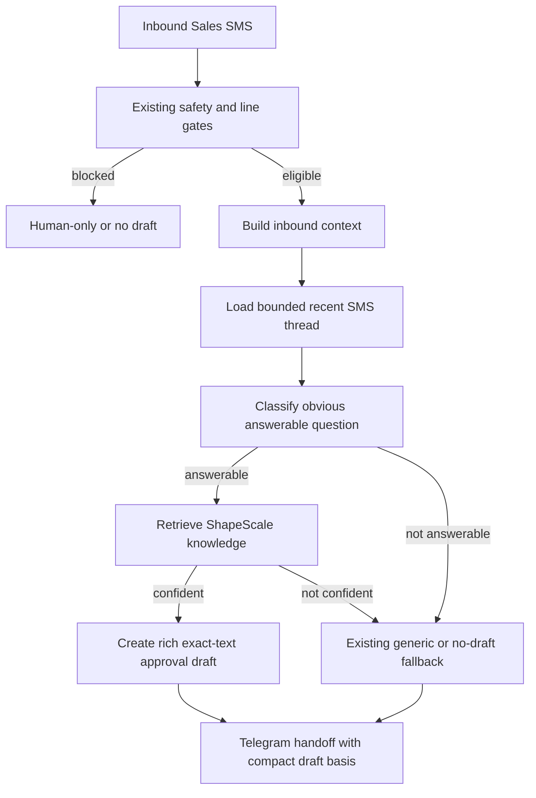

# feat: Add Rich Sales SMS Approval Drafts

## Summary

Add a bounded knowledge-backed draft mode to the existing Dialpad inbound SMS approval path. The implementation should keep the current approval ledger and safety gates, but allow eligible Sales SMS to produce short useful drafts for obvious product, booking, link, and pricing questions using ShapeScale knowledge and recent Dialpad thread context.

---

## Problem Frame

The current webhook can create safe generic approval drafts, but those drafts do not answer simple inbound questions such as a broken booking link or a basic product/pricing ask. The existing approval and inbound-context architecture is the right place to improve draft content without weakening send safety.

---

## Requirements

- R1. Eligible inbound SMS to the Sales line can produce a richer approval draft when the message asks an obvious product, booking, link, or pricing question.
- R2. Rich drafts answer directly in short SMS-friendly language and include the relevant link or next step when useful.
- R3. Rich drafts use ShapeScale knowledge as the authoritative source for factual product, booking, pricing, and common sales-question answers.
- R4. Recent Dialpad SMS history is used to resolve short active-thread references.
- R5. If knowledge or context is insufficient, the system falls back to no rich draft, a generic approval draft, or human-only handling without inventing facts.
- R6. Existing opt-out, risky-content, sensitive-content, wrong-line, degraded-lookup, and human-only gates remain authoritative.
- R7. All rich replies remain exact-text approval drafts; no customer SMS is sent until human approval.
- R8. Customer-facing drafts do not include citations, internal labels, or implementation details.
- R9. Telegram makes the draft basis visible enough for the operator to distinguish rich, generic, and human-only outcomes.
- R10. Telegram stays compact and shows only context needed to judge the draft.

**Origin actors:** A1 Operator, A2 Sales prospect, A3 Dialpad webhook skill, A4 Knowledge/context layer
**Origin flows:** F1 Rich answer draft for an obvious Sales SMS, F2 Knowledge is insufficient or unsafe
**Origin acceptance examples:** AE1 booking link, AE2 product/pricing answer, AE3 broken-link active thread, AE4 insufficient knowledge/blocked policy, AE5 compact source-aware handoff

---

## Scope Boundaries

- No autonomous SMS sending.
- No broad CRM/deal-aware personalization for every inbound SMS.
- No Attio or Dialpad contact mutation, normalization, or dedupe.
- No broad web research by default.
- No long-form sales copy or multi-paragraph SMS replies.
- No replacement for existing opt-out, risky-content, sensitive-content, degraded-lookup, or human-only gates.
- No Telegram approval-button changes.

### Deferred to Follow-Up Work

- Attio/OpenClaw memory personalization: defer until the knowledge-backed first slice proves useful and safe.
- Rich drafting for missed calls or voicemails: defer unless implementation reveals a shared helper that can support them without extra policy surface.

---

## Context & Research

### Relevant Code and Patterns

- `scripts/webhook_server.py` owns inbound SMS normalization, Dialpad contact enrichment, inbound context construction, draft eligibility, draft text construction, approval draft creation, OpenClaw hook payloads, and Telegram handoff text.
- `lookup_recent_sms_context()` currently fetches only the latest prior SMS metadata and text availability; rich drafting needs a bounded recent-thread context helper rather than overloading that boolean-style signal.
- `build_inbound_context()` already records identity confidence, evidence, recency, and draft mode. Rich draft basis should extend this operator-facing vocabulary without replacing existing fields.
- `should_send_proactive_reply()` and `create_proactive_reply_draft()` are the critical safety path. Rich draft eligibility must pass through them or an equivalent helper with the same blockers.
- `build_proactive_reply_message()` is the current deterministic draft text function. It is the natural handoff point for selecting between rich knowledge-backed text, context-aware generic text, and deterministic fallback.
- `build_inbound_context_brief()` renders the Telegram source/basis summary. It should gain compact wording for knowledge-backed rich drafts.
- `scripts/sms_sqlite.py` stores local SMS history in SQLite with text, direction, timestamp, and contact number, which is enough for a bounded recent-thread context.
- `tests/test_sender_enrichment.py`, `tests/test_webhook_server.py`, and `tests/test_webhook_hooks.py` already cover draft creation, inbound context, opt-out, stale drafts, Telegram wording, and OpenClaw payload shape.
- `tests/test_openclaw_integration_docs.py` enforces documentation for approval drafts and no-auto-send behavior.

### Institutional Learnings

- Approval drafts are durable exact text; bot/self approval is rejected by the approval ledger.
- Low-confidence identity can allow generic drafting but must not drive personalization.
- Fresh local SMS history proves active-thread continuity, but recent history by itself should not authorize unsupported factual claims.
- Stale session memory is not proof of a send, update, or current fact.

### External References

- None used. Local patterns and the existing qmd CLI expectation are sufficient for this bounded feature.

---

## Key Technical Decisions

- Keep rich drafting inside the existing approval-draft path: This preserves opt-out, stale-draft invalidation, exact-text approval, and no-auto-send guarantees.
- Add a bounded knowledge-backed draft mode rather than replacing deterministic fallback: Generic drafts remain the safe fallback when the knowledge layer cannot answer confidently.
- Treat qmd results as optional and fail-closed: Missing qmd, empty results, low-confidence results, or lookup failure should not break webhook notification or create unsupported product claims.
- Use recent Dialpad thread text only as context for references: Prior SMS helps understand "the link" or "that price," but the factual answer still needs a reliable knowledge or deterministic source.
- Keep customer SMS citation-free: Source labels belong in Telegram/operator context, not in the outbound text.
- Keep Attio/OpenClaw memory out of v1 rich draft requirements unless already available at negligible cost: This prevents the first slice from becoming a general CRM reasoning project.

---

## Open Questions

### Resolved During Planning

- Which qmd source should count as authoritative? Use the local qmd CLI as the retrieval boundary and require implementation to make the corpus/query configurable or narrowly scoped to ShapeScale knowledge. Do not hardcode a broad web search path.
- How much recent Dialpad history is enough? Use a bounded recent-thread window with a small number of latest messages, favoring fresh active-thread references over long conversation summaries.
- What should happen when rich drafting is uncertain? Fall back to existing generic/no-draft/human-only behavior and make that basis visible in Telegram.

### Deferred to Implementation

- Exact qmd invocation and confidence heuristic: finalize after inspecting available qmd command behavior in the target runtime.
- Final operator label wording for rich drafts: keep it compact and test the rendered Telegram output.
- Exact SMS length guard: choose a practical limit during implementation and assert that rich drafts remain SMS-friendly.

---

## High-Level Technical Design

> *This illustrates the intended approach and is directional guidance for review, not implementation specification. The implementing agent should treat it as context, not code to reproduce.*

---

## Implementation Units

### U1. Add bounded recent SMS thread context

**Goal:** Provide enough recent Dialpad SMS text to resolve short active-thread references without turning the draft step into a long conversation summarizer.

**Requirements:** R4, R5, AE3

**Dependencies:** None

**Files:**
- Modify: `scripts/webhook_server.py`
- Test: `tests/test_sender_enrichment.py`

**Approach:**
- Add a helper that reads a small number of recent prior SMS messages for the customer number, excluding the current inbound message.
- Reuse existing SQLite storage and failure behavior: lookup failures should log and return no thread context rather than breaking the webhook.
- Include direction, timestamp, and text preview/content only as needed for draft context.
- Keep the existing `lookup_recent_sms_context()` behavior available for recency and evidence; this unit adds richer local context for drafting.

**Execution note:** Add characterization tests around active-thread lookup before changing draft selection.

**Patterns to follow:**
- `lookup_recent_sms_context()` in `scripts/webhook_server.py`
- SMS history setup patterns in `tests/test_sender_enrichment.py`

**Test scenarios:**
- Happy path: with prior outbound text containing a booking link and current inbound "The link doesn't work", the helper returns the prior outbound text in newest-first or otherwise deterministic order.
- Edge case: with no prior messages, the helper returns an empty/no-context result without raising.
- Edge case: with the current inbound message already stored, the helper excludes it by Dialpad id or timestamp.
- Error path: with SQLite lookup failure, webhook-safe fallback returns no context and logs a warning.

**Verification:**
- Recent SMS thread context is available to drafting code without changing existing recency evidence behavior.

---

### U2. Add ShapeScale knowledge retrieval boundary

**Goal:** Make ShapeScale knowledge available to draft selection through a small, fail-closed retrieval interface.

**Requirements:** R3, R5, AE1, AE2, AE4

**Dependencies:** None

**Files:**
- Modify: `scripts/webhook_server.py`
- Test: `tests/test_sender_enrichment.py`

**Approach:**
- Add a narrow retrieval helper for ShapeScale knowledge that can call qmd when configured/available.
- Return a structured result that distinguishes confident answer material from missing, unavailable, timed out, or ambiguous retrieval.
- Keep the webhook resilient: qmd failure should suppress rich drafting, not fail the inbound webhook or approval ledger.
- Avoid broad web search or unrelated knowledge sources in this first slice.

**Patterns to follow:**
- Existing stdlib-only subprocess-free style where possible in `scripts/webhook_server.py`; if a subprocess is needed for qmd, keep it bounded with timeout and no shell interpolation.
- Degraded lookup behavior in `lookup_contact_enrichment()`.

**Test scenarios:**
- Happy path: mocked qmd retrieval returns an answer/link for a booking question and is marked usable for rich drafting.
- Error path: qmd unavailable, timeout, non-zero exit, or empty output returns an unusable result and does not raise.
- Edge case: irrelevant/ambiguous retrieval output does not authorize a rich draft.
- Safety path: retrieval text is not copied into customer SMS with citations or internal source labels.

**Verification:**
- Drafting can ask for ShapeScale knowledge through one boundary and can reliably distinguish usable from unusable results.

---

### U3. Select rich draft mode for obvious Sales SMS questions

**Goal:** Choose rich knowledge-backed draft text for bounded answerable Sales SMS while preserving existing generic and no-draft behavior.

**Requirements:** R1, R2, R5, R6, R7, R8, AE1, AE2, AE3, AE4

**Dependencies:** U1, U2

**Files:**
- Modify: `scripts/webhook_server.py`
- Test: `tests/test_sender_enrichment.py`
- Test: `tests/test_webhook_server.py`

**Approach:**
- Add a small classifier for obvious answerable categories: booking/link issue, product basics, pricing/buyout/financing basics, and demo next step.
- Evaluate rich draft eligibility only after existing line, policy, opt-out, risky-content, and degraded-lookup gates.
- For active-thread link failures, use recent SMS context to identify the referenced link and draft a practical direct response.
- For product/pricing/basic sales questions, require usable ShapeScale knowledge before drafting specific facts.
- If rich drafting is not eligible or confident, preserve current fallback behavior exactly.
- Persist rich drafts through the same `sms_approval` flow and context fingerprinting as other approval drafts.

**Execution note:** Implement behavior test-first using mocked knowledge retrieval and SMS history.

**Patterns to follow:**
- `should_send_proactive_reply()`
- `build_proactive_reply_message()`
- `create_proactive_reply_draft()`
- Existing opt-out and stale-draft tests in `tests/test_sender_enrichment.py`

**Test scenarios:**
- Covers AE1. Booking-link inbound creates an unsent rich approval draft with the correct booking next step.
- Covers AE2. Product/pricing inbound with confident ShapeScale knowledge creates a short direct approval draft without citations.
- Covers AE3. "The link doesn't work" after recent outbound booking-link SMS creates a link-focused draft, not the generic receipt draft.
- Covers AE4. Unknown/unanswerable inbound falls back to existing generic/no-draft behavior without a rich draft.
- Safety path: opt-out language blocks rich draft creation and invalidates pending drafts as before.
- Safety path: risky-content policy still marks or blocks according to existing approval policy before any send.
- Integration: created rich draft calls no direct Dialpad send and returns `auto_reply_status` consistent with approval draft creation.

**Verification:**
- Rich draft behavior is additive and all existing generic/context-aware draft tests still pass.

---

### U4. Surface compact rich draft basis in Telegram and hook payloads

**Goal:** Let the operator see why a draft is rich/knowledge-backed versus generic or human-only without bloating the customer SMS.

**Requirements:** R8, R9, R10, AE5

**Dependencies:** U3

**Files:**
- Modify: `scripts/webhook_server.py`
- Test: `tests/test_sender_enrichment.py`
- Test: `tests/test_webhook_hooks.py`

**Approach:**
- Extend the inbound context/auto-reply metadata with an additive draft-basis signal for knowledge-backed rich drafts.
- Render Telegram wording that identifies the rich draft basis compactly and separately from the exact SMS text.
- Preserve existing fields for downstream OpenClaw hook consumers; any new fields should be additive.
- Ensure customer-facing draft text remains short and citation-free.

**Patterns to follow:**
- `build_inbound_context_brief()`
- `build_approval_review_suffix()`
- `build_openclaw_hook_payload()`
- Existing Markdown escaping tests

**Test scenarios:**
- Covers AE5. Telegram handoff for a rich draft includes a compact knowledge-backed basis and the exact unsent draft text.
- Customer-facing exact draft contains no source citations, confidence labels, or internal labels.
- Hook payload remains backward-compatible and includes additive metadata only when a rich draft basis exists.
- Existing generic fallback Telegram wording remains unchanged for non-rich drafts.

**Verification:**
- Operators can distinguish rich draft basis from generic fallback in Telegram, and hook payload tests show additive compatibility.

---

### U5. Update docs for rich approval drafts

**Goal:** Document the new rich draft mode and its safety boundaries for operators and downstream integrations.

**Requirements:** R6, R7, R8, R9, R10

**Dependencies:** U3, U4

**Files:**
- Modify: `README.md`
- Modify: `references/api-reference.md`
- Modify: `references/openclaw-integration.md`
- Test: `tests/test_openclaw_integration_docs.py`

**Approach:**
- Explain that eligible Sales SMS may get knowledge-backed approval drafts for obvious product, booking, link, and pricing questions.
- State that qmd/ShapeScale knowledge is used for factual answers and that failures fall back safely.
- Preserve no-auto-send, exact approval, opt-out hard stop, and bot/self-approval constraints.
- Document that customer-facing drafts are citation-free while operator handoffs may show basis/provenance.

**Patterns to follow:**
- Existing approval-draft and inbound-context documentation in `README.md`
- Documentation assertions in `tests/test_openclaw_integration_docs.py`

**Test scenarios:**
- Docs mention rich/knowledge-backed approval drafts.
- Docs continue to mention approval-only/no-auto-send and opt-out hard stop.
- Docs distinguish operator provenance from customer-facing SMS text.

**Verification:**
- Documentation and doc tests align with the implemented contract.

---

## System-Wide Impact

- **Interaction graph:** `POST /webhook/dialpad` remains the primary entry point; rich drafting is an additive mode inside the existing approval-draft path.
- **Error propagation:** qmd or SMS-history lookup failure must degrade to existing fallback behavior and must not fail the webhook response.
- **State lifecycle risks:** Rich drafts must still invalidate older pending drafts for the same thread/customer through the existing approval ledger.
- **API surface parity:** OpenClaw hook payload additions must remain backward-compatible; Telegram approval mechanics remain unchanged.
- **Integration coverage:** Tests must cover webhook processing through draft persistence and Telegram text, not just isolated helper output.
- **Unchanged invariants:** No direct Dialpad SMS send occurs from inbound-triggered rich drafting; human approval remains mandatory.

---

## Risks & Dependencies

| Risk | Mitigation |
|------|------------|
| qmd retrieval returns stale or irrelevant knowledge | Require a usable/confident retrieval result before rich drafting; otherwise fall back safely |
| Rich drafts become too verbose for SMS | Keep draft construction short and test for citation-free SMS-friendly output |
| Active-thread context creates false personalization | Use recent SMS only to resolve references, not to assert unverified CRM facts |
| Safety gates are bypassed while adding rich mode | Route rich drafts through existing eligibility, policy, approval, and opt-out paths |
| Telegram wording confuses operators | Add explicit tests for rich versus generic versus no-draft basis labels |

---

## Verification Plan

- `python3 -m pytest tests/test_sender_enrichment.py tests/test_webhook_server.py tests/test_webhook_hooks.py -q`
- `python3 -m pytest tests/test_openclaw_integration_docs.py -q`
- `python3 -m pytest -q`
- Local code review against `origin/main`

---

## Sources & References

- Origin: `docs/brainstorms/2026-05-13-rich-sales-sms-drafts-requirements.md`
- Related requirements: `docs/brainstorms/2026-03-26-first-contact-enrichment-replies-requirements.md`
- Related requirements: `docs/brainstorms/2026-04-30-low-confidence-sales-sms-drafts-requirements.md`
- Related plan: `docs/plans/2026-04-29-001-feat-inbound-contact-context-drafts-plan.md`
- Related plan: `docs/plans/2026-04-30-002-fix-low-confidence-sales-sms-drafts-plan.md`
- Code: `scripts/webhook_server.py`
- SMS storage: `scripts/sms_sqlite.py`
- Tests: `tests/test_sender_enrichment.py`, `tests/test_webhook_server.py`, `tests/test_webhook_hooks.py`, `tests/test_openclaw_integration_docs.py`
