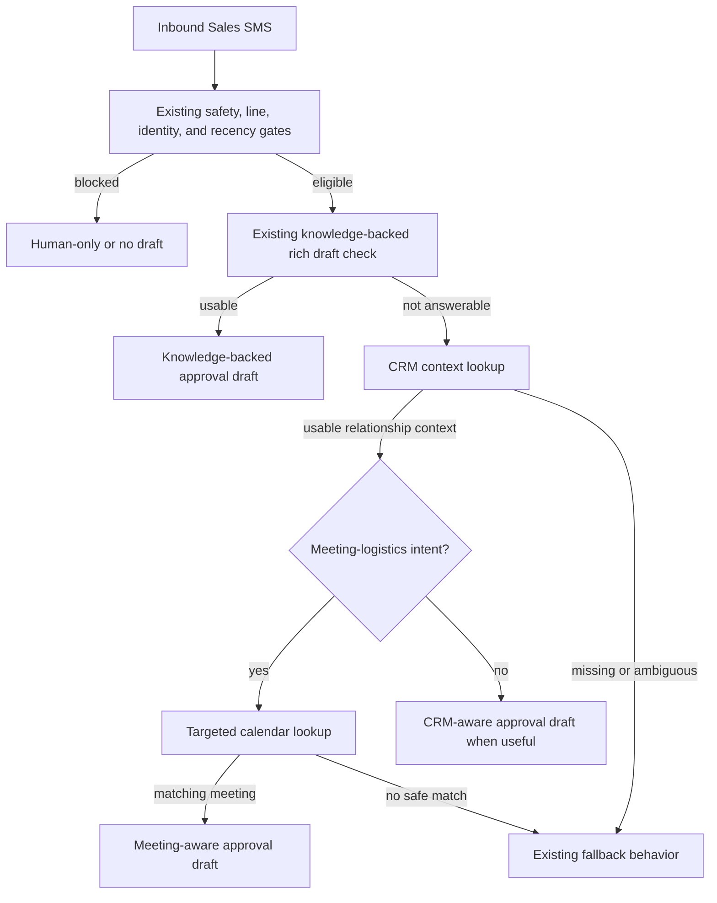

# feat: Add Meeting and CRM-Aware Sales SMS Drafts

## Summary

Extend the existing Dialpad inbound Sales SMS approval path so high-confidence, fresh-context messages can create more useful exact-text drafts from compact Attio context, with a targeted calendar lookup only for obvious meeting-logistics messages. The feature must keep the current approval ledger, safety gates, and fail-closed fallback behavior.

---

## Problem Frame

The webhook can now distinguish low-confidence generic fallback, active-thread suppression, and knowledge-backed product/question drafts. The remaining weak path is high-confidence context-aware drafting: the system knows who the sender is and that recent conversation exists, but it does not retrieve the business or meeting context needed to produce a useful reply. For messages like "I'm running 5 min late," that produces a safe but low-value draft.

---

## Requirements

- R1. High-confidence inbound SMS to the Sales line retrieves compact Attio context before creating a context-aware customer-facing draft.
- R2. Attio context prioritizes contact, company, deal, owner, stage, and recent relationship signal.
- R3. Attio is the primary context source for relationship-aware Sales SMS drafts.
- R4. Calendar lookup runs only for clear meeting timing, joining, lateness, rescheduling, or meeting-link messages.
- R5. Calendar context drives draft text only when a relevant current or near-future ShapeScale meeting is confidently identified.
- R6. Customer-facing exact-text drafts are created only when retrieved context makes the reply materially more useful than generic or vague context-aware copy.
- R7. CRM-aware drafts stay short, SMS-friendly, and limited to facts supported by retrieved context.
- R8. Meeting-logistics drafts directly acknowledge the logistics instead of saying only that a recent conversation was seen.
- R9. Missing, ambiguous, conflicting, stale, or insufficient retrieved context must not produce invented CRM, deal, meeting, owner, or relationship facts.
- R10. Existing opt-out, risky-content, sensitive-content, wrong-line, degraded-lookup, and human-only gates remain authoritative.
- R11. All outbound SMS remains approval-gated through the existing SMS approval flow.
- R12. Telegram draft basis distinguishes CRM-aware, meeting-aware, knowledge-backed, generic fallback, context-only, and human-only outcomes.
- R13. Telegram context stays compact.

**Origin actors:** A1 Operator, A2 Sales prospect, A3 Dialpad webhook skill, A4 Attio context source, A5 Calendar context source
**Origin flows:** F1 CRM-aware Sales SMS draft, F2 Meeting-logistics draft, F3 Missing or ambiguous context
**Origin acceptance examples:** AE1 CRM-aware known-contact draft, AE2 running-late meeting-aware draft, AE3 timing language without calendar match, AE4 ambiguous Attio context, AE5 compact basis handoff

---

## Scope Boundaries

- No autonomous SMS sending.
- No CRM mutation, contact cleanup, or deal-stage updates.
- No broad calendar scanning for every inbound SMS.
- No arbitrary sales-copy generation from all available memory.
- No replacement for the existing ShapeScale knowledge-backed product/question draft slice.
- No Telegram approval-button mechanics changes.
- No full Attio or calendar record dumps in Telegram.

---

## Context & Research

### Relevant Code and Patterns

- `scripts/webhook_server.py` owns the inbound SMS path, including identity enrichment, inbound context, rich draft selection, approval draft persistence, OpenClaw hook payloads, and Telegram rendering.
- `build_inbound_context()` already records identity confidence, evidence, recency, and `draftMode`. This feature should extend that vocabulary rather than add a parallel context object.
- `build_rich_sms_reply()` is the current fail-closed rich-draft seam. It returns a structured result with `usable`, `status`, `basis`, `category`, and `message`.
- `build_proactive_reply_message()` selects rich text before falling back to context-aware or generic copy. This remains the right customer-facing selection point.
- `should_send_proactive_reply()` and `create_proactive_reply_draft()` are the critical safety path. New CRM/meeting draft eligibility must flow through the same gates.
- `build_inbound_context_brief()` renders compact Telegram basis labels. It should gain labels for CRM-aware and meeting-aware drafts.
- Approval draft metadata and fingerprints currently include `first_contact`, `inbound_context`, and `rich_reply`; new retrieved context should be reflected in the fingerprint at a compact summary level so stale drafts are invalidated when the basis changes.
- `tests/test_sender_enrichment.py` already covers low-confidence generic drafts, active-thread suppression, knowledge-backed drafts, risky-message approval, and high-confidence context-aware drafts.
- `tests/test_webhook_server.py` covers broader handler responses and approval ledger behavior.
- `tests/test_openclaw_integration_docs.py` enforces documentation for approval and no-auto-send behavior.

### External Skill Surfaces

- ShapeScale CRM guidance prefers the `mcporter call attio.*` surface for agent workflows and keeps the `attio` script as a legacy CLI wrapper. The plan should use an injectable context lookup boundary so implementation can use the fastest available Attio path without coupling webhook tests to live CRM.
- ShapeScale Google Workspace guidance requires `--account martin@shapescale.com`; calendar event lookup can use `gog-shapescale calendar events primary --from <iso> --to <iso> --max <n> --account martin@shapescale.com` or an equivalent injectable lookup boundary.

### Institutional Learnings

- Low-confidence identity can permit generic drafts but must not drive personalization.
- Fresh local SMS history proves active-thread continuity but does not prove CRM facts.
- Approval drafts are durable exact text; bot/self approval is rejected by the approval ledger.
- Existing product-question rich drafts already fail closed when knowledge is unavailable or unsafe.

### External Research

- No internet research used. The relevant integration behavior is determined by local skill contracts and existing webhook patterns.

---

## Key Technical Decisions

- Add a second rich draft source beside ShapeScale knowledge, not a new approval flow: This keeps approval, opt-out, risk, and stale-draft behavior centralized.
- Treat retrieved CRM/calendar context as optional and fail-closed: Missing tools, non-zero exits, ambiguous matches, or unsafe output should not break webhook notification or create unsupported drafts.
- Use Attio before calendar for relationship-aware drafting: Calendar is only warranted when message intent is meeting/logistics-shaped.
- Keep v1 draft generation bounded: Prefer deterministic templates and short context slots for the first implementation; defer any broader LLM composition decision unless local implementation proves a narrow LLM step is necessary.
- Store and expose compact context summaries: The webhook should not put full CRM/calendar records into Telegram, approval metadata, or hook payloads.
- Preserve knowledge-backed precedence for product/link/pricing questions: CRM/meeting context should improve the high-confidence context-aware branch, not regress the existing rich product-question behavior.

---

## Open Questions

### Resolved During Planning

- Which source is primary? Attio is primary for relationship/deal context; calendar is secondary only for meeting-logistics intent.
- Should v1 produce customer-facing draft text? Yes, but only as exact-text approval drafts through the existing ledger.
- Should calendar run for every Sales SMS? No; only for clear meeting timing, joining, lateness, rescheduling, or meeting-link intent.

### Deferred to Implementation

- Exact Attio command/MCP invocation and output normalization, after confirming what shape is most stable in the runtime.
- Exact calendar query window and attendee/company matching. Start narrow around the inbound timestamp and keep the matcher conservative.
- Exact Telegram basis wording for missing/ambiguous CRM/calendar context, as long as it remains compact and tested.

---

## High-Level Technical Design

> This is directional guidance for review, not implementation code.

---

## Implementation Units

### U1. Add CRM/calendar context retrieval boundaries

**Goal:** Provide fail-closed, testable helpers that retrieve compact context summaries without coupling unit tests to live Attio or Google Workspace.

**Files:**
- Modify: `scripts/webhook_server.py`
- Test: `tests/test_sender_enrichment.py`

**Approach:**
- Add structured helper behavior for CRM context lookup keyed by high-confidence sender information.
- Add structured helper behavior for targeted calendar lookup keyed by timestamp, contact/company hints, and meeting-logistics intent.
- Keep helpers injectable or monkeypatch-friendly so tests can provide deterministic context.
- Normalize retrieved data to compact summaries: status, basis, a small number of safe labels, and enough detail to produce a short draft.
- Fail closed on unavailable tools, non-zero exits, parsing errors, missing identity, ambiguous matches, or stale context.

**Requirements Covered:** R1, R2, R3, R4, R5, R9

**Tests:**
- CRM lookup unavailable returns an unusable context result and does not raise.
- Ambiguous CRM result returns a safe status that prevents CRM-specific draft claims.
- Calendar lookup is not called for non-logistics SMS.
- Calendar lookup is called for running-late/joining/reschedule/link intent when identity is high-confidence.

### U2. Select CRM-aware and meeting-aware rich draft modes

**Goal:** Create useful exact-text drafts from retrieved context when it is safe, while preserving the existing knowledge-backed and fallback behavior.

**Files:**
- Modify: `scripts/webhook_server.py`
- Test: `tests/test_sender_enrichment.py`

**Approach:**
- Extend the rich draft selection seam so it can return CRM-aware and meeting-aware draft results.
- Keep existing knowledge-backed product/link/pricing behavior intact and higher precedence for its current categories.
- For CRM-aware drafts, use only compact verified context and produce short SMS-friendly copy.
- For meeting-aware drafts, use the calendar match to acknowledge timing/logistics directly.
- If context does not materially improve the draft, fall back to existing generic/context-aware/no-draft behavior.

**Requirements Covered:** R6, R7, R8, R9, R10, R11

**Tests:**
- A high-confidence known contact with usable CRM context creates a CRM-aware approval draft and does not call `dialpad_send_sms`.
- A high-confidence known contact saying "I'm running 5 min late" with a matching current demo creates a meeting-aware approval draft such as a no-worries acknowledgment.
- A logistics message without a matching calendar event does not claim a meeting exists and falls back safely.
- Existing product/link knowledge-backed tests continue to pass unchanged.
- Existing opt-out and risky-message tests still dominate new context behavior.

### U3. Expose compact draft basis in Telegram, hook payloads, and approval metadata

**Goal:** Make operators understand why a draft exists without flooding Telegram or persisting full CRM/calendar records.

**Files:**
- Modify: `scripts/webhook_server.py`
- Test: `tests/test_sender_enrichment.py`
- Test: `tests/test_webhook_hooks.py`

**Approach:**
- Extend inbound context/rich reply metadata with compact basis fields for CRM-aware and meeting-aware drafts.
- Update Telegram basis rendering to distinguish CRM-aware, meeting-aware, knowledge-backed, generic fallback, context-only, and human-only outcomes.
- Include compact retrieved-context status in approval fingerprint/metadata so draft replacement is tied to the draft basis.
- Keep customer-facing SMS text free of internal labels, confidence terms, and source details.

**Requirements Covered:** R12, R13, R9, R11

**Tests:**
- Telegram handoff for a meeting-aware draft labels the basis clearly and remains compact.
- Hook payload `autoReply.richReply` or equivalent metadata includes basis/category without full raw CRM/calendar records.
- Approval metadata/fingerprint changes when the draft basis changes.
- Customer-facing exact text contains no internal labels or source citations.

### U4. Update docs and agent guidance

**Goal:** Document the new bounded context-aware drafting behavior and its safety boundaries.

**Files:**
- Modify: `README.md`
- Modify: `SKILL.md`
- Modify: `references/openclaw-integration.md`
- Modify: `references/api-reference.md`
- Test: `tests/test_openclaw_integration_docs.py`

**Approach:**
- Explain that high-confidence Sales SMS may use Attio context for relationship-aware drafts.
- Explain that calendar lookup is targeted to obvious meeting logistics only.
- Preserve the no-auto-send and approval-ledger warnings.
- Document fail-closed behavior when context is unavailable or ambiguous.

**Requirements Covered:** R10, R11, R12, R13

**Tests:**
- Docs tests assert the presence of Attio/CRM-aware drafting guidance.
- Docs tests assert calendar lookup is targeted to meeting logistics, not every SMS.
- Docs tests preserve approval-only/no-auto-send language.

---

## Risks and Mitigations

| Risk | Mitigation |
| --- | --- |
| Live CRM/calendar lookup slows or breaks webhook handling | Bound timeouts, catch all lookup failures, and fail closed to existing behavior |
| CRM context causes unsupported personalization | Require high-confidence identity and compact verified context; never use low-confidence or ambiguous results for claims |
| Calendar match picks the wrong event | Run calendar only for logistics intent, use a narrow time window, and require conservative attendee/company matching |
| Telegram becomes noisy | Persist compact basis/status only; keep full records out of alerts |
| New draft path bypasses safety gates | Route through existing `should_send_proactive_reply()` / `create_proactive_reply_draft()` approval path |

---

## Verification Plan

- `python -m pytest tests/test_sender_enrichment.py -q`
- `python -m pytest tests/test_webhook_hooks.py -q`
- `python -m pytest tests/test_openclaw_integration_docs.py -q`
- `python -m pytest tests/test_webhook_server.py -q`
- `python -m pytest`

---

## Rollout Notes

- After merge, sync the live AlphaClaw skill copy as part of deployment; the runtime previously had a stale `dialpad-openclaw-skill` copy.
- In live smoke testing, use a controlled inbound-like payload or a non-sending approval draft path. Do not approve/send real customer SMS as part of automated verification.
- Confirm runtime availability for the selected Attio and calendar command paths before enabling the richer draft mode in production.
