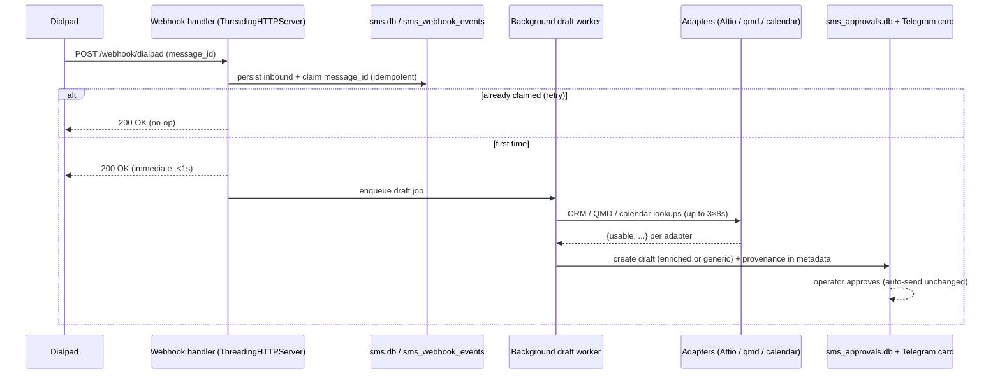
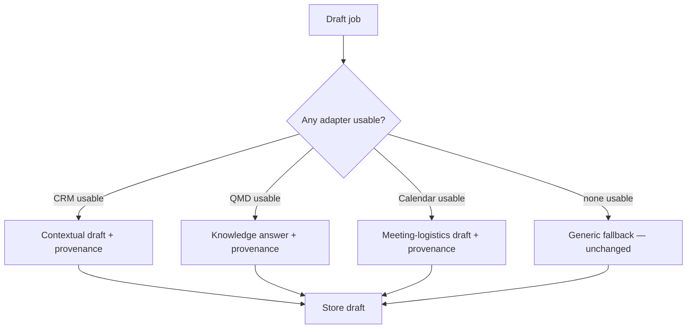

# feat: Wire Dialpad enrichment draft modes with async + idempotency (S1)

## Summary

The Dialpad auto-responder already implements three richer draft modes (Attio CRM, QMD knowledge, Calendly/Attio calendar) but they fail closed to a generic template because the context commands are unset and the rich path is gated behind high-confidence known contacts. This plan wires the three context-command adapters, un-gates them into the operator-approval draft lane so they fire for any sales-line inbound, and — because un-gating would otherwise block the single-threaded webhook for up to 24s per message — moves draft generation off the HTTP ACK path with SMS idempotency to prevent duplicate drafts on Dialpad retries. Auto-send behavior is unchanged; S2–S6 stay clean downstream seams.

---

## Problem Frame

Inbound SMS on the sales line produces boilerplate ("thanks for reaching ShapeScale for Business Sales…") even though `webhook_server.py` has CRM-aware, calendar-aware, and QMD-knowledge draft builders. Two root causes (verified in origin de-risk):

1. `DIALPAD_CRM_CONTEXT_COMMAND`, `DIALPAD_CALENDAR_CONTEXT_COMMAND` are unset and `DIALPAD_QMD_COMMAND` resolves to a bare `qmd` not on the service PATH, so all three modes return `{"usable": false}`.
2. Even wired, the rich modes only run inside `_high_confidence_sales_context_allowed()` (`scripts/webhook_server.py:2203`), which requires a high-confidence **known** Dialpad contact — excluding the unknown senders that generate most of the "generic" complaint.

Un-gating these lookups is the fix, but it is unsafe today: draft generation runs **inline before the 200 ACK** (`scripts/webhook_server.py:3329` precedes `:3475`) with up to 24s of subprocess work (3×8s), on a **single-threaded `HTTPServer`** (`scripts/webhook_server.py:3895`). Un-gating would block the whole server on every inbound and trigger Dialpad retries. So the async refactor and SMS idempotency are in-scope prerequisites, not optional polish.

---

## Requirements

Traced from origin `docs/brainstorms/2026-06-18-s1-wire-enrichment-paths-requirements.md`:

- **R1** — Attio CRM adapter: standalone CLI, input `"<phone> <name> <company>"`, output `{usable, status, basis, summary, deal, stage, company, owner}`; built reusably for S2.
- **R2** — QMD leg reachable: `DIALPAD_QMD_COMMAND=/home/art/.local/bin/qmd`, verified from the service environment.
- **R3** — Calendar adapter: input `"<name> <company> <deal> <timestamp>"`, output `{usable, status, basis, summary|title, startsInMinutes}`; Attio deal demo-date as the reliable path, Calendly best-effort.
- **R4** — Un-gate: rich lookups run in the approval-draft lane at medium/unknown confidence; generic fallback only when all applicable adapters return unusable.
- **R5** — Provenance: operator-facing draft carries the match basis; customer-facing send text does not.
- **R6** — Draft generation off the ACK path with idempotency on the Dialpad event id (no duplicate draft/send on retry).
- **R7** — Wiring: env vars + dedicated API keys set; service restarted. No hard dependency on OpenClaw/AlphaClaw being up.

**Success criteria:** known Attio contact → draft with real company/stage/last-note + QMD answer + provenance line (verified on a replayed inbound); unknown sender asking pricing/booking/product → real QMD answer, not boilerplate; all adapters unusable → generic fallback fires unchanged; no auto-send regression.

---

## Key Technical Decisions

- **KTD1 — In-process background worker, ACK-first, `ThreadingHTTPServer`; no external queue.** The handler validates, persists the inbound to `sms.db`, claims idempotency, ACKs 200, and enqueues draft generation to an in-process worker. `HTTPServer`→`ThreadingHTTPServer` stops one request from blocking others. A durable queue (Redis/BullMQ) is rejected for S1: ~5–10 msgs/day, the inbound is already persisted first so a lost job is recoverable, and adding a broker dependency contradicts "no dependency on external services being up." *(see origin: R6)*
- **KTD2 — SMS idempotency mirrors the missed-call dedup.** A new `sms_webhook_events` table + atomic claim, parallel to `missed_call_webhook_events` / `claim_missed_call_notification` (`scripts/webhook_server.py:1274,1286`), keyed on `message_id` (fallback `id`, `scripts/webhook_server.py:1882`). Claim happens before enqueue so a Dialpad retry is a no-op.
- **KTD3 — Provenance lives in `metadata_json`, not `draft_text`.** The draft metadata dict already carries `crm_context`/`calendar_context` (`scripts/webhook_server.py:2860`); add a human-readable `provenance` key and render it on the Telegram approval card. `draft_text` (customer-facing) is untouched. No schema migration. *(see origin: R5)*
- **KTD4 — Adapters are standalone CLIs calling REST directly.** Attio and Calendly are reached via their REST APIs with dedicated keys (`ATTIO_API_KEY`, `CALENDLY_API_KEY`), mirroring `DIALPAD_API_KEY = os.environ.get(...)` (`scripts/webhook_server.py:97`). Not via the claude.ai Attio MCP (down, 401). The Attio adapter is a clean module so S2 can call it as a cascade stage.
- **KTD5 — Calendar reliability via Attio deal demo-date.** The adapter resolves `startsInMinutes` from the Attio deal's demo-date attribute first; Calendly (`/users/me` → `/scheduled_events?invitee_email=…&status=active`) is attempted only when an email is known and is best-effort, since its email-filter behavior is unconfirmed. *(see origin: R3)*
- **KTD6 — Production wiring is gated behind the async refactor.** The context-command env vars are not enabled in the live service until U5+U6 land, because even the pre-existing high-confidence path runs the lookups inline. Adapters are built and tested via their CLIs independently in the meantime.

---

## High-Level Technical Design

Inbound SMS lifecycle after this change:

Draft-mode selection inside the worker (un-gated):

---

## Implementation Units

### U1. Discover the real Attio pipeline schema — DONE (2026-06-18)

**Goal:** Pin the exact Attio object/attribute slugs the CRM and calendar adapters depend on.
**Requirements:** R1, R3.
**Dependencies:** none.
**Files:** `docs/reference/attio-schema.md` (written).
**Outcome:** Validated `ATTIO_API_KEY` against the live REST API. The pipeline is the **standard `deals` object** (the "0 rows" was the MCP 401, not a custom object — wrong assumption retired). Confirmed slugs: `name`, `stage`, `owner`, `associated_company`, `associated_people`, `value`, `demo_scheduled_at` (calendar fallback). Phone→person→deal resolution path documented (phone lives on `people`, not `deals`). See `docs/reference/attio-schema.md`.

### U2. Attio CRM context adapter (standalone CLI)

**Goal:** A CLI that resolves a sender to Attio CRM context for the CRM-aware draft mode, reusable by S2.
**Requirements:** R1.
**Dependencies:** U1.
**Files:** `scripts/adapters/attio_context.py` (new), `scripts/adapters/__init__.py` (new if needed), `tests/test_attio_context.py` (new).
**Approach:** Accept the query as the final CLI arg (`"<phone> <name> <company>"`, matching `_run_context_command` at `scripts/webhook_server.py:2138`). Normalize the phone, search Attio by phone (primary) then name, map the matched record to `{usable, status, basis, summary, deal, stage, company, owner}` using U1's slugs, and include the demo-date when present so U3 can reuse it. Emit JSON on stdout. Fail closed to `{"usable": false, "status": ...}` on no-match, auth error, or timeout. Keep Attio access in a thin client function S2 can import.
**Patterns to follow:** existing context-command output contract (`scripts/webhook_server.py:2174`); `customer_safe_knowledge_text()` filtering expectations for `summary`.
**Test scenarios:**
- Known phone in Attio → JSON with `usable:true` and populated company/stage/owner.
- Unknown phone → `{usable:false, status:"not_found"}`, exit 0.
- Name fallback when phone misses but name matches.
- Attio 401/500 → `{usable:false, status:"degraded"}`, no stack trace on stdout.
- Network timeout → fails closed within the adapter's own timeout (< the 8s `DIALPAD_CONTEXT_LOOKUP_TIMEOUT_SECONDS`).
- Phone normalization: `+1 (415) 520-1316` and `4155201316` resolve identically.
- `summary` passes the customer-safe filter (no URLs/paths/metadata leakage).

### U3. Calendar context adapter (standalone CLI)

**Goal:** Resolve an upcoming demo time for the calendar-aware draft mode.
**Requirements:** R3.
**Dependencies:** U1, U2.
**Files:** `scripts/adapters/calendar_context.py` (new), `tests/test_calendar_context.py` (new).
**Approach:** Accept `"<name> <company> <deal> <timestamp>"` as the final CLI arg. Resolve `startsInMinutes` from the **Attio deal demo-date attribute** first (reliable path via U2's client). Attempt Calendly only when an email is resolvable: `GET /users/me` → org URI → `GET /scheduled_events?organization=…&invitee_email=…&status=active&min_start_time=now`, reading `start_time`. Treat Calendly as best-effort — its `invitee_email` filter behavior is unconfirmed (see Risks). Output `{usable, status, basis, summary|title, startsInMinutes}`; fail closed otherwise.
**Patterns to follow:** U2 adapter structure and output contract; calendar contract at `scripts/webhook_server.py:2300`.
**Test scenarios:**
- Attio deal has demo-date in the future → `usable:true`, correct `startsInMinutes`.
- No demo-date, Calendly returns an active event for the email → `usable:true` from Calendly.
- No demo-date, no email → `{usable:false}`.
- Past/cancelled event → `{usable:false}` (not surfaced as upcoming).
- Calendly auth/endpoint failure → falls back to Attio-only result, no crash.
- `startsInMinutes` is a scalar, not a dict/list (matches `scripts/webhook_server.py:2300` parsing).

### U4. QMD knowledge wiring + reachability

**Goal:** Make the QMD knowledge lookup actually resolve from the service environment.
**Requirements:** R2.
**Dependencies:** none.
**Files:** `.env` (add `DIALPAD_QMD_COMMAND=/home/art/.local/bin/qmd`).
**Approach:** Set the absolute path so `subprocess.run(["/home/art/.local/bin/qmd","search",…])` resolves under the systemd unit's nix-store-only PATH. No code change — the bare `qmd` default at `scripts/webhook_server.py:118` is the only gap.
**Test scenarios:**
- Integration: an inbound product/pricing question, run through the (un-gated) draft path, yields a draft containing a QMD-sourced answer rather than the generic template. Covers the QMD half of R4's success criteria.
- qmd binary unavailable → existing graceful `{usable:false,status:"unavailable"}` path still holds (no regression).
**Verification:** From a shell matching the service environment, `qmd search` returns usable output; a replayed product-question inbound produces a knowledge-backed draft.

### U5. ACK-first async draft generation

**Goal:** Stop draft generation from blocking the webhook ACK and the single-threaded server.
**Requirements:** R6.
**Dependencies:** none (lands before U7 enables un-gate in production).
**Files:** `scripts/webhook_server.py` (handler + server setup + new worker), `tests/test_webhook_async.py` (new).
**Approach:** Switch `HTTPServer`→`ThreadingHTTPServer` (`scripts/webhook_server.py:3895`). In the SMS handler, persist the inbound and send the 200 ACK *before* draft generation; move `create_proactive_reply_draft()` (`scripts/webhook_server.py:3329`) into a background worker (a small daemon worker thread consuming an in-process queue, or a bounded `ThreadPoolExecutor`). Worker exceptions are logged and isolated — never crash the server or the handler. Preserve current ordering guarantees (a draft still supersedes a prior draft for the same thread via `create_replacement_draft`).
**Execution note:** Start with a failing integration test asserting the ACK returns before draft generation completes.
**Test scenarios:**
- ACK returns in well under the worst-case lookup time while draft generation is still running (assert timing/ordering with a slow-adapter stub).
- Draft is still created after the ACK (poll `sms_approvals.db`).
- Worker raises mid-job → server stays up, next inbound still processed.
- Two inbounds arrive close together → both processed, server not serialized for 24s (Covers the single-thread regression).
- Existing high-confidence inline behavior still produces the same draft output (characterization).

### U6. SMS webhook idempotency

**Goal:** A Dialpad retry of the same message cannot create a duplicate draft or send.
**Requirements:** R6.
**Dependencies:** U5.
**Files:** `scripts/webhook_server.py` (claim before enqueue), `scripts/sms_approval.py` or the existing dedup module (new `sms_webhook_events` table + claim function), `tests/test_sms_idempotency.py` (new).
**Approach:** Add an `sms_webhook_events` table and an atomic `claim_sms_webhook_event(message_id)` mirroring `missed_call_webhook_events` / `claim_missed_call_notification` (`scripts/webhook_server.py:1274,1286`). Key on `message_id` (fallback `id`, `scripts/webhook_server.py:1882`). Claim in the handler before enqueueing the draft job; an already-claimed message ACKs 200 and does nothing else.
**Execution note:** This is the delivery-correctness invariant — the test asserts at-most-once draft creation per `message_id`, not just that the claim function runs.
**Test scenarios:**
- Same `message_id` delivered twice → exactly one draft created.
- Two different `message_id`s → two distinct drafts.
- Concurrent claims of the same `message_id` (two threads) → exactly one wins (atomicity).
- Missing `message_id`, present `id` → dedup keys on `id`.
- Claim persists across a worker restart (table-backed, not in-memory).

### U7. Un-gate rich lookups into the draft lane + provenance

**Goal:** Run CRM/QMD/calendar enrichment for any sales-line inbound (not just high-confidence known contacts), with operator-visible provenance.
**Requirements:** R4, R5.
**Dependencies:** U2, U3, U4, U5, U6.
**Files:** `scripts/webhook_server.py` (mode-selection at `:2337`–`:2393`, `:2504`–`:2559`; draft metadata at `:2860`), Telegram approval-card rendering, `tests/test_draft_ungate.py` (new).
**Approach:** In the worker's draft-mode selection, attempt the CRM/QMD/calendar lookups in the approval-draft path regardless of `identityConfidence`, choosing the richest usable result and falling back to generic only when all applicable adapters return unusable. Build a human-readable provenance string (e.g., `Attio: +1415… → Acme · stage: Demo Booked · matched on phone`) and store it under a `provenance` key in the draft `metadata` dict (`scripts/webhook_server.py:2860`); render it on the operator's Telegram approval card. Do **not** add it to `draft_text`. Leave `_high_confidence_sales_context_allowed()` and the auto-send/high-confidence path untouched.
**Test scenarios:**
- Known Attio contact (medium confidence, not gated as "high") → enriched draft with company/stage + provenance.
- Unknown sender with a pricing question → QMD answer in draft, not boilerplate. Covers R4.
- All three adapters unusable → generic fallback fires, byte-identical to today. Covers the no-regression criterion.
- Provenance string present in `metadata_json` and on the approval card, absent from `draft_text` (customer send text). Covers R5.
- Auto-send / high-confidence path output unchanged (characterization) — un-gate touches only the draft lane.
- One adapter usable, others fail → draft built from the usable one; provenance reflects which source fired.

### U8. Secrets, env wiring, and deploy

**Goal:** Turn the wired pipeline on in the live service safely.
**Requirements:** R7.
**Dependencies:** U2, U3, U4, U5, U6, U7.
**Files:** `.env` (context-command vars), `~/.config/systemd/user/secrets.conf` (API keys), `systemd/dialpad-webhook.service` (only if an explicit PATH/key reference is needed).
**Approach:** Add `ATTIO_API_KEY` and `CALENDLY_API_KEY` to the secret store (never literal in `.env`), and set `DIALPAD_CRM_CONTEXT_COMMAND`, `DIALPAD_CALENDAR_CONTEXT_COMMAND`, and `DIALPAD_QMD_COMMAND` in `.env` to invoke the new adapters/qmd by absolute path. Restart `dialpad-webhook.service`. Per KTD6, do not enable the two context-command vars until U5+U6 are merged. Confirm the service has no hard dependency on OpenClaw being up.
**Test scenarios:** Test expectation: none — configuration/deploy. Verification is the end-to-end replay below.
**Verification:** A replayed real inbound (known Attio contact, and an unknown product-question sender) produces enriched operator drafts with provenance; the service restarts cleanly; ACK latency stays low under a burst of replayed inbounds.

---

## Phased Delivery

- **Phase A — Enrichment sources:** U1 → U2 → U3, and U4 (parallel). Buildable/testable via CLIs without touching the live webhook.
- **Phase B — Delivery safety:** U5 → U6. Must land before un-gate goes live.
- **Phase C — Integration:** U7, then U8. U7 depends on A+B; U8 flips production on.

---

## Risks & Mitigations

- **Calendly `invitee_email` filtering unconfirmed (R3).** Mitigation: KTD5 makes the Attio deal demo-date the reliable path; Calendly is best-effort and its failure degrades to Attio-only, not a broken leg. Verify the exact Calendly call sequence at implementation time against the live API.
- ~~**Attio pipeline is a custom object/list, not `deals`.**~~ RESOLVED in U1: it is the standard `deals` object; slugs confirmed in `docs/reference/attio-schema.md`. Key is present in `secrets.conf`.
- **In-process worker loses a draft job on crash/restart (KTD1).** Mitigation: the inbound is persisted to `sms.db` before ACK, so a lost job is recoverable; a future reconciliation pass (S6 territory) can re-derive missed drafts. Acceptable at ~5–10 msgs/day.
- **Un-gating increases external API call volume.** Each inbound now triggers up to three lookups. At current volume this is negligible, but adapters must enforce their own sub-8s timeouts so a slow API cannot stall the worker queue.
- **ThreadingHTTPServer + shared SQLite.** Concurrent worker threads writing `sms.db`/`sms_approvals.db` must use per-thread connections or serialized writes; verify the existing DB access is thread-safe or wrap it.
- **Exposed Attio MCP token (from de-risk).** Out of band but related: rotate the leaked claude.ai Attio MCP token; it is unrelated to the dedicated `ATTIO_API_KEY` this plan introduces.

---

## Scope Boundaries

**In scope:** the three adapters, qmd wiring, the un-gate into the draft lane, provenance, the ACK-first async refactor, SMS idempotency, and deploy.

### Deferred to Follow-Up Work
- **S2** — full phone-first identity cascade (Gmail/Granola, Apollo, reverse-phone), caching, and confidence scoring. The U2 Attio adapter is built to be reused as its first stage.
- **S3** — segmented customer/prospect draft templates.
- **S4** — confidence-gated auto-send. Auto-send behavior is unchanged here.
- **S5** — line-based sales/work routing and Attio write-back.
- **S6** — approval-DB eval loop and a reconciliation pass for lost worker jobs.

### Outside this change
- Rewriting the Dialpad identity/confidence scorer — the un-gate bypasses the gate for the draft lane only.
- Introducing a durable external queue/broker (rejected in KTD1).

---

## Sources & Research

- Origin requirements: `docs/brainstorms/2026-06-18-s1-wire-enrichment-paths-requirements.md`
- Ideation: `docs/ideation/2026-06-18-dialpad-auto-response-enrichment.md`
- Code contracts and gates: `scripts/webhook_server.py` (`:97, :118, :1274, :1286, :1882, :2138, :2174, :2203, :2300, :2337, :2504, :2860, :3329, :3475, :3895`), `scripts/sms_approval.py` (`:140, :220, :426`).
- Calendly API v2: PAT Bearer auth; `/users/me` → `/scheduled_events?invitee_email=…&status=active&min_start_time=…`, `start_time` field (https://developer.calendly.com/api-docs/reference). `invitee_email` direct-filter behavior unconfirmed.
