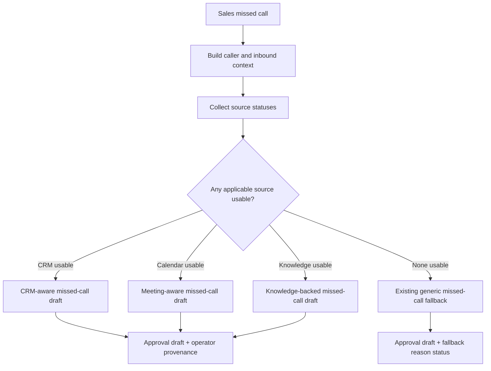
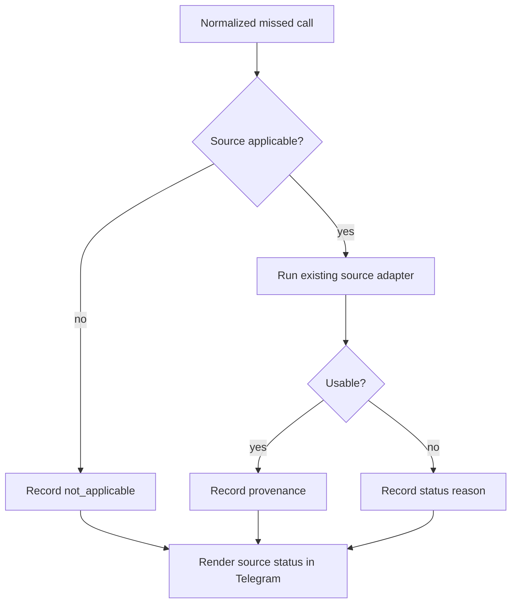

# feat: Enrich Dialpad missed-call approval drafts

## Summary

Extend the existing Dialpad enrichment draft lane from Sales SMS to Sales missed calls. The plan reuses the shipped Attio/calendar/QMD adapters, provenance metadata, ACK-first intake patterns, and SMS idempotency work, while adding missed-call eligibility, call-specific enriched copy, source-status visibility, missed-call response-timing safety, and regression coverage.

---

## Problem Frame

The Sales missed-call path already normalizes caller context and can create approval drafts, but it still treats rich enrichment as SMS-only. That means payload-only or low-confidence missed calls go straight to generic copy even when Attio or calendar context could help the operator draft a better follow-up.

The prior SMS enrichment work already established the central safety invariant: enrichment may be operator-facing at low confidence, but customer-facing names and company data must stay behind the high-confidence gate. This plan carries that invariant forward for missed calls instead of reopening the PII boundary.

---

## Requirements

**Draft Selection**

- R1. Sales missed calls enter the enrichment-eligible approval-draft lane before generic fallback is selected. Covers origin R1, R4, AE1.
- R2. Missed calls can produce CRM-aware drafts when Attio returns usable caller context. Covers origin R2, F1, AE1.
- R3. Missed calls can produce meeting-aware drafts when upcoming or bounded recent-demo calendar context is applicable and usable. Covers origin R3, F1, AE4.
- R4. Generic missed-call fallback remains available when all applicable enrichment sources are unusable or unavailable. Covers origin R5, F3, AE3.

**Customer-Facing Safety**

- R5. Low-confidence missed-call drafts do not include payload-only names, low-confidence Attio names, or low-confidence company names in customer-facing text. Covers origin R6, F2, AE2.
- R6. High-confidence missed-call drafts may use the same safe personalization gates as SMS drafts. Covers origin R7, AE4.
- R7. Enriched missed-call drafts remain written as missed-call follow-ups, not as reused inbound-SMS acknowledgements. Covers origin R8, AE4.

**Operator Handoff**

- R8. Telegram distinguishes CRM-aware, meeting-aware, knowledge-backed, context-aware, and generic missed-call draft bases when those bases occur. Covers origin R9.
- R9. Telegram shows usable enrichment provenance in an operator-facing location. Covers origin R10, AE1, AE2.
- R10. Generic fallback Telegram cards show why enrichment did not supply the draft, including not applicable, not configured, not found, degraded, unsafe, and unavailable states. Covers origin R11, AE3.

**Regression Protection**

- R11. Tests cover missed calls entering the enrichment-eligible lane. Covers origin R12.
- R12. Tests cover low-confidence enrichment remaining operator-only for missed calls. Covers origin R13.
- R13. Tests cover unchanged generic fallback behavior when enrichment is unusable. Covers origin R14.
- R14. Tests preserve the no-unattended-send invariant for missed-call rich drafts. Covers origin scope boundary.

---

## Key Technical Decisions

- **KTD1 — Extend the existing draft lane, do not add a parallel missed-call pipeline.** The SMS enrichment path already owns context commands, rich-reply metadata, provenance, draft modes, and approval storage. Missed calls should widen event eligibility and specialize copy/status where needed.
- **KTD2 — Applicability-aware source attempts.** Attio is applicable for silent missed calls because caller number exists. Calendar is applicable only when CRM or local context indicates upcoming or bounded recent-demo context; missed-call calendar lookup must not depend on the SMS-only `meeting_logistics_intent(text)` heuristic. QMD is only applicable when the normalized call event has usable text or transcript-like content; otherwise it should report `not_applicable` rather than running a weak empty query.
- **KTD3 — Customer-facing copy gets a missed-call wrapper.** The existing CRM and meeting reply helpers are SMS-shaped. Missed calls need call-specific enriched copy while preserving the same high-confidence personalization gates.
- **KTD4 — Fallback explanation belongs in operator metadata and Telegram, not SMS text.** Source status should make the operator card auditable, while customer-facing fallback copy remains short and unchanged when enrichment fails.
- **KTD5 — Delivery safety must extend to the missed-call enrichment path.** SMS already has post-ACK processing, but missed-call draft creation currently runs inline before the webhook response. If missed-call enrichment adds Attio, calendar, or QMD adapter calls, implementation must either move the call-side enrichment work behind an ACK-first/background seam or prove a strict nonblocking latency bound before adapter lookup. SMS idempotency, missed-call dedupe, approval drafts, and shadow auto-send behavior remain invariants.

---

## High-Level Technical Design

Missed-call draft selection after this change:

Source-status flow:

---

## Implementation Units

### U0. Add missed-call ACK-first enrichment handoff

- **Goal:** Ensure Sales missed-call webhooks respond before any slow enrichment adapter can run.
- **Requirements:** R1, R11, R14.
- **Dependencies:** none.
- **Files:** `scripts/webhook_server.py`, `tests/test_webhook_server.py`, `tests/test_webhook_async.py`.
- **Approach:** Move missed-call enrichment and approval-draft creation behind a post-response/background seam before widening any enrichment gates. Reuse the SMS async/idempotency pattern where possible, while preserving missed-call dedupe so retries cannot create duplicate operator-visible drafts.
- **Execution note:** Implement this unit before U1. U1 must not enable missed-call Attio/calendar/QMD lookup until this timing seam is in place.
- **Patterns to follow:** Existing SMS post-ACK processing and missed-call duplicate suppression.
- **Test scenarios:**
  - Covers R14. A Sales missed-call webhook sends its HTTP response before a mocked slow adapter or draft worker completes.
  - Duplicate missed-call retry behavior remains unchanged and does not create duplicate drafts.
  - Background worker failure records/logs an operator-visible source status where possible without replaying customer-visible output.
- **Verification:** Handler-level tests prove missed-call response timing before enrichment work and preserve existing duplicate suppression behavior.

### U1. Allow missed calls into the enrichment gate

- **Goal:** Make Sales missed calls eligible for CRM/calendar enrichment without changing voicemail or non-Sales behavior.
- **Requirements:** R1, R2, R3, R11.
- **Dependencies:** U0.
- **Files:** `scripts/webhook_server.py`, `tests/test_ungate_provenance.py`, `tests/test_webhook_server.py`.
- **Approach:** Extend the existing enrichment eligibility helper to allow `missed_call` alongside `sms`, and update stale SMS-only comments and tests. Also refactor the `build_rich_sms_reply` event-type gate or rich-reply selection seam so `missed_call` does not stop at `unsupported_event` before CRM/calendar context can run. Keep `voicemail` unsupported unless a later requirements document explicitly scopes it in.
- **Execution note:** Start with the gate test currently asserting missed calls are rejected, then update the handler-level missed-call tests.
- **Patterns to follow:** The SMS un-gate tests in `tests/test_ungate_provenance.py`; existing missed-call handler tests in `tests/test_webhook_server.py`.
- **Test scenarios:**
  - Covers AE1. `_sales_context_draft_allowed` returns true for `missed_call` and remains true for SMS.
  - Covers AE1. `build_rich_sms_reply` or its successor no longer returns `unsupported_event` for Sales missed calls before contextual enrichment is attempted.
  - Non-Sales missed calls still fail `should_send_proactive_reply` through the existing sales-line check.
  - `voicemail` remains rejected by the enrichment gate.
  - Existing SMS un-gate tests continue to pass unchanged.
- **Verification:** Missed-call normalized events can reach CRM/calendar lookup code in unit tests without changing non-Sales or voicemail behavior.

### U2. Add missed-call-aware enriched draft text

- **Goal:** Produce enriched missed-call approval text that is useful and still reads like a missed-call follow-up.
- **Requirements:** R2, R3, R5, R6, R7, R12, R14.
- **Dependencies:** U0, U1.
- **Files:** `scripts/webhook_server.py`, `scripts/adapters/calendar_context.py`, `tests/test_webhook_server.py`, `tests/test_sender_enrichment.py`, `tests/test_ungate_provenance.py`, `tests/test_calendar_context.py`.
- **Approach:** Keep the existing CRM and meeting context builders as the source of truth for usable context, but route missed-call customer text through missed-call-specific phrasing. Generalize the meeting-aware branch so call events can use scheduled or recent demo context even when there is no inbound SMS text. Because the current calendar adapter only surfaces future demos, include the adapter/helper change needed to expose bounded recent demo context for missed-call use; recent-demo/no-show test coverage must require actual meeting-aware enrichment, not a status-only fallback. Preserve `_draft_greeting` and company/segment gates so low-confidence text stays generic while high-confidence callers can receive safe personalization.
- **Technical design:** Directional shape only: source selection can reuse `rich_reply` and context metadata, while message composition should branch on event type before returning customer-facing text.
- **Patterns to follow:** `_crm_reply_message`, `_meeting_reply_message`, `_draft_greeting`, and `build_proactive_reply_message`.
- **Test scenarios:**
  - Covers AE1. A Sales missed call with usable Attio context creates a CRM-aware draft and does not use the generic missed-call template.
  - Covers AE4. A high-confidence known caller can receive safe personalization while the message remains a missed-call follow-up.
  - Covers AE2. A low-confidence missed call with usable Attio context starts with `Hi there,` and does not include the low-confidence name or company.
  - A silent missed call with CRM/demo context can attempt calendar lookup or record a calendar status without relying on SMS text intent.
  - A missed call tied to a bounded recent demo/no-show produces meeting-aware context; it must not pass with only a recent-demo unavailable status.
  - A meeting-aware missed-call draft acknowledges follow-up around the call/demo context without saying the caller texted an update.
  - Shadow auto-send remains metadata-only and does not create an unattended send path for missed calls.
- **Verification:** Handler-level tests capture `auto_reply.message`, `draftMode`, `richReply`, and approval draft state for CRM-aware, meeting-aware, and low-confidence missed calls.

### U3. Record source statuses for missed-call fallback

- **Goal:** Make generic missed-call drafts explainable when enrichment does not produce the draft.
- **Requirements:** R4, R8, R9, R10, R13.
- **Dependencies:** U0, U1.
- **Files:** `scripts/webhook_server.py`, `tests/test_webhook_server.py`, `tests/test_ungate_provenance.py`.
- **Approach:** Add a compact source-status structure to normalized events or draft metadata that records per-source outcomes for applicable enrichment. Render usable provenance with the existing provenance line and render unusable statuses in the inbound context block or approval-card context when the draft is generic.
- **Technical design:** Directional status vocabulary should include usable, not_applicable, not_configured, not_found, degraded, unsafe, unavailable, and not_allowed. The exact storage shape is implementation detail, but it must be available to both draft metadata and Telegram rendering.
- **Patterns to follow:** `_build_draft_provenance`, `build_inbound_context_brief`, and the metadata passed to `sms_approval.create_replacement_draft`.
- **Test scenarios:**
  - Covers AE3. A missed call with all applicable sources unusable creates the existing generic text and includes source status in Telegram.
  - A missed call with no query text records QMD as not applicable, not as a failed knowledge lookup.
  - A missed call with usable normalized text or transcript-like content can produce a knowledge-backed draft and QMD provenance.
  - A CRM unsafe output status appears as a fallback reason and does not appear in customer-facing SMS text.
  - A usable CRM or calendar result still renders the normal provenance line.
- **Verification:** Approval draft metadata and Telegram text expose source statuses without changing `draft_text`.

### U4. Integrate missed-call enriched drafts in the handler

- **Goal:** Ensure the missed-call webhook path forwards enriched draft metadata consistently to OpenClaw hooks, Telegram, and the approval database.
- **Requirements:** R1, R8, R9, R10, R11, R13, R14.
- **Dependencies:** U0, U1, U2, U3.
- **Files:** `scripts/webhook_server.py`, `tests/test_webhook_server.py`, `tests/test_webhook_hooks.py`, `tests/test_webhook_async.py`.
- **Approach:** Update the missed-call handler path so `auto_reply` includes rich reply metadata like the SMS path does, Telegram includes both draft basis and provenance/status details, and hook payloads carry the same normalized event state. This unit depends on U0, so slow adapter work must already be behind the missed-call ACK-first/background seam before rich metadata integration expands enrichment.
- **Patterns to follow:** The SMS inbound path that adds `richReply` to `auto_reply`, renders provenance, and builds the approval review suffix.
- **Test scenarios:**
  - Covers AE1. Missed-call hook payload includes `auto_reply.richReply` for a CRM-aware draft.
  - Covers AE2. Telegram shows operator-facing Attio provenance while the exact draft text remains low-confidence safe.
  - Covers AE3. Generic fallback Telegram includes source statuses and the approval draft suffix.
  - Covers R14. A Sales missed-call webhook responds before slow enrichment adapters complete, or the implementation proves those adapters are not run inline before the response.
  - Duplicate missed-call dedupe behavior remains unchanged and does not re-emit operator-visible output.
- **Verification:** Existing missed-call tests still pass, and new tests assert parity with the SMS handoff for rich metadata and provenance.

### U5. Update documentation for missed-call enrichment behavior

- **Goal:** Document the missed-call extension and its safety boundary for future changes.
- **Requirements:** R5, R8, R10, R14.
- **Dependencies:** U0, U1, U2, U3, U4.
- **Files:** `docs/reference/enrichment-adapters.md`, `docs/solutions/ungate-enrichment-customer-pii.md`.
- **Approach:** Add a short note that the enrichment adapters are now used by both SMS and missed-call approval drafts, and that silent missed calls treat QMD as not applicable unless call text or transcript content exists. Extend the PII-safety note to call out missed-call drafts as another customer-facing surface covered by the same rule.
- **Test scenarios:** Test expectation: none -- documentation only.
- **Verification:** Docs state the event surfaces, low-confidence PII rule, and QMD applicability rule without duplicating implementation details.

---

## Acceptance Examples

- AE1. Given a Sales missed call from a caller with usable Attio context, when the approval draft is created, then the draft basis is CRM-aware and Telegram shows Attio provenance.
- AE2. Given a low-confidence missed call with an Attio match, when the approval draft is created, then Telegram may show the match but the customer-facing SMS text does not include the low-confidence name or company.
- AE3. Given a Sales missed call where enrichment sources are unusable, when the approval draft is created, then the generic missed-call copy is used and Telegram shows why enrichment did not supply the draft.
- AE4. Given a high-confidence known caller with fresh context, when the missed-call draft is created, then customer-facing text may use safe personalization and remains written as a missed-call follow-up.

---

## Scope Boundaries

### In Scope

- Widening the existing enrichment draft lane to Sales missed calls.
- Missed-call-specific enriched customer copy.
- Operator-facing provenance and fallback source status for missed-call drafts.
- Regression tests for missed-call enrichment, generic fallback, and PII safety.

### Deferred to Follow-Up Work

- A full phone-first identity resolver or new source cascade.
- Unattended auto-send expansion.
- Attio write-back changes for missed calls.
- Full retry/reconciliation for post-ACK missed-call processing failures beyond bounded logging/source-status visibility.
- Adding new transcription or voicemail parsing. Existing normalized call text or transcript-like fields may be used as a knowledge-query source.

### Outside this change

- Non-Sales missed-call behavior.
- Voicemail enrichment behavior.
- Replacing the existing adapter CLI contracts.

---

## Risks & Dependencies

- **Customer PII leak risk:** Low-confidence Attio context can be wrong. Mitigation: keep names/company data out of customer-facing text unless the existing high-confidence gate passes.
- **QMD false signal risk:** Silent missed calls do not contain a useful question. Mitigation: record QMD as not applicable unless usable text exists.
- **Calendar applicability risk:** Reusing the SMS meeting-intent heuristic would make silent missed calls skip calendar enrichment. Mitigation: add a missed-call-specific calendar applicability check based on CRM/demo context.
- **Recent-demo coverage risk:** The current calendar adapter only surfaces future demos. Mitigation: require adapter/helper support for bounded recent demo context when R3 is implemented, with tests that fail if recent-demo/no-show context only produces fallback status.
- **Webhook retry risk:** Inline missed-call adapter calls can hold the Dialpad webhook response open and trigger retries. Mitigation: extend the ACK-first/background seam to missed-call enrichment or prove a strict nonblocking path before adapter calls.
- **Operator-card noise risk:** Source-status rendering can make Telegram cards too long. Mitigation: keep statuses compact and only expand unusable details when fallback is generic.
- **Regression risk in SMS enrichment:** Shared helpers serve SMS and missed calls. Mitigation: preserve existing SMS tests and add event-type-specific tests around changed branches.
- **Delivery replay risk:** Missed-call dedupe already owns duplicate suppression. Mitigation: avoid changing dedupe keys or replay behavior in this plan.

---

## System-Wide Impact

- Telegram approval cards, OpenClaw hook payload metadata, approval draft metadata, webhook response timing, and customer-facing SMS draft text are affected.
- Existing SMS enrichment behavior, missed-call duplicate suppression, ACK-first intake, and approval-only delivery remain invariants.

---

## Documentation / Operational Notes

- No new secrets or live env vars are required if the existing enrichment adapter wiring is already deployed.
- Implementation should verify the deployed Attio and calendar adapter environment before production smoke testing; missing adapter config should degrade to source statuses plus generic fallback.
- A live smoke replay should use a real Sales missed-call payload against the staging or local webhook first, then production only after unit and handler tests pass.
- The live Telegram card should be checked visually for concise source-status rendering before treating the change as fully deployed.

---

## Sources & Research

- Origin requirements: `docs/brainstorms/2026-06-22-missed-call-enrichment-requirements.md`.
- Prior enrichment plan: `docs/plans/2026-06-18-001-feat-dialpad-enrichment-wiring-plan.md`.
- PII safety learning: `docs/solutions/ungate-enrichment-customer-pii.md`.
- Adapter contracts: `docs/reference/enrichment-adapters.md`.
- Main webhook code: `scripts/webhook_server.py`.
- Existing tests: `tests/test_ungate_provenance.py`, `tests/test_webhook_server.py`, `tests/test_sender_enrichment.py`, `tests/test_webhook_hooks.py`, `tests/test_auto_send_shadow.py`, `tests/test_webhook_async.py`, `tests/test_sms_idempotency.py`.
