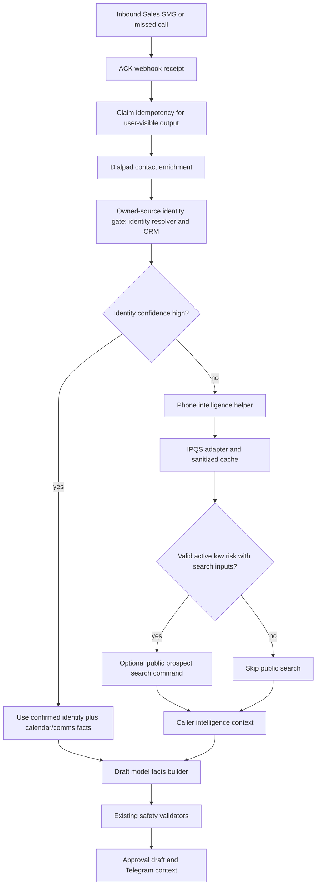

# feat: Add phone validation prospect enrichment

## Summary

Add a shared caller-intelligence layer for inbound Sales SMS and missed-call workflows. When owned sources do not identify the caller with high confidence, the skill should validate the phone number, classify risk, optionally enrich likely business context, and feed a compact, safety-filtered fact set into the existing draft model path.

The change must improve operator context and draft quality without treating reverse lookup or public search as authoritative identity. Confirmed owned-source evidence, including CRM and Dialpad exact matches, remains the only basis for high-confidence customer-facing personalization.

---

## Problem Frame

The current fallback path handles unknown callers conservatively:

- Dialpad contact lookup can provide only webhook-level identity.
- Attio can be missing or not match the number.
- Calendar and comms context are only useful after a stronger identity signal exists.
- Generic fallback drafts are safe, but they miss useful signals such as valid active number, city/state, line type, carrier, abuse risk, and possible reverse-name context.

For example, an unknown Fort Worth wireless caller can currently produce only:

> Hi there, you've reached ShapeScale for Business Sales. Sorry we missed your call. How can we help?

That is safe, but it leaves the operator without evidence that the number is active, non-abusive, wireless, and possibly associated with a named person who may be searchable as a business owner.

---

## Requirements

### Functional Requirements

- R1. Use one shared phone-intelligence path for both Sales SMS webhooks and Sales missed-call webhooks.
- R2. Run phone intelligence only for external inbound Sales contacts after owned-source identity resolution, primarily when Dialpad/CRM identity confidence is not high.
- R3. Validate and normalize IPQS phone data: valid, active status, fraud/risk signals, carrier, line type, country, region, city, timezone, local format, and reverse name when available.
- R4. Keep IPQS reverse name as possible caller evidence, not confirmed identity.
- R5. Add optional bounded public prospect enrichment when a valid active low-risk number has enough public signals to search, such as reverse name plus city/state.
- R6. Treat public search output as operator context unless another owned source confirms it.
- R7. Feed the draft model a compact fact set that includes safe caller-intelligence facts and explicit constraints.
- R8. Let the model produce the final draft text from tool-call facts, but preserve existing safety validators and deterministic fallbacks.
- R9. Suppress customer-facing personalization from low-confidence phone intelligence: no named greeting, no unconfirmed company claim, no "I saw your business" claim.
- R10. Escalate risky or invalid numbers in operator context and avoid warmer prospect drafts for those cases.
- R11. Treat high-risk, invalid, or inactive callers as human-only in v1: create operator context and metadata, but do not generate a customer-facing draft.
- R12. Fail closed on missing secrets, provider errors, timeouts, malformed responses, search misses, and enrichment budget exhaustion.
- R13. Cache sanitized phone-intelligence results to reduce latency and vendor calls without storing raw provider payloads.
- R14. Add deterministic per-window provider-call budgets so unique-number spam cannot burn unbounded IPQS or public-search credits.
- R15. Document secrets and runtime configuration using environment references, not literal keys.
- R16. Add tests that prove both webhook surfaces use the same logic and preserve low-confidence safety invariants.

### Non-Goals

- No voicemail transcription or call recording analysis in this PR.
- No automatic CRM write-back.
- No automatic sending based only on IPQS or public search.
- No broad person-search dossier, home address enrichment, relatives, age, or other sensitive identity expansion.
- No direct browser automation inside the webhook request path.

---

## Key Technical Decisions

### KTD-1: Use the existing context-adapter pattern

Add a focused phone-intelligence adapter instead of embedding IPQS calls inside webhook handlers. The repo already uses subprocess JSON adapters for Attio and calendar context, with a fail-closed contract and compact returned payloads. The owned-source identity gate should reuse the existing `scripts/adapters/identity_resolver.py` path before deciding whether caller intelligence is eligible.

Decision:

- Add `scripts/adapters/phone_intelligence.py`.
- Wire it through a shared helper in `scripts/webhook_server.py`.
- Configure it with environment variables and make it optional by default.
- Use the existing identity resolver/CRM confidence before invoking phone intelligence; keep IPQS and public search in a separate operator-only `callerIntelligence` lane.

Rationale:

- Keeps provider logic testable outside webhook delivery.
- Avoids duplicating lookup behavior between SMS and missed calls.
- Matches existing degraded-source behavior in `lookup_sales_crm_context`, `lookup_sales_calendar_context`, and adapter docs.
- Prevents phone validation from becoming a parallel identity resolver with conflicting provenance.

### KTD-2: Use IPQS as validation evidence, not identity authority

IPQS can return reverse names and owner-style fields, but those are not strong enough to identify the caller for customer-facing copy.

Decision:

- IPQS may contribute `callerIntelligence`.
- IPQS cannot upgrade `identityConfidence` to `high`.
- Reverse name can appear in Telegram/operator context as "possible reverse lookup".
- Draft facts must distinguish confirmed CRM/Dialpad facts from possible phone-intelligence facts.

Rationale:

- This preserves the existing safety rule from `docs/solutions/ungate-enrichment-customer-pii.md`.
- It prevents a stale reverse lookup from becoming a named greeting or company claim.

### KTD-3: Public prospect search is a bounded command seam

The webhook service should not hardwire live web search or browser automation. It should call an optional command that accepts compact input and returns compact JSON.

Decision:

- Add optional `DIALPAD_PUBLIC_PROSPECT_SEARCH_COMMAND`.
- Invoke it only after phone validation produces a usable, active, low-risk number with enough search inputs.
- Require the command response to include bounded evidence entries: source type, domain or title, matched terms, and no page snippets.
- Mark `publicProspect.usable` true only when at least one evidence entry ties the reverse name plus location to a business, role, or organization relevant to ShapeScale for Business.
- Cap and sanitize summaries, sources, and evidence before model facts; strip instruction-like text and sensitive personal details.
- Treat search misses as `{usable:false,status:"not_found"}`. Treat search timeouts as `{usable:false,status:"timeout"}` and provider failures as a degraded unavailable status.

Rationale:

- Keeps provider choice replaceable.
- Keeps latency bounded.
- Lets the runtime use a cheap model/search pipeline without making the webhook server own that implementation.
- Keeps untrusted search output from becoming prompt instructions or unauditable prospect claims.

### KTD-4: Cache sanitized results only

The IPQS response can contain more data than this workflow needs.

Decision:

- Cache only normalized fields used by operator context and drafting.
- Do not store raw IPQS JSON.
- Exclude sensitive expanded identity payloads if enabled by account tier, including addresses, emails, birthdates, and unrelated identity data.
- Default phone-validation TTL to 24 hours and public-prospect-search TTL to 6 hours, with environment overrides.
- Store cache files under the configured private runtime state/log directory; create parent directories with `0700` and SQLite files with `0600`.
- Use the repo's SQLite concurrency pattern: `busy_timeout` plus best-effort WAL.
- Purge expired rows on read/write and avoid logging cached values.
- Include a lookup-policy version in the cache key or stored metadata covering provider endpoint, strictness, country hint, and risk-threshold version.

Rationale:

- Reduces vendor calls and request latency.
- Limits privacy exposure and accidental prompt leakage.
- Prevents stale results from surviving changes to provider options or risk thresholds.

### KTD-5: Risk policy is deterministic before model drafting

The model should not decide whether a caller is safe or abusive.

Decision:

- Normalize deterministic risk first.
- Mark invalid, inactive, known spammer, recent-abuse, risky, or `fraud_score >= 90` numbers as `riskLevel:"high"`.
- Mark `fraud_score >= 75` as `riskLevel:"medium"` when no high-risk flag is present.
- Mark all remaining usable numbers as `riskLevel:"low"`.
- High-risk callers are human-only in v1: render the reason for the operator and do not generate a customer-facing draft.
- Medium-risk callers may receive only the conservative generic approval draft, with a visible operator warning.

Rationale:

- IPQS documents high-risk interpretations for invalid/inactive numbers and high fraud scores.
- This is routing and safety policy, not prose generation.

### KTD-6: External enrichment runs after ACK and inside budgets

IPQS and public search must not become part of webhook receipt availability.

Decision:

- Acknowledge webhook receipt before IPQS or public-search calls.
- Run missed-call enrichment only after the missed-call idempotency claim succeeds.
- Use deterministic per-window budgets for IPQS and public search; expose `budget_exceeded` or `rate_limited` source statuses when a cap is hit.
- Use `DIALPAD_CALLER_INTELLIGENCE_BUDGET_WINDOW_SECONDS` for the budget window, defaulting to one hour.
- Use `DIALPAD_PHONE_INTELLIGENCE_MAX_CALLS_PER_WINDOW` and `DIALPAD_PUBLIC_PROSPECT_SEARCH_MAX_CALLS_PER_WINDOW`, initially defaulting to 120 IPQS validations/hour and 30 public searches/hour.
- If post-ACK enrichment exceeds its configured time or budget, continue with the existing generic fallback or human-only behavior and never replay user-visible output.

Rationale:

- Preserves the ACK-first/idempotency invariant from `docs/solutions/ack-first-webhook-idempotency.md`.
- Prevents provider stalls or unique-number spam from delaying receipt handling or burning unbounded credits.

---

## High-Level Technical Design



### Data Contract

Add a new `callerIntelligence` object to inbound context metadata:

```json
{
  "usable": true,
  "status": "found",
  "source": "ipqs",
  "phone": {
    "e164": "+18178460085",
    "localFormat": "(817) 846-0085",
    "country": "US",
    "region": "TX",
    "city": "FORT WORTH",
    "timezone": "America/Chicago"
  },
  "line": {
    "carrier": "Verizon Wireless",
    "type": "wireless",
    "active": true,
    "activeStatus": "active"
  },
  "risk": {
    "level": "low",
    "fraudScore": 0,
    "recentAbuse": false,
    "risky": false,
    "spammer": false
  },
  "possibleIdentity": {
    "reverseName": "BILL H HARTIN",
    "basis": "ipqs_reverse_lookup",
    "confidence": "low"
  },
  "publicProspect": {
    "usable": true,
    "status": "found",
    "summary": "Possible Fort Worth business/professional match.",
    "confidence": "low",
    "evidence": [
      {
        "sourceType": "business_directory",
        "domainOrTitle": "Example public business profile",
        "matchedTerms": ["BILL H HARTIN", "Fort Worth"]
      }
    ]
  }
}
```

The exact field names can be adjusted during implementation, but the boundaries must remain:

- confirmed identity stays separate from possible identity;
- risk is deterministic;
- public prospect facts are explicitly low confidence unless confirmed elsewhere;
- public prospect evidence is bounded and sanitized before it reaches model facts.

---

## Implementation Units

### Unit 1: Phone Intelligence Adapter

Files:

- `scripts/adapters/phone_intelligence.py`
- `tests/test_phone_intelligence.py`
- `docs/reference/enrichment-adapters.md`

Work:

- Add an import-safe adapter with a CLI JSON contract matching the existing adapter pattern.
- Read `IPQS_API_KEY` or a narrowly named equivalent from the environment.
- Call IPQS Phone Number Validation with a bounded timeout.
- Prefer the `IPQS-KEY` header so the API key is not present in URLs or logs.
- Default `strictness` to `0`; allow env override for stricter future tuning.
- Support a country hint, defaulting to US for NANP numbers.
- Normalize provider output into compact statused fields.
- Return exit code `0` for expected misses/degraded states with `usable:false`.
- Add cache support for sanitized normalized results.
- Add `DIALPAD_PHONE_INTELLIGENCE_CACHE_DB`, `DIALPAD_PHONE_INTELLIGENCE_CACHE_TTL_SECONDS` with a 24-hour default, and `DIALPAD_PUBLIC_PROSPECT_SEARCH_CACHE_TTL_SECONDS` with a 6-hour default.
- Store cache entries with a lookup-policy version that covers endpoint, strictness, country hint, and risk-threshold version.
- Create cache parent directories with `0700`, cache files with `0600`, expired-row purging, and the existing SQLite `busy_timeout`/best-effort-WAL pattern.
- Add provider-call budget checks for unique-number floods before making paid or external calls, using `DIALPAD_CALLER_INTELLIGENCE_BUDGET_WINDOW_SECONDS`, `DIALPAD_PHONE_INTELLIGENCE_MAX_CALLS_PER_WINDOW`, and `DIALPAD_PUBLIC_PROSPECT_SEARCH_MAX_CALLS_PER_WINDOW`.

Tests:

- valid active wireless number normalizes expected fields;
- invalid number returns unusable/high-risk context;
- high risk is assigned for invalid, inactive, `recent_abuse`, `risky`, `spammer`, or `fraud_score >= 90`;
- medium risk is assigned for `fraud_score >= 75` when no high-risk flag is present;
- provider timeout returns degraded unusable context;
- malformed response returns degraded unusable context;
- secret is never printed or stored in cached payload;
- cache hit avoids provider call and returns the same normalized shape;
- cache entries invalidate when the lookup-policy version changes;
- budget exhaustion returns a `budget_exceeded` or `rate_limited` status without a provider call.

### Unit 2: Shared Webhook Integration

Files:

- `scripts/webhook_server.py`
- `scripts/adapters/identity_resolver.py`
- `tests/test_sender_enrichment.py`
- `tests/test_webhook_hooks.py`
- `tests/test_deal_segment.py`

Work:

- Add one shared `lookup_caller_intelligence` helper used by both inbound Sales SMS and missed-call flows.
- Run it only after webhook receipt acknowledgement and, for missed calls, after the missed-call idempotency claim succeeds.
- Define one shared Sales enrichment order: Dialpad contact enrichment, owned-source identity check through the existing resolver/CRM path, caller-intelligence eligibility, then metadata/Telegram/model-facts threading from the same enriched context object.
- Run caller intelligence only for inbound external Sales numbers and only when owned-source identity is not already high confidence.
- Thread `callerIntelligence` into approval metadata, hook payloads, and Telegram context.
- Add source-status reporting alongside CRM, calendar, comms, and QMD.
- Preserve idempotency gates: duplicate missed calls must not re-run user-visible output paths.
- Preserve fallback behavior when post-ACK caller intelligence exceeds timeout or budget.

Tests:

- Sales SMS with low identity confidence gets caller-intelligence context;
- missed call with low identity confidence gets the same context shape;
- the owned-source resolver/CRM gate runs before caller intelligence eligibility;
- high-confidence CRM/Dialpad identity does not rely on IPQS for identity;
- duplicate missed call does not create duplicate phone-intelligence-rendered drafts;
- source status renders degraded/missing states without breaking draft creation;
- provider timeout or budget exhaustion after ACK still produces the existing fallback path without replay.

### Unit 3: Public Prospect Enrichment Command Seam

Files:

- `scripts/webhook_server.py`
- `tests/test_webhook_hooks.py`
- `docs/reference/enrichment-adapters.md`

Work:

- Add optional `DIALPAD_PUBLIC_PROSPECT_SEARCH_COMMAND`.
- Pass only minimal inputs: phone local format, reverse name, city, region, country, and risk classification.
- Use a strict timeout and compact JSON response.
- Require returned confidence plus bounded evidence entries with source type, domain or title, and matched terms.
- Reject `publicProspect.usable` unless at least one evidence entry ties the reverse name plus location to a business, role, or organization relevant to ShapeScale for Business.
- Sanitize all public-search output before prompt/model facts: cap field lengths, strip instruction-like text, strip sensitive personal details, and never keep page snippets.
- Cache sanitized search summaries separately from IPQS results.
- Do not call public search for invalid, inactive, high-risk, or insufficient-input cases.
- Distinguish search miss, timeout, unavailable, unsafe output, and budget-exhausted statuses.

Tests:

- command timeout degrades cleanly;
- high-risk number skips public search;
- public search summary appears only in operator context/model facts with low-confidence labeling;
- malformed command output is ignored safely;
- malicious search summaries cannot alter model instructions or customer-facing draft behavior;
- same-name personal results without business/professional evidence are rejected as unusable.

### Unit 4: Model Draft Facts and Safety

Files:

- `scripts/draft_model.py`
- `scripts/webhook_server.py`
- `tests/test_ungate_provenance.py`
- `tests/test_auto_send_shadow.py`

Work:

- Extend the model facts builder with `callerIntelligence`.
- Preserve the current rule that low-confidence facts cannot create named greetings or confirmed business claims.
- Add explicit model constraints for possible reverse-name and public-search facts.
- Treat public-search facts as untrusted data that arrive after sanitization and under explicit constraints.
- Keep existing URL allowlist and unsupported-claim validators.
- Add deterministic fallback drafts for degraded, low-risk, and medium-risk cases.
- For high-risk, invalid, or inactive callers, produce operator metadata and human-only Telegram context without a generated customer-facing draft.

Tests:

- model facts include low-risk phone validation context;
- low-confidence reverse name cannot appear as a greeting;
- unconfirmed business/professional search result cannot appear as a confirmed company claim;
- high-risk, invalid, or inactive caller produces human-only escalation with no generated customer-facing draft;
- medium-risk caller produces only the conservative generic approval draft with an operator warning;
- unsafe model output falls back to the deterministic draft.

### Unit 5: Runtime Configuration, Docs, and Verification

Files:

- `README.md`
- `docs/reference/enrichment-adapters.md`
- `docs/solutions/ungate-enrichment-customer-pii.md`
- relevant tests listed above

Work:

- Document the IPQS secret setup using env var references only.
- Document optional public prospect search command contract.
- Document cache DB, TTL, policy-version, file-permission, purge, and rate-budget configuration.
- Document source-status behavior and draft safety boundaries.
- Add a concise operational example for an unknown Fort Worth caller.
- Run focused unit tests plus the existing webhook/enrichment safety suite.

Verification commands:

- `python -m pytest tests/test_phone_intelligence.py`
- `python -m pytest tests/test_sender_enrichment.py tests/test_webhook_hooks.py tests/test_ungate_provenance.py`
- `python -m pytest tests/test_auto_send_shadow.py tests/test_deal_segment.py`

---

## Scope Boundaries

Customer-facing draft text may use:

- generic business-safe wording;
- callback intent;
- confirmed owned-source facts;
- booking-link or next-step language already allowed by current draft safety rules;
- conservative generic wording for low-risk and medium-risk unknown callers only.

Customer-facing draft text may not:

- use low-confidence phone intelligence to claim the caller's name;
- use low-confidence phone intelligence to claim the caller's company;
- use low-confidence phone intelligence to claim the caller's profession;
- state that ShapeScale looked the caller up publicly;
- state that a public-search result is definitely the caller;
- generate any reply for high-risk, invalid, or inactive callers in v1.

Operator-facing Telegram context may show:

- phone validity and active status;
- carrier, line type, city/state, country;
- fraud/risk signals;
- possible reverse name;
- sanitized public-search evidence with low-confidence labeling;
- human-only escalation for high-risk, invalid, or inactive callers.

---

## Risks and Mitigations

- Risk: Reverse lookup is stale or wrong.
  Mitigation: Keep it out of identity confidence and label it as possible evidence.

- Risk: Public search finds a same-name person in the same area.
  Mitigation: Require at least one business/professional evidence entry tied to reverse name plus location, and treat it as low-confidence operator context unless owned sources confirm it.

- Risk: Provider latency slows webhook handling.
  Mitigation: Run provider calls only after webhook ACK and idempotency claim, use strict timeouts, cache sanitized results, and fail closed.

- Risk: Raw provider data leaks into prompts or logs.
  Mitigation: Normalize allowlisted fields only, sanitize public-search output before model facts, avoid storing raw payloads, and avoid logging cached values.

- Risk: Risk scoring blocks useful prospects.
  Mitigation: Use explicit thresholds; high-risk callers become human-only, while medium-risk callers can still get conservative generic drafts with operator warnings.

- Risk: Unique-number spam burns provider credits.
  Mitigation: Add deterministic per-window budgets with `budget_exceeded` or `rate_limited` source statuses and existing fallback behavior.

---

## Open Questions

- Which runtime command will implement public prospect search first: an existing local search wrapper, a browser/search skill wrapper, or a provider-specific script?
- Should the phone-intelligence source status be shown in the compact Telegram brief even when the number is already high-confidence in CRM?

---

## Sources

- Brainstorm requirements: `docs/brainstorms/2026-06-23-phone-validation-prospect-enrichment-requirements.md`
- Existing adapter pattern: `docs/reference/enrichment-adapters.md`
- Existing identity resolver: `scripts/adapters/identity_resolver.py`
- PII and low-confidence safety: `docs/solutions/ungate-enrichment-customer-pii.md`
- ACK/idempotency behavior: `docs/solutions/ack-first-webhook-idempotency.md`
- IPQS Phone Number Validation overview: `https://www.ipqualityscore.com/documentation/phone-number-validation-api/overview`
- IPQS advanced options: `https://www.ipqualityscore.com/documentation/phone-number-validation-api/advanced-options`
- IPQS response parameters: `https://www.ipqualityscore.com/documentation/phone-number-validation-api/response-parameters`
