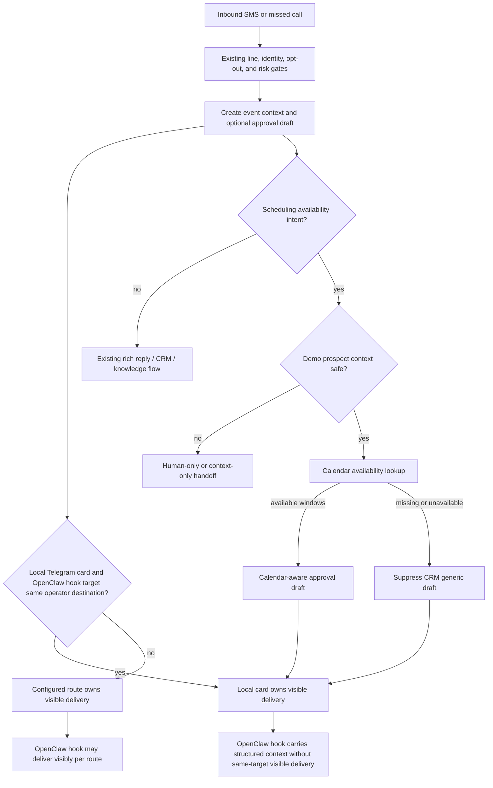

# fix: Prevent Duplicate Dialpad Inbound Operator Messages

## Summary

Fix issue #111 by giving each inbound Dialpad SMS or missed-call event exactly one operator-visible notification owner per Telegram target, then making scheduling-availability SMS messages use one canonical suggested-reply path. A high-confidence demo prospect asking for same-day availability should either get a calendar-aware approval draft or a human-only/context-only outcome, not a generic CRM-aware approval draft plus a separate downstream calendar suggestion.

---

## Debug Summary

There are two related duplication paths.

First, inbound SMS and missed-call handlers can emit two operator-visible Telegram messages for the same Dialpad event. The repo configuration can enable both OpenClaw hook delivery to Telegram and the local Dialpad Telegram card. In code, the SMS handler creates the approval draft, sends `send_sms_to_openclaw_hooks(...)`, and then sends the local `Dialpad SMS` Telegram card when `DIALPAD_SMS_TELEGRAM_NOTIFY` is enabled. The missed-call handler follows the same pattern: create the draft, call `send_to_openclaw_hooks(...)`, then send the local `Missed Call` Telegram card. `build_openclaw_hook_payload()` currently sets `deliver: True`, so the hook path is also allowed to create a visible operator message. The local Telegram card is still the richer approval owner because it carries the approval actions and exact draft context.

Second, the reported inbound SMS text, `Do you have anything today?`, currently misses the calendar-aware branch. A read-only probe showed `meeting_logistics_intent()` returns false, `classify_rich_sms_question()` returns no category, `build_rich_sms_reply()` returns an `attio_crm` draft, and `calendar_context` remains unset for the exact issue text.

The causal chain is local and then cross-surface:

- The local handler can send a visible Telegram approval card while the OpenClaw hook payload also asks the gateway to visibly deliver the same inbound event.
- `prepare_inbound_reply_event()` builds identity and inbound context without calendar context.
- `should_send_proactive_reply()` calls `build_rich_sms_reply()`.
- `meeting_logistics_intent()` only recognizes lateness, joining, reschedule, and meeting-link cases, so same-day availability language does not trigger calendar lookup.
- `build_contextual_sales_sms_reply()` only calls `lookup_sales_calendar_context()` when `_context_calendar_applicable()` is true; for SMS, that currently depends on meeting-logistics intent.
- The approval draft is persisted as CRM-aware, rendered in the Telegram card, and forwarded to OpenClaw in `autoReply`.
- A downstream OpenClaw/tool path can still interpret the original text as an availability request and produce a second suggestion.

Existing tests cover the running-late calendar path and assert hook payload shape, but they do not cover same-target visible-delivery ownership, availability wording like "anything today", or ownership between the local approval draft and downstream hook suggestion.

---

## Problem Frame

The current code has two owners for one operator job. Local Dialpad Telegram cards own approval UI, but OpenClaw hook delivery can also create a visible Telegram notification for the same SMS or call. That should be impossible by default when both routes point at the same operator target.

The scheduling-specific issue compounds the notification duplication. The code treats "I am running late" as meeting logistics but treats "Do you have anything today?" as ordinary CRM follow-up. That is the wrong boundary for a demo-request prospect: the customer is asking for scheduling availability, so a generic "I saw your demo conversation" draft is lower value and competes with the separate calendar-aware suggestion the operator actually needs.

The fix should keep the existing approval ledger as the send authority. It should not introduce autonomous sends, broad sales-copy generation, or raw calendar payloads in operator-visible metadata.

---

## Requirements

**Visible notification ownership**

- R1. A single inbound SMS or missed-call event may produce at most one operator-visible notification per Telegram target by default.
- R2. When the local Dialpad Telegram card is sent to the same target as the OpenClaw hook route, the local card owns visible delivery because it carries the approval UI.
- R3. The OpenClaw hook may still carry structured event context for routing, memory, or analysis, but it must not also request visible same-target delivery unless an explicit fanout mode is configured.
- R4. SMS and missed-call paths use the same notification-ownership policy.

**Canonical recommendation**

- R5. A single inbound SMS may produce at most one operator-facing suggested SMS text.
- R6. When a calendar-aware scheduling suggestion is available, it owns the approval draft text.
- R7. When scheduling availability is requested but availability cannot be established, the CRM-aware generic draft is suppressed or clearly demoted to non-canonical context.

**Intent and calendar behavior**

- R8. Same-day or near-term availability language from a high-confidence demo prospect is recognized separately from lateness/reschedule/link logistics.
- R9. Availability lookup remains scoped to demo-stage or demo-request prospects; it is not broad calendar scanning for every Sales SMS.
- R10. Calendar facts exposed to drafts and metadata are compact and safe: status, source, summary, and bounded candidate windows.

**Safety and integration**

- R11. All customer-facing SMS remains approval-gated through the existing SMS approval ledger.
- R12. Low-confidence or ambiguous identity must not put customer or company-specific claims into draft text.
- R13. The OpenClaw hook payload must identify the canonical recommendation owner so downstream agents do not create a second SMS suggestion for the same inbound event.

---

## Scope Boundaries

- No autonomous sending.
- No CRM mutation or deal-stage update.
- No full free/busy calendar UI.
- No raw SMS, Gmail, CRM, or calendar bodies in customer-facing draft text.
- No broad rewrite of the webhook pipeline or approval ledger.
- No removal of OpenClaw hook forwarding as a capability; the patch should change visible-delivery ownership, not delete the integration.

### Deferred to Follow-Up Work

- Richer availability ranking across more calendars or time zones.
- Live prompt/config changes in AlphaClaw if the hook ownership signal or non-visible delivery mode still needs runtime reinforcement after the repo patch.

---

## Key Technical Decisions

- **Resolve notification ownership before delivery:** A handler should decide whether the hook or local card owns visible delivery before sending either path. This keeps SMS and missed-call behavior aligned and testable.
- **Prefer the local Dialpad card for same-target approval UI:** When the local card and OpenClaw hook target the same Telegram destination, the local card owns visibility because it includes approval actions, source details, and draft metadata. The hook remains a structured context path if non-visible delivery is supported.
- **Make fanout explicit:** If an operator intentionally wants both a local card and visible OpenClaw hook delivery, that should require a clear opt-in or a different target, not happen from two defaults interacting.
- **Separate availability intent from meeting logistics:** Lateness and meeting-link messages are about an existing event; "anything today" asks for open slots. A dedicated intent avoids stretching the current matcher until it becomes vague.
- **Calendar-aware availability is canonical:** For detected availability intent, do not fall back to the CRM-aware generic draft as customer-facing text. That fallback is safe but it is the source of the competing recommendation.
- **Use the existing approval path:** The fix should feed `build_rich_sms_reply()`, `create_proactive_reply_draft()`, Telegram rendering, approval metadata, and hook payloads through the current flow.
- **Keep unavailable calendar results human-safe:** If availability cannot be verified, the operator should see context and source status, but automation should not invent available times.
- **Make hook ownership explicit:** `autoReply` is forwarded to OpenClaw, so the payload must make clear whether Dialpad already owns the canonical draft or whether downstream advisory drafting is allowed.

---

## High-Level Technical Design

---

## Implementation Units

### U1. Add inbound notification ownership resolver

**Goal:** Prevent duplicate operator-visible Telegram messages for the same inbound SMS or missed-call event when local Dialpad notification and OpenClaw hook delivery point at the same target.

**Requirements:** R1, R2, R3, R4

**Dependencies:** None

**Files:**

- `scripts/webhook_server.py`
- `tests/test_webhook_hooks.py`
- `tests/test_webhook_server.py` or the existing inbound webhook handler test module
- `README.md`
- `references/openclaw-integration.md`

**Approach:** Add a small resolver that determines visible-delivery ownership from the local notification settings and OpenClaw hook route. For same-target Telegram delivery, keep the local Dialpad card visible and make the hook non-visible/context-only if the OpenClaw hook contract supports `deliver: false`. If the hook endpoint cannot be relied on to honor non-visible delivery, suppress same-target hook forwarding for that event and stamp the reason in local logs/metadata. Preserve visible hook delivery for different targets or explicit fanout configuration.

**Execution note:** Start with failing tests that model the current duplicated configuration: hooks enabled to Telegram and local Telegram notification enabled to the same target. Do not print or snapshot real tokens or chat ids in tests.

**Patterns to follow:** `build_openclaw_hook_payload()`, `send_sms_to_openclaw_hooks()`, `send_to_openclaw_hooks()`, and the SMS/missed-call Telegram card send blocks.

**Test scenarios:**

- Given SMS hooks enabled to Telegram and local SMS Telegram notification enabled for the same target, the handler produces only one visible delivery owner and the local card owns approval UI.
- Given missed-call hooks enabled to Telegram and local missed-call Telegram notification enabled for the same target, the handler produces only one visible delivery owner.
- Given OpenClaw hooks route to a different target than the local card, both configured deliveries are allowed and labeled with distinct owners.
- Given an explicit fanout/duplicate-delivery opt-in, same-target visible hook delivery remains possible and is auditable.
- Existing hook payload tests continue to pass after updating their expectation from unconditional `deliver: True` to route-dependent delivery ownership.

**Verification:** There is no default configuration where one inbound SMS or missed call creates both a visible OpenClaw Telegram hook message and a visible local Dialpad Telegram card to the same target.

### U2. Add scheduling-availability intent and gating

**Goal:** Recognize same-day or near-term availability requests without broadening the existing meeting-logistics matcher.

**Requirements:** R7, R8, R9, R12

**Dependencies:** None

**Files:**

- `scripts/webhook_server.py`
- `tests/test_sender_enrichment.py`

**Approach:** Add a narrow availability-intent helper for phrases like "anything today", "available today", "any openings", and "do you have time". Gate customer-facing availability drafts on high-confidence owned identity plus CRM demo signal, while keeping lower-confidence matches operator-only.

**Execution note:** Start with a failing test for the exact issue text before changing the matcher.

**Patterns to follow:** `meeting_logistics_intent()`, `_crm_has_demo_signal()`, `_context_calendar_applicable()`, and the high-confidence customer-facing data rule in `docs/solutions/ungate-enrichment-customer-pii.md`.

**Test scenarios:**

- Given high-confidence demo-request context and text `Do you have anything today?`, the event is classified as scheduling availability, not generic CRM follow-up.
- Given high-confidence non-demo CRM context and the same text, no calendar availability draft is created.
- Given low or medium identity confidence with a phone-only CRM match, availability context may be operator-visible but does not produce a named or company-specific customer draft.
- Given existing running-late logistics text, the current meeting-aware path still fires unchanged.

**Verification:** The exact issue text reaches a calendar-aware or human-safe scheduling branch before CRM-aware fallback can become the canonical draft.

### U3. Extend calendar context for availability summaries

**Goal:** Provide compact availability facts for scheduling-intent drafts without exposing raw calendar payloads.

**Requirements:** R6, R9, R10, R12

**Dependencies:** U2

**Files:**

- `scripts/adapters/calendar_context.py`
- `scripts/webhook_server.py`
- `tests/test_calendar_context.py`
- `tests/test_sender_enrichment.py`
- `docs/reference/enrichment-adapters.md`

**Approach:** Extend the calendar adapter contract so scheduling availability queries can return a safe summary of candidate windows across the configured ShapeScale sales calendars. Preserve the existing scheduled-demo lookup for missed calls and meeting logistics. If the adapter is missing, times out, or cannot identify useful windows, return an unavailable/not-found status rather than a guessed draft.

**Patterns to follow:** `gog_next_event()`, `_gog_calendar_ids()`, `_gog_calendar_label()`, `lookup_sales_calendar_context()`, and the compact adapter contract in `docs/reference/enrichment-adapters.md`.

**Test scenarios:**

- Given mocked calendar events with open windows for Alex and Lilla today, availability context returns a compact usable summary with no raw event body or secret calendar id.
- Given a missing calendar command, availability context returns a not-configured/unavailable status and does not raise.
- Given no useful same-day windows, availability context returns not-found and does not produce customer-facing times.
- Given the existing scheduled-demo query shape, upcoming and recent demo tests keep passing.

**Verification:** Calendar availability facts are compact, source-labeled, and fail closed.

### U4. Make availability drafts canonical and suppress CRM fallback

**Goal:** Ensure the approval card uses the best scheduling-aware draft or no customer-facing draft, rather than competing with CRM-aware generic copy.

**Requirements:** R5, R6, R7, R11, R12

**Dependencies:** U2, U3

**Files:**

- `scripts/webhook_server.py`
- `tests/test_sender_enrichment.py`
- `tests/test_sms_approval.py`

**Approach:** Add a calendar availability rich-reply basis/category and route it through `build_rich_sms_reply()`, `build_proactive_reply_message()`, and `create_proactive_reply_draft()`. For availability-intent misses, stamp a status that prevents CRM-aware fallback from becoming the approval draft. Persist the selected basis in the existing approval metadata and fingerprint so replacement behavior tracks the actual recommendation.

**Patterns to follow:** Calendar meeting-aware handling in `build_contextual_sales_sms_reply()`, draft-mode stamping in `create_proactive_reply_draft()`, and source-status rendering in `collect_enrichment_source_statuses()`.

**Test scenarios:**

- Given the exact issue payload with usable availability context, the persisted approval draft text offers bounded times and `draftMode` is calendar-aware.
- Given the exact issue payload with calendar unavailable, no CRM-aware generic approval draft is created for that scheduling request.
- Given a previous pending CRM-aware draft for the same thread, a later calendar-aware draft replaces it rather than leaving two pending drafts.
- Given opt-out or risky text, the existing reply policy still blocks or marks risk before any availability draft is persisted.

**Verification:** There is never more than one pending approval draft for the issue thread, and its basis matches the canonical recommendation.

### U5. Prevent downstream duplicate suggestions in hook payloads

**Goal:** Make forwarded OpenClaw hook payloads respect the same single-notification and single-recommendation ownership as the Telegram approval card.

**Requirements:** R1, R2, R3, R5, R6, R7, R13

**Dependencies:** U1, U4

**Files:**

- `scripts/webhook_server.py`
- `tests/test_webhook_hooks.py`
- `tests/test_sender_enrichment.py`
- `references/openclaw-integration.md`
- `README.md`
- `SKILL.md`

**Approach:** Add compact ownership metadata to forwarded `autoReply` data and/or hook message context so downstream agents can distinguish "Dialpad already created the canonical approval draft" from "downstream advisory drafting is allowed." Include the visible-notification owner from U1 so the hook path does not try to recover a second same-target operator message. For scheduling-intent calendar misses, forward source status and human-needed context without a competing CRM draft message.

**Patterns to follow:** `build_openclaw_hook_payload()`, `build_inbound_context_brief()`, and the existing decision to keep `autoSendShadow` out of forwarded `autoReply`.

**Test scenarios:**

- A hook payload with a calendar-aware approval draft marks that recommendation as canonical and includes no second advisory suggestion field.
- A hook payload for a same-target local Telegram card marks visible delivery as local-owner/context-only rather than asking OpenClaw to post another operator message.
- A hook payload for a scheduling-intent calendar miss marks the event human-needed or context-only and does not include CRM generic draft text as canonical.
- Existing hook payload tests for first-contact context, inbound context, agent routing, and safe metadata still pass.
- Telegram card text and OpenClaw hook payload agree on draft mode and source statuses for the same event.

**Verification:** The repo emits one visible notification owner and one recommendation owner per inbound event, and downstream payloads no longer invite an independent suggested-SMS path when the approval draft already owns the response.

---

## Acceptance Examples

- AE1. Given Natalie Lindo from Embody Wellness Retreat texts `Do you have anything today?` with high-confidence demo-request context and usable same-day availability, the Telegram card shows one calendar-aware approval draft with candidate times.
- AE2. Given the same inbound SMS but calendar lookup is unavailable, the Telegram card shows source status and no CRM-aware generic approval draft.
- AE3. Given the same inbound SMS is forwarded to OpenClaw, the hook payload identifies whether Dialpad owns the canonical draft or whether the event is human-needed; it does not present a second competing SMS suggestion.
- AE4. Given an existing running-late message with a matching current demo, the existing meeting-aware draft remains approval-gated and unchanged.
- AE5. Given inbound SMS hooks and local SMS Telegram notifications are both enabled to the same Telegram target, the operator receives one visible message: the Dialpad approval card.
- AE6. Given missed-call hooks and local missed-call Telegram notifications are both enabled to the same Telegram target, the operator receives one visible message: the Dialpad missed-call card.

---

## Sources and Research

- GitHub issue: `https://github.com/kesslerio/dialpad-openclaw-skill/issues/111`
- `scripts/webhook_server.py`
- `scripts/adapters/calendar_context.py`
- `tests/test_sender_enrichment.py`
- `tests/test_webhook_hooks.py`
- `tests/test_calendar_context.py`
- `docs/brainstorms/2026-05-14-meeting-crm-aware-sales-sms-drafts-requirements.md`
- `docs/brainstorms/2026-06-23-calendar-aware-demo-context-requirements.md`
- `docs/reference/enrichment-adapters.md`
- `docs/solutions/ungate-enrichment-customer-pii.md`

---

## Risks and Mitigations

| Risk | Mitigation |
| --- | --- |
| `deliver: false` is ignored or unsupported by the OpenClaw hook endpoint | Verify the hook contract before relying on it; if uncertain, suppress same-target hook forwarding while logging structured context locally, or gate visible hook delivery behind explicit fanout. |
| A route comparison misidentifies two Telegram targets as different | Normalize chat id and topic/thread id before deciding ownership, and test missing topic, matching topic, and different-topic cases. |
| Availability matcher catches casual non-scheduling language | Gate on demo prospect context and test non-demo same wording. |
| Calendar availability implies a time is bookable when it is not | Use bounded candidate windows as operator-approved suggestions, not confirmed bookings. |
| Low-confidence CRM data leaks into customer-facing draft text | Reuse the high-confidence customer-facing data rule and keep lower-confidence facts operator-only. |
| Downstream OpenClaw still posts a second suggestion or notification | Add hook ownership metadata, avoid same-target visible hook delivery by default, and document the runtime prompt/config follow-up if live behavior still ignores it. |
| Adapter contract grows too large for a patch PR | Keep the first patch to compact same-day windows and defer richer ranking. |

---

## Documentation and Rollout Notes

- Update `README.md`, `SKILL.md`, and `references/openclaw-integration.md` to describe the single-visible-notification rule for inbound SMS/calls and the single-canonical-draft rule for scheduling availability SMS.
- Keep `docs/reference/enrichment-adapters.md` aligned with any calendar adapter contract extension.
- After merge, deploy/sync the live AlphaClaw skill copy before testing with real inbound customer messages.
- Live validation should use a controlled inbound-like payload or a non-customer number; do not approve/send a real customer SMS during smoke testing.
