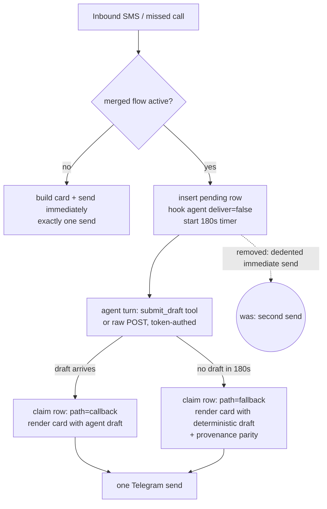

# Merged-Flow Duplicate Cards + Dead Draft Callback - Plan

**Target repos:** dialpad skill (plan home; webhook + plugin + tests) and `kesslerio/openclaw-ops` (production-config seed unit, paths prefixed `(openclaw-ops)`).

---

## Goal Capsule

Every inbound Dialpad event produces exactly one Telegram card, and the agent-draft callback works end to end for the first time — so cards carry context-aware drafts (agent-composed) instead of the generic deterministic template, with the fallback surviving as a genuine safety net rather than the 100% path.

Authority: this plan > repo conventions > implementer judgment. Stop conditions: if the tool-policy merge semantics (per-agent `alsoAllow` on top of `tools.profile`) turn out not to expose `submit_draft` on the live gateway, stop and surface rather than loosening the global profile; live-gateway config/restart steps (U6) are operator-gated.

---

## Product Contract

### Summary

Scope the webhook's immediate Telegram send to the non-merged path (single-send invariant, SMS and missed-call), repair the three stacked callback blockers (tool stripped by profile, container-loopback plugin URL, container-loopback webhook fallback URL), add context-aware draft guidance to the hook prompt, and make a dead callback pipe observable.

### Problem Frame

Diagnosed in-session (2026-07-06). The merged flow (PRs #118/#120) intends: hook the agent with `deliver=false`, wait for its draft via `/internal/draft-callback`, render one rich card; fall back to the deterministic draft after 180s. Two defects ship instead:

1. **Duplicates (SMS only):** the immediate card build + send block sits outside the SMS merged branch's `else` in `scripts/webhook_server.py`, so merged mode also sends immediately; the fallback then re-sends at +180s. Every inbound SMS posts twice (journal: paired sends 180s apart on every event). The missed-call merged branch is already correctly scoped — its immediate send lives inside the `else` — so missed-call work is regression coverage, not a code move.
2. **Dead callback → generic drafts:** `path=fallback` on 22/22 merged renders in 7 days. Three independent blockers: (a) the gateway strips `submit_draft` from agent sessions via `tools.profile: "coding"`; (b) the plugin's default `callbackUrl` is `http://127.0.0.1:8081` — container loopback — and the live plugin config carries no override (the untracked manifest's `configSchema` would even reject one: `additionalProperties: false` with no properties); (c) the webhook embeds `http://127.0.0.1:{PORT}` as the raw-HTTP fallback URL in the hook message (both the SMS and missed-call sites).

Verified environment facts the fixes rest on: the webhook binds `0.0.0.0:8081` (no bind change needed); the AlphaClaw compose already maps `host.docker.internal:host-gateway` (container→host works today); the hook agent is `niemand-work` (`hooks.allowedAgentIds`); per-agent `tools.alsoAllow` on top of the profile has a live precedent (`niemand` + `browser`); `/internal/draft-callback` enforces a per-job `X-Callback-Token` with constant-time compare (401 otherwise); `production-config-seed.mjs` repairs `openclaw.json` on every start, so durable config belongs in the seed.

### Requirements

**Single-send invariant**
- R1. In merged-flow mode the webhook performs zero immediate Telegram sends; the card is sent exactly once, by whichever of callback or fallback claims the pending row. Non-merged mode keeps exactly one immediate send. Applies to inbound SMS and missed-call flows alike.
- R2. The fallback-rendered card carries the same provenance content as the immediate card (the Attio line is present on both).

**Working callback pipeline**
- R3. The hook agent session exposes the `submit_draft` tool (per-agent allowance for `niemand-work`; the global profile is not loosened).
- R4. The plugin posts to a container-reachable callback URL: seeded `callbackUrl` config, manifest schema that accepts it, and a container-reachable default.
- R5. The webhook's embedded raw-HTTP fallback URL is env-configurable with a container-reachable default (`host.docker.internal`), at both the SMS and missed-call sites.
- R6. Callback auth is unchanged: requests without a valid per-job `X-Callback-Token` are rejected (401).

**Draft quality and observability**
- R7. The hook message instructs the agent to compose a context-aware reply from the inbound context it already receives (contact identity, Attio stage, recent thread) — e.g., referencing a booked demo and its day — in plain text, SMS-length, no markdown.
- R8. A dead callback pipe is observable: consecutive-fallback tracking with a loud warning at a threshold, and cumulative path counts in the merged-flow log line.

**Deployment**
- R9. Config durability: gateway-side settings land in `production-config-seed.mjs` (+ its test), not as live-JSON-only edits; live verification shows `path=callback` occurring and single cards on real traffic.

### Scope Boundaries

**In scope:** the fixes above; incorporating the operator's in-progress `extensions/dialpad-draft-callback/` packaging changes (src/ts `extensions` + `runtimeExtensions` split, the untracked manifest) into the same PR.

**Deferred to Follow-Up Work:** tuning the 180s timeout; richer draft context sources beyond what the webhook already gathers; a `/health`-endpoint fallback-rate metric (log-based signal suffices now); missed-call draft-quality prompt work beyond parity with the SMS wording.

**Out of scope:** redesigning the merged flow; changing the approval-button flow; loosening the global `coding` tools profile.

---

## Planning Contract

### Key Technical Decisions

- KTD1 — **Enforce the single-send invariant structurally, not with a flag.** The immediate card build + send moves inside the non-merged branch (both flows); merged mode's only senders remain the claim-based renders (`claim_pending_draft` already makes callback/fallback mutually exclusive). No `if telegram_status == "merged_flow_waiting"` guards sprinkled around shared code.
- KTD2 — **Reachability is a URL fix, not a network fix.** `host.docker.internal:8081` works today (compose `extra_hosts` present; webhook binds `0.0.0.0`). Both URL producers become configurable with that default: a webhook env var for the embedded fallback URL, and the plugin's `callbackUrl` config (manifest schema must gain the property — the current untracked manifest rejects unknown config keys).
- KTD3 — **Tool exposure is per-agent and seed-durable — with replace-not-layer semantics respected.** Agent-level `tools.alsoAllow` SHADOWS the global list (nullish-coalescing in openclaw's policy resolution, not a union), so seeding `niemand-work.tools.alsoAllow` must write the union of the global `tools.alsoAllow` entries (currently browser + tavily) plus `submit_draft` — seeding `[submit_draft]` alone would strip the work lane's existing tools. Done via `production-config-seed.mjs` alongside `plugins.entries["dialpad-draft-callback"].config.callbackUrl`; live-JSON edits alone are wiped by restart repair.
- KTD4 — **Security posture unchanged.** The endpoint was already LAN-exposed (`0.0.0.0` bind); the per-job token with constant-time compare stays mandatory and gets an explicit regression test (no token / wrong token → 401, no render).
- KTD5 — **Draft quality is prompt-level.** Extend `format_hook_message`'s callback instructions with drafting guidance grounded in the context block the agent already receives; no new data sources.
- KTD6 — **Health signal is log-based.** A consecutive-fallback counter (reset on any callback) warns loudly at ≥3 and the `[merged-flow]` line carries cumulative callback/fallback counts — enough to make a dead pipe visible in a day, not a week, without new infrastructure.

### High-Level Technical Design

Callback reachability (all three URL surfaces converge on one value): plugin `callbackUrl` (seeded config) = webhook `DIALPAD_DRAFT_CALLBACK_URL` env default = `http://host.docker.internal:8081/internal/draft-callback`, reachable via the compose `host-gateway` mapping.

---

## Implementation Units

### U1. Single-send invariant in the webhook

**Repo:** dialpad skill
**Goal:** Merged mode never sends immediately; every event yields exactly one card (R1, R2).
**Dependencies:** none.
**Files:** `scripts/webhook_server.py` (SMS merged branch and its dedented card block; the shared merged render for fallback provenance; startup orphan sweep), `tests/test_webhook_merged_flow.py` (new — no existing test touches the merged flow or the pending-draft store, so this file builds its own fixtures; borrow the `object.__new__(DialpadWebhookHandler)` harness pattern from `tests/test_webhook_server.py`).
**Approach:** Per KTD1: move the immediate card build + `send_to_telegram` under the non-merged branch in the SMS flow (the missed-call flow already has this structure — verify and add regression coverage only); add `_build_draft_provenance` output to the merged render so fallback/callback cards match the immediate card's provenance content. Close the orphaned-row gap the removal creates: the fallback timer is in-memory while the pending row is in sqlite, so on webhook startup claim-and-fallback-render any unclaimed pending rows older than the draft timeout (a restart inside the 180s window must still yield exactly one card, not zero), and arm the timer before — or in a `finally` around — the hook send so a mid-setup exception cannot strand a row.
**Patterns to follow:** the existing merged render (`_render_merged_card`-equivalent around the `[merged-flow]` print) and the immediate card builder — the fix is scoping, not new rendering.
**Test scenarios:**
- Merged mode, callback arrives: zero immediate sends; exactly one Telegram send via the callback render; status stays `merged_flow_waiting` at the webhook-response boundary.
- Merged mode, no callback: zero immediate sends; exactly one send when the fallback timer fires (use a shortened timeout injection for the test); the rendered card includes the provenance line when inbound context carries Attio data.
- Merged mode, callback AND timer race: exactly one send total (claim exclusivity regression).
- Orphaned row: a pending row older than the timeout with no live timer (simulated restart) is claimed and rendered exactly once at webhook startup; a fresh row (within the window) is left for its timer.
- Non-merged mode (merged flow disabled/ineligible): exactly one immediate send, unchanged content.
- Missed-call event through the merged path: same zero-immediate/one-send assertions.
- Token auth regression (R6): a callback POST with no token or a wrong token → 401 and no card render; the pending row stays claimable by the fallback.
**Verification:** new tests green; full `pytest tests` green.

### U2. Container-reachable callback URLs in the webhook

**Repo:** dialpad skill
**Goal:** The hook message's raw-HTTP fallback URL is reachable from the container (R5).
**Dependencies:** none.
**Files:** `scripts/webhook_server.py` (both callback-URL construction sites — SMS and missed-call), `tests/test_webhook_merged_flow.py`, `README.md`/`SKILL.md` (env var doc).
**Approach:** Per KTD2: one module-level env-resolved constant (e.g. `DIALPAD_DRAFT_CALLBACK_URL`) defaulting to the `host.docker.internal:8081` callback path; both sites use it.
**Test scenarios:** default embeds `host.docker.internal` in the hook message; env override is respected at both sites.
**Verification:** tests green.

### U3. Plugin packaging + configurable callbackUrl

**Repo:** dialpad skill
**Goal:** The plugin accepts and uses a configured callback URL; the operator's in-progress packaging changes land (R4).
**Dependencies:** none.
**Files:** `extensions/dialpad-draft-callback/package.json` (incorporate the existing `extensions`/`runtimeExtensions` split), `extensions/dialpad-draft-callback/openclaw.plugin.json` (commit it; `configSchema` gains the `callbackUrl` string property so config is not rejected), `extensions/dialpad-draft-callback/src/index.ts` (default URL becomes the container-reachable one), plus the built `dist/` per the repo's plugin build convention.
**Approach:** Keep the operator's WIP intent; the behavioral changes are the schema property + default URL. `dist/` is gitignored repo-wide and stays untracked — building it is an explicit deploy step (U6), not a commit; `package-lock.json` gets committed. Note the OpenClaw constraint from host docs: live-installed plugin files must be real files, not symlinks.
**Test scenarios:** `Test expectation: none — packaging/config; verified by gateway startup accepting the config (U6 smoke) and the seeded config round-tripping.`
**Verification:** gateway loads the plugin with `callbackUrl` config without schema errors.

### U4. Seed-durable gateway config (tool allowance + plugin config)

**Repo:** openclaw-ops
**Goal:** `submit_draft` reaches the `niemand-work` hook agent and the plugin gets its `callbackUrl`, durably across restart repair (R3, R4, R9).
**Dependencies:** U3 (schema accepts the config key).
**Files:** `(openclaw-ops) deploy/alphaclaw/production-config-seed.mjs`, `(openclaw-ops) test/alphaclaw-production-config.test.ts`.
**Approach:** Per KTD3: seed `agents.list[niemand-work].tools.alsoAllow` as the union of the global `tools.alsoAllow` list plus `submit_draft` (agent-level alsoAllow shadows the global list — replace-not-layer), and `plugins.entries["dialpad-draft-callback"].config.callbackUrl` to the shared default. Follow the seed's existing plugin-entry normalization pattern (the Voyage entry) and the repo rule that durable config changes patch the seed + its test.
**Test scenarios:** seed test asserts both keys after a repair pass over (a) an empty config, (b) a config carrying pre-existing agent-level `alsoAllow` entries (preservation, no duplicates), and (c) the shadowing case: after seeding, `niemand-work`'s effective `alsoAllow` still contains every global entry (browser, tavily_search, tavily_extract) alongside `submit_draft`.
**Verification:** `bun test test/alphaclaw-production-config.test.ts` green; drift-gate green.

### U5. Draft-quality prompt guidance + fallback-rate signal

**Repo:** dialpad skill
**Goal:** The agent is told how to write a good draft, and a dead callback pipe is visible within a day (R7, R8).
**Dependencies:** U1 (log-line shape).
**Files:** `scripts/webhook_server.py` (`format_hook_message` callback-instruction block; the `[merged-flow]` logging site), `tests/test_webhook_hooks.py` (prompt content), `tests/test_webhook_merged_flow.py` (counter behavior).
**Approach:** Per KTD5/KTD6. Prompt: compose a specific, warm, plain-text SMS reply using the provided inbound context — reference the live deal state when present (e.g., a booked demo and its day), match the sender's tone, one or two sentences, no markdown/links unless asked, and submit via `submit_draft` (raw POST as fallback). Signal semantics (pinned): increment only on a *successful fallback claim* (inside the timer callback after the claim succeeds — the timer also fires when the callback already won, and that no-op must not count); reset on any token-authenticated callback including the late `callback_lost` case (the pipe is alive, just slow); warning log at ≥3 consecutive fallbacks naming the likely blockers; cumulative `callback=N fallback=M` counts on the `[merged-flow]` line. The counters are per-process — restarts reset them; acceptable and stated.
**Test scenarios:** hook message contains the drafting-guidance block and the callback tool instructions; three successful fallback claims emit the warning once at the threshold; a callback (including a late `callback_lost` one) resets the counter; callback-wins-then-timer-fires does NOT increment; the log line carries both counters.
**Verification:** tests green; full suite green.

### U6. Deploy and live proof

**Repo:** both (operator-gated)
**Goal:** The pipeline works on live traffic: single cards, `path=callback` observed, context-aware draft text (R9).
**Dependencies:** U1-U5.
**Files:** none new — service restarts and live checks.
**Approach:** Restart `dialpad-webhook.service`. Plugin install is NOT skill-synced: the gateway loads its own copy at `.openclaw/extensions/dialpad-draft-callback/` under the AlphaClaw state root, so build the plugin (`dist/`) and copy manifest + package.json + dist as real files into that directory before or together with the U4 seed landing — otherwise the stale empty schema rejects the seeded `callbackUrl` at startup. Then restart the gateway (`alphaclaw.service` restart applies the seed) and confirm (a) the tool-policy log no longer strips `submit_draft` for the hook session and (b) the plugin's tool schema actually reloaded (a stale record in `plugins/installs.json` can pin the old version — verify, don't assume).
**Execution note:** Smoke-first. Do not run isolated-PATH tests on this host.
**Test scenarios (live proofs):**
- A real inbound SMS produces exactly one Telegram card.
- The journal shows `path=callback` for that event, and the card's draft references conversation context (not the deterministic template).
- Token regression: a callback POST without the token gets 401.
- Fallback still works: with the gateway agent unavailable (or a forced timeout), one card via `path=fallback`, provenance intact.
**Verification:** all four proofs captured; no duplicate cards over the following day of traffic.

---

## Verification Contract

- Dialpad skill: `pytest` full suite green, including the new merged-flow tests.
- openclaw-ops: `bun test test/alphaclaw-production-config.test.ts`, `bun run check`, `bun run drift-gate` — all green.
- Live gates (U6): the four live proofs; `path=callback` present in the journal; zero duplicate cards observed post-deploy.
- PR gate: `/thermo-nuclear-code-quality-review` on each branch before opening PRs.

---

## Definition of Done

- R1-R8 proven by the unit tests listed per unit (R6 by U1's token-auth regression test); R9's config-durability clause proven by U4's seed test, its live-verification clause by the U6 live proofs.
- Both repos' suites green; the operator's plugin WIP is committed — nothing uncommitted in `extensions/dialpad-draft-callback/` except gitignored build artifacts (`dist/`, `node_modules/`).
- Docs updated for the new env var and the plugin config key.
- No abandoned experimental code in the diffs.

---

## Risks & Dependencies

- **Tool-policy merge semantics:** per-agent `alsoAllow` layering over `tools.profile` has a live precedent (`niemand`+`browser`), but that proves built-in tools, not plugin-provided ones — U4 can pass its seed test and still strip `submit_draft` live; U6's tool-policy log check is the real gate, and if `alsoAllow` cannot reach plugin tools, stop and surface (Goal Capsule) rather than loosening the profile globally. Note also that the allowance exposes `submit_draft` to all `niemand-work` sessions, not only hook sessions — misuse is inert (per-job token, 401/404) but stray attempts may appear in logs.
- **Prompt-injection trust boundary (named, load-bearing):** inbound SMS text is untrusted and, with this plan, reaches an agent holding a tool privilege (`submit_draft`) in the same hook message as the tool instructions. The human tap-to-approve gate is the sole mitigation for injected or manipulative draft content — any future change that weakens or bypasses that gate (auto-send, batch approval) must re-open this review. Server-side draft validation (length cap, markdown/link stripping) in the callback handler is cheap defense-in-depth; include it in U5 if time permits, defer otherwise.
- **Agent behavior variance:** with the pipe open, draft quality depends on the hook agent actually using the context; the U5 prompt is the lever, and the fallback template remains the floor. If live drafts disappoint, iterate on the prompt — not in this plan's scope to add data sources.
- **Two-repo sequencing:** U1/U2/U3/U5 land in the dialpad skill repo; only U4 lands in openclaw-ops. The webhook fixes (U1/U2/U5) are safe to deploy alone — duplicates stop immediately; cards simply stay fallback-rendered until the gateway side lands. U3 (schema accepts `callbackUrl`) should land before U4's seed references the key. Full benefit needs both repos deployed.
- **Restart repair:** any hand-edit of live `openclaw.json` without the U4 seed change evaporates on the next restart — the seed unit is not optional polish.

---

## Sources & Research

- In-session ce-debug diagnosis (2026-07-06): dedented immediate-send block after the merged branch; 22/22 `path=fallback` over 7 days; tool-policy strip log lines; `hooks.allowedAgentIds: ["niemand-work"]`; hook agent turn confirmed running (`hook agent run completed without announcement`).
- Verified environment facts: webhook `ThreadingHTTPServer(("0.0.0.0", PORT))`; compose `extra_hosts: host.docker.internal:host-gateway` in `(openclaw-ops) deploy/alphaclaw/docker-compose.yml`; per-job token check with `hmac.compare_digest` + 401 in the draft-callback handler; seed plugin-entry pattern in `(openclaw-ops) deploy/alphaclaw/production-config-seed.mjs` (Voyage entry).
- Prior work: dialpad PRs #118 (merged flow + fallback timer), #120 (missed-call drafts + callback tool), #121 (path fixes); plan docs `docs/plans/2026-06-24-001-feat-agent-draft-into-local-card-plan.md` and `docs/plans/2026-06-25-001-feat-context-aware-missed-call-drafts-plan.md` (original merged-flow intent).
- Operator WIP incorporated: `extensions/dialpad-draft-callback/` package.json split + untracked `openclaw.plugin.json` (whose empty `configSchema` currently rejects `callbackUrl` — fixed by U3).
