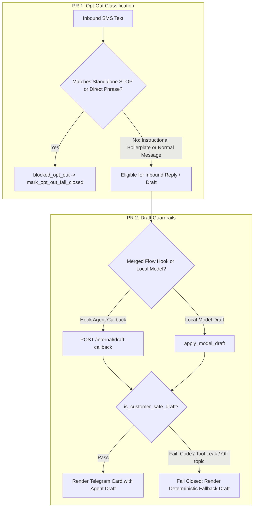

# Fix Closed-Office Opt-Out Misclassification + Draft Cross-Context Guardrails - Plan

**Target repo:** dialpad-openclaw-skill (webhook server, draft model, approval pipeline, test suites)

---

## Goal Capsule

Inbound Dialpad triage accurately distinguishes business compliance/closed-office autoresponder footers from customer opt-outs, and inbound SMS draft generation strictly rejects off-topic cross-context content, code blocks, or foreign tool text before approval cards are created—failing closed to deterministic ShapeScale fallback replies.

Authority: this plan > repo conventions > implementer judgment. Stop conditions: if distinguishing autoresponder boilerplate from opt-outs creates risk of unhandled regulatory opt-out evasion, pause and confirm keyword rules; sequential PRs are to be authored and reviewed independently.

---

## Product Contract

### Summary

Deliver two sequential P1 fixes for Dialpad inbound triage:
1. **PR 1 (Issue #139)**: Refine inbound opt-out pattern classification so instructional boilerplate (e.g. "Reply STOP to unsubscribe" in office-closed auto-replies) is not classified as an opt-out, while standalone STOP keywords and explicit opt-out requests remain strict opt-outs.
2. **PR 2 (Issue #138)**: Introduce comprehensive customer-safety and cross-context guardrails in both local model drafting and the merged-flow `/internal/draft-callback` handler to reject code blocks, tool/plugin leakage (e.g. YOURLS-MCP), and off-topic text, falling back to deterministic ShapeScale sales drafts.

### Problem Frame

Two P1 reliability defects affect the Dialpad inbound SMS pipeline:
1. **Issue #139 (Closed-Office Opt-Out False Positives)**: When a customer or prospect's business system emits a standard after-hours or closed-office auto-reply containing compliance instructions (e.g., *"Our office is closed until Monday. Reply STOP to unsubscribe."*), the classifier triggers on the substring `unsubscribe`. This marks the sender with `blocked_opt_out`, records a permanent opt-out in the database, and blocks future automated outreach to legitimate prospects.
2. **Issue #138 (Cross-Context / Code Output in SMS Drafts)**: Inbound SMS draft generation (via local model execution or merged-flow agent callback) can occasionally emit irrelevant context from other tools running in the same agent runtime (e.g. YOURLS-MCP plugin detection messages or raw JavaScript snippets). The draft pipeline lacked code/tool sanitization at the callback ingestion boundary and in model draft validation, allowing off-topic content into operator Telegram approval cards.

### Requirements

#### Opt-Out Classification (PR 1 / Issue #139)

- R1. A standalone keyword matching standard carrier opt-out commands (`STOP`, `STOPALL`, `UNSUBSCRIBE`, `CANCEL`, `END`, `QUIT`) with optional whitespace and trailing punctuation must always classify as `blocked_opt_out`.
- R2. Explicit first-person opt-out phrases (e.g., `stop texting me`, `please unsubscribe me`, `remove me from your list`, `do not contact me`, `leave me alone`) must always classify as `blocked_opt_out`.
- R3. Instructional compliance boilerplate embedded in multi-sentence messages or business autoresponders (e.g., `Reply STOP to unsubscribe`, `Text STOP to opt out`, `To unsubscribe reply STOP`) must not classify as an opt-out when the sender did not request removal.
- R4. False-positive autoresponders must not trigger `mark_opt_out_fail_closed` or persist an opt-out block against the customer's phone number.

#### Draft Guardrails & Rejection (PR 2 / Issue #138)

- R5. All SMS reply drafts (from both `draft_model.py` and `/internal/draft-callback`) must pass a unified customer-safety validation filter before persistence or card rendering.
- R6. Drafts containing programming code syntax, markdown fenced code blocks, script tags, variable declarations, or console logging statements must be rejected.
- R7. Drafts containing references to internal tools, MCP servers, plugins, system prompts, or foreign projects (e.g., `YOURLS`, `MCP`, `plugin`, `dialpad-draft-callback`) must be rejected.
- R8. When draft validation fails on `/internal/draft-callback` or `draft_model.py`, the system must fail closed to the deterministic fallback draft (`path="callback_unsafe_rejected"` or `modelDraft.status="unsafe_output"`), ensuring operators always receive a safe, valid ShapeScale reply card.
- R9. The hook message prompt in `format_hook_message` must explicitly instruct the agent to output only customer-facing plain text without code, tool names, or markdown.

### Scope Boundaries

- **In Scope:**
  - Regex and classification logic in `scripts/webhook_server.py`.
  - Draft validation and negative patterns in `scripts/draft_model.py` and `scripts/webhook_server.py`.
  - Prompt guidance hardening in `format_hook_message`.
  - Comprehensive unit and integration regression test suites in `tests/`.
- **Deferred to Follow-Up Work:**
  - Semantic NLP-based classifier models for autoresponders.
  - Adding new CRM context providers beyond existing Attio / Google Calendar fields.
- **Out of Scope:**
  - Modifying the Telegram bot UI or approval button callback protocol.
  - Changes to live OpenClaw container infrastructure.

---

## Planning Contract

### Key Technical Decisions

- KTD1. **Structural separation of instructional boilerplate vs direct opt-out intent.** Refactor `OPT_OUT_PATTERNS` in `scripts/webhook_server.py` to separate exact standalone keywords (`^\s*(stop|...)\s*$`) from direct action phrases (`stop texting`, `unsubscribe me`). Strip out or ignore standard compliance instructional phrases (`reply stop to unsubscribe`) prior to keyword evaluation when the surrounding context is an auto-response.
- KTD2. **Shared customer-safe draft validation validator.** Extract or standardize a reusable `is_customer_safe_draft(text)` validator used by both `scripts/draft_model.py` and `scripts/webhook_server.py` (`handle_draft_callback`). This centralizes checks for code blocks, syntax identifiers, tool/plugin names, and length constraints.
- KTD3. **Fail-closed fallback on callback rejection.** When `/internal/draft-callback` receives an invalid or unsafe draft, it logs a warning, claims the pending row with path `callback_unsafe_rejected`, and renders the card using `claimed.get("fallback_draft")` so operator workflow is uninterrupted.
- KTD4. **Prompt defense-in-depth.** Update `format_hook_message` prompt guidance to add explicit negative constraints against code, tool tokens, and markdown.
- KTD5. **Sequential PR structure.** Deliver the work in two independent PRs to minimize review surface and allow immediate deployment of the opt-out fix (PR 1) followed by draft sanitization (PR 2).

### High-Level Technical Design



---

## Implementation Units

### U1. Distinguish Closed-Office & Compliance Boilerplate from Customer Opt-Outs (PR 1 / Issue #139)

- **Goal:** Prevent false-positive opt-out classification on business autoresponders containing compliance footers while strictly enforcing genuine opt-outs.
- **Requirements:** R1, R2, R3, R4.
- **Dependencies:** None.
- **Files:**
  - `scripts/webhook_server.py`
  - `tests/test_webhook_server.py`
  - `tests/test_sender_enrichment.py`
- **Approach:**
  1. Refactor `OPT_OUT_PATTERNS` in `scripts/webhook_server.py`:
     - Keep standalone commands strict: `r"^\s*(stop|stopall|unsubscribe|cancel|end|quit)\s*[.!]?\s*$"`
     - Replace generic `\bunsubscribe\b` with explicit direct requests: `r"\b(please\s+)?(unsubscribe\s+me|remove\s+me|take\s+me\s+off(\s+your\s+list)?)\b"`, `r"\b(do not|don't|please don't)\s+(contact|text|message|call|reach out to)\s+me\b"`.
     - Add explicit handling/filtering to ensure instructional patterns such as `\b(?:reply|text)\s+stop\s+to\s+(?:unsubscribe|opt\s*out)\b` and `\bto\s+(?:unsubscribe|opt\s*out)[,\s]+(?:reply|text)\s+stop\b` are treated as boilerplate rather than direct sender requests.
  2. Verify that closed-office messages (e.g. *"Our office is closed until 9am Monday. Reply STOP to unsubscribe."*) return `state: "normal"` / `eligible`.
  3. Ensure no opt-out record is created in SQLite when boilerplate is encountered.
- **Test Scenarios:**
  - *Standalone Opt-Outs:* Inbound message with `"STOP"`, `"stop."`, `"UNSUBSCRIBE"`, `"Cancel"` classifies as `blocked_opt_out` and triggers `mark_opt_out_fail_closed`.
  - *Direct Phrases:* `"Please unsubscribe me"`, `"Stop texting me"`, `"Do not contact me"` classify as `blocked_opt_out`.
  - *Closed-Office Autoresponder with Footer:* `"Thank you for contacting XYZ Dental. Our office is closed for Labor Day. We will reopen Tuesday. Reply STOP to unsubscribe."` classifies as `normal` (not `blocked_opt_out`).
  - *After-Hours Message:* `"We have received your text but are currently out of the office. Text STOP to opt out."` classifies as `normal`.
  - *Ambiguous Message:* Inbound text that is neither an explicit opt-out nor eligible for auto-reply routes to standard human review without persisting opt-out.
- **Verification:**
  - `pytest tests/test_webhook_server.py tests/test_sender_enrichment.py -q`

---

### U2. Reject Off-Topic Cross-Context Output and Code in SMS Drafts (PR 2 / Issue #138)

- **Goal:** Prevent code blocks, tool diagnostic leaks, and foreign project content from appearing in SMS draft approval cards.
- **Requirements:** R5, R6, R7, R8, R9.
- **Dependencies:** U1 (for clean sequential branch base).
- **Files:**
  - `scripts/draft_model.py`
  - `scripts/webhook_server.py`
  - `tests/test_webhook_merged_flow.py`
  - `tests/test_webhook_hooks.py`
- **Approach:**
  1. Define unified draft validation rules in `scripts/draft_model.py` / `scripts/webhook_server.py`:
     - Reject code syntax: markdown code fences (```), JS/TS constructs (`const `, `let `, `var `, `function(`, `=>`, `console.log`, `import `, `<script>`), Python code (`def `, `class `, `import `).
     - Reject tool/MCP/plugin chatter: `YOURLS`, `MCP`, `plugin-detection`, `submit_draft`, `dialpad-draft-callback`, `system prompt`, `OpenClaw`.
     - Reject URLs not matching approved booking link (`https://bysha.pe/book-demo`).
  2. Integrate draft validation into `scripts/webhook_server.py`'s `handle_draft_callback`:
     - Before accepting and rendering a callback draft, validate it with the customer safety rules.
     - If rejected, log warning, record path as `callback_unsafe_rejected`, and render the card with `claimed.get("fallback_draft")`.
  3. Update `format_hook_message` in `scripts/webhook_server.py`:
     - Add explicit negative guidance: *"Output must be a clean customer-facing SMS reply. Never include code, tool references, plugin output, markdown formatting, or internal diagnostics."*
- **Test Scenarios:**
  - *Safe Callback Draft:* Agent submits `"Hi Alex, we can definitely help with 3D body scanning. Are you free for a quick demo tomorrow?"` -> accepted and rendered in card.
  - *Code/Tool Leak Callback Rejection:* Agent submits draft starting with `"YOURLS-MCP plugin detected. const result = await fetch(...);"` -> rejected, falls back to deterministic fallback draft; status recorded as `callback_unsafe_rejected`.
  - *Markdown Code Block Draft:* Agent submits draft containing ```javascript console.log(1)``` -> rejected and falls back.
  - *Unapproved URL in Draft:* Draft containing unapproved link -> rejected.
  - *Model Draft Unsafe Output:* `apply_model_draft` with code output marks `status="unsafe_output"` and keeps fallback.
  - *Prompt Guidance:* `format_hook_message` includes negative drafting instructions.
- **Verification:**
  - `pytest tests/test_webhook_merged_flow.py tests/test_webhook_hooks.py tests/test_webhook_server.py -q`

---

## Verification Contract

| Test Suite | Scope | Target Command |
|---|---|---|
| Opt-Out Classification & Enrichment | Verifies U1 boilerplate vs opt-out distinction | `pytest tests/test_sender_enrichment.py tests/test_webhook_server.py -k opt_out` |
| Merged Flow & Draft Callback | Verifies U2 draft safety, callback rejection & fallback | `pytest tests/test_webhook_merged_flow.py tests/test_webhook_hooks.py` |
| Full Regressions Suite | Verifies zero regressions across the skill | `pytest tests/ -q` |

---

## Definition of Done

1. All acceptance criteria for Issue #139 are met:
   - Closed-office message with "Reply STOP to unsubscribe" is not classified as an opt-out.
   - Standalone "STOP" and explicit opt-out phrases remain strict opt-outs.
   - No improper opt-out state persistence on autoresponders.
2. All acceptance criteria for Issue #138 are met:
   - Output containing code, plugin names, or foreign tool text is rejected before Telegram card creation.
   - Callback and model draft pipelines fail closed to deterministic ShapeScale drafts.
   - Hook message instructions enforce plain-text customer reply constraints.
3. All unit and integration tests pass without regression.
4. Changes split cleanly into two PRs with respective issue links.

---

## Sources & Research

- GitHub Issues: #139 (closed-office autoresponders), #138 (cross-context draft output), related #122 (pricing inquiry drafts).
- Existing Implementations:
  - Opt-out patterns: `scripts/webhook_server.py:291-297`, `classify_sms_reply_policy:846-867`.
  - Merged flow callback: `scripts/webhook_server.py:6575-6630`, `_render_merged_card`.
  - Model draft filter: `scripts/draft_model.py:20-49`, `_customer_safe_text:177-184`, `_safe_message:203-228`.
