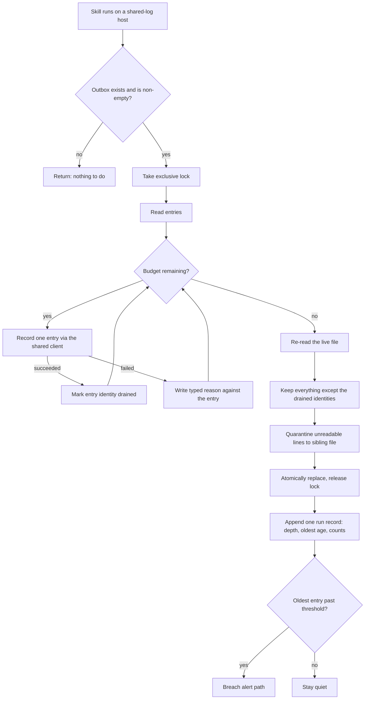
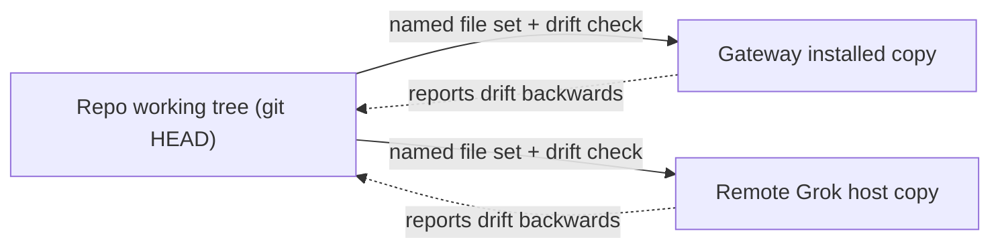

# Dialpad interaction-log outbox: self-draining, diagnosable, and observable - Plan

**Target repo:** `dialpad-openclaw-skill`. Two runtime copies of this skill live outside the repo on other filesystems; they are named as runtime surfaces, not repo paths.

---

## Goal Capsule

- **Objective:** Someone checking a customer's SMS thread from either machine can trust it is complete, and an interaction that failed to reach the shared log records itself and clears itself without a human noticing first.
- **Means:** A budgeted drain that runs device-side when the skill runs, plus evidence derived from the outbox file itself (KTD1, KTD4).
- **Authority:** Requirements govern product behavior; KTDs govern mechanism. The repo working tree is the only source of truth for code; the two runtime copies are deployments, never edit targets.
- **Execution profile:** Code. Standard depth. Test-bearing units only.
- **Stop conditions:** Stop if a drain change would need to re-send an SMS or re-place a call to pass its tests — that violates the record-only contract. Stop if the delivery step would require a recursive copy onto a runtime copy (KTD7).
- **Tail ownership:** Merging follows the repo PR review policy — wait for the Codex review, address findings, or proceed after 10 minutes with no findings.

---

## Product Contract

### Summary

The outbox that holds Dialpad interaction observations which failed to reach the shared log has no drain trigger on the one host that needs one, no recorded reason for why anything is waiting, and no depth signal. This plan makes the drain run itself under an explicit time and entry budget, records a typed reason on every queued and failed entry, quarantines unreadable lines, surfaces backlog depth and age, and carries the fix to both drifted runtime copies as a reviewed file set.

It does not change what gets recorded, how identity and merge work, or when a message is sent.

### Problem Frame

On 2026-09-17 the outbox on the remote Grok host held 18 observations spanning 2026-09-14 to 2026-09-16. A manual drain delivered all 18, which proves the transport and the merge both work — and proves nothing had ever run the drain. That host has no scheduler at all: `systemctl` and `crontab` are absent from the image, so `replay_outbox()` only runs when an agent happens to invoke it.

The queueing itself had a separate cause that is already fixed. Until PR #153, a shared-log client with no `DIALPAD_LOG_TOKEN` in its process environment got no auth and the POST was rejected. Queueing stopped one minute before that PR merged, and an authenticated request now succeeds on that host with the token deliberately stripped from the environment — `log_api_client._load_env_file()` resolves it from `~/.config/dialpad.env`. What PR #153 did not do is drain what had already accumulated.

Two facts make this more than a missing cron entry. `enqueue_observation()` persists only `queued_at` and the observation; the caller's `memory_error` is a class name returned to a caller that discards it, so a three-day-old backlog carries no diagnosis. And the drain is unsafe as an automatic action: `_read_entries()` reads the whole file and `_rewrite()` replaces it, so an observation appended by a concurrent send between those two points is silently deleted. Draining at send time widens exactly that window.

No customer message was lost. Every one of the 18 rows already existed in the shared database, written within about two seconds of its message timestamp by the Dialpad webhook. The backlog delayed provenance and delivery-result fields, nothing more — which is precisely why an unmonitored queue looked healthy.

### Requirements

**Drain execution**

- R1. The outbox drains itself when the skill is used on a host configured for the shared log, with no scheduler, wrapper, or human step.
- R2. A drain never delays a confirmed outbound send beyond its stated budget, and never runs before the send receipt has been emitted.
- R3. An observation appended by a concurrent send while a drain is in progress is still present afterwards.
- R4. A line that cannot be parsed or carries no observation object is removed from the active outbox and kept somewhere inspectable, so the active file can reach empty.
- R5. Drain and enqueue resolve the outbox location and the log destination through the same code path, so a drain can never reconcile an empty file in the wrong place.

**Diagnosability**

- R6. Every queued entry carries a machine-readable reason, and every failed replay attempt records one against that entry rather than discarding it.
- R7. Transport failures are distinguished from observations rejected on their own content, and neither one caps the other.

**Operator visibility**

- R8. Backlog depth and the age of the oldest entry are answerable on demand from the outbox and the drain's own run records, without a second index to keep correct.
- R9. An entry older than a configured threshold produces one operator alert, cleared when the backlog clears. A healthy run stays silent.
- R10. Each drain run record carries its own timestamp, so staleness is computable by anything that has a clock, and the idle-host blind spot is written down rather than reported as health.

**Delivery**

- R11. The fix reaches each drifted runtime copy as an explicitly named, diff-reviewed file set, and the drift between a runtime copy and the repo is answerable after applying it.
- R12. The documented manual-replay procedure is updated wherever it is currently stated.

### Key Decisions

- **Drain trigger is device-side, not centrally pulled.** Governs R1, R2. Chosen against having the existing ten-minute job on this host pull the remote queue over ssh: that repo has no ssh-based job today, so the pull would invent a cross-host idiom and add ssh reachability as a new production dependency for a text file.
- **The merge machinery is treated as done.** Governs R3, R6. `interaction_log.py` already does provider-id-first identity, a constrained fingerprint fallback, a `body_known` gate, and a source union, and the live 18-entry replay confirmed the merge. The work is testing it, not building it.
- **The Grok host stays without new authority.** Governs R11. Nothing here gives the scheduler-less host a scheduled responsibility or a new credential.

### Success Criteria

- On a host with no scheduler, a backlog older than the threshold is visible without logging in, and the drain that clears it was not started by a human.
- A stale outbox can be diagnosed from the file alone, without reproducing the outage.
- After this change, `remaining` can reach zero. Today poison lines make that unreachable.
- Applying the fix leaves a checkable answer to "is the running copy actually current".

### Key Flows

- F1. Deferred drain at send time.
  - **Trigger:** `bin/send_sms.py` completes a Dialpad send on a host configured for the shared log.
  - **Steps:** Record the observation → emit the send receipt → run a bounded drain only if an outbox exists and has entries → report the drain in the run's own record.
  - **Outcome:** The send receipt is unchanged and un-delayed; the queue shrinks by what the budget allowed.
  - **Covers:** R1, R2, R6.
- F2. Breach alert.
  - **Trigger:** A drain run sees an entry older than the threshold.
  - **Steps:** Write the alert marker as undelivered → send → mark delivered only on a channel-confirmed result → clear the marker once the backlog is empty.
  - **Outcome:** One alert per breach, not one per run.
  - **Covers:** R9, R10.

### Acceptance Examples

- AE1. `Covers R3.` A send appends an observation after the drain has read the file but before it compacts. The appended observation is still queued afterwards and is not reported as delivered.
- AE2. `Covers R4, R8.` One unparseable line and one valid entry sit in the file. The drain quarantines the bad line, records the valid one, and the active file is gone.
- AE3. `Covers R7.` The log host is unreachable. Every attempt is recorded as a transport failure and the entries keep their original queue reason; nothing is dropped.
- AE4. `Covers R2.` The log host blackholes connections until the budget expires. The send receipt is already out, and the run finishes within the budget plus one in-flight request.
- AE5. `Covers R9.` Two consecutive drains both see the same over-threshold entry. One alert is sent.

### Scope Boundaries

**Deferred to Follow-Up Work**

- Reconciling the obsolete `dialpad-tunnel.service` unit file with the cloudflared processes that actually front the webhook. The live ingress is the named tunnel, and the coverage job already probes the right unit; the stale unit file is misleading, not load-bearing.
- A scheduled trigger for the drain run from this host over ssh, which would close the idle-host blind spot at the cost the drain-trigger decision rejected.
- Registering the drain's run record with the fleet's lane-vitality canary once that surface exists.
- Giving the Grok host a canonical name in the fleet vocabulary. It is used as a host name in `README.md` and in `scripts/log_outbox.py` but appears in neither `CONCEPTS.md` nor the server-family reference, which is why "which machine" is hard to answer in writing.

**Outside this product's identity**

- Anything that resends a customer message or re-places a call. The outbox is record-only by contract, and the fleet invariant "never replay user-visible output" is the reason.

### Dependencies

- PR #152 (live numbers scrubbed from public examples) and PR #153 (auto-load `dialpad.env` and shared-log auth fallback) are both merged; this plan assumes both.
- Repo PR review policy: Codex review on PR open, address findings or proceed after 10 minutes.

---

## Planning Contract

### Key Technical Decisions

- KTD1. **Drain on use, under a two-part budget.** A per-run entry cap and a wall-clock budget, enforced as one combined limit. The client's per-request timeout is 5 seconds with no retry budget, so an unbudgeted drain of 18 entries against a blackholing host would add roughly 90 seconds to a user-visible send. The budget is the reason a drain may run on a hot path at all. (session-settled: user-directed — chosen over central ssh pull: the automations repo has no ssh job idiom, and a file read is a poor reason to add one.)
- KTD2. **The drain is a trigger, never a second configurator.** It calls the same `resolve_outbox_path()` and the same `log_api_client` configuration path as the enqueuer and resolves nothing itself. A prior fleet incident was a drain that "reconciled an empty queue in the wrong directory" because it re-derived its own destination.
- KTD3. **Exclusive lock plus identity-based compaction.** One lock spans read, replay, and rewrite. Compaction re-reads the file at commit time and removes only the specific entries it successfully recorded, matched by identity, rather than writing back a snapshot of what it read first. This is what makes R3 true; a lock alone does not, because the compaction is the lossy step.
- KTD4. **Observability is derived, never maintained.** Depth and age come from `queued_at` already present on each entry, read at run time; the only new persisted artifact is one append-only record per drain run. No "first seen" index, which would become a second source of truth needing its own repair tooling. Any age field is excluded from a delivery-dedupe hash, because a clock-derived value ticks on its own and would re-deliver an otherwise unchanged operator report.
- KTD5. **Reasons are typed, and two counters stay separate.** Persist a stable code, the retryable flag already carried on the client error, and a short message. Count transport failures and content rejections separately; cap neither on the other, so an outage cannot exhaust the retries of a genuinely bad observation and a bad observation cannot mask an outage.
- KTD6. **Poison lines get their own sibling file.** Quarantine rather than retain, so one bad line costs one line and the active outbox can reach zero.
- KTD7. **Delivery is a named file set with a before-and-after drift check.** Never a recursive copy. The three copies have drifted in both directions, so each of them is behind on something different, and the delivery step must not smuggle one copy's staleness into another.
- KTD8. **Alert through the existing idiom, marker-first.** Reuse the coverage job's Telegram send shape and the marker-written-undelivered-then-flipped-on-channel-confirmed pattern, with dedupe on delivered state rather than marker existence. A duplicate alert is survivable; permanent suppression is not.

### Assumptions

- The gateway's installed skill copy still exposing two production Dialpad numbers is a live finding that predates this plan. Applying KTD7 to that copy closes it, but the decision to touch that copy is the operator's and is not assumed by any unit here.
- The remote host's outbox location stays where `DIALPAD_LOG_OUTBOX` and the default path already put it.

### Sequencing

U1 and U2 are independent of each other and both precede U3. U4 depends on U1 and U3. U5 is last and depends on all of them.

### Sources & Research

- `scripts/log_outbox.py` — `enqueue_observation`, `_read_entries`, `_rewrite`, `replay_outbox`, `resolve_outbox_path`; the read-then-replace window and the discarded failure reason both live here.
- `scripts/log_api_client.py` — `_load_env_file`, `request_json`; the 5-second default timeout and the retryable flag.
- `scripts/interaction_log.py` — identity, fingerprint fallback, `body_known` gate, source union; the merge that must not be re-solved.
- `tests/test_log_outbox.py` and `tests/test_send_sms_memory.py` — the shape to mirror: `tmp_path` plus `monkeypatch` on the `DIALPAD_LOG_*` variables, `unittest.mock.patch` on `log_outbox.remote_record_message`.
- `scripts/cron/run-sms-coverage.sh` in the automation repo — the alert-send idiom, per-unit health probing, and the pending-notify dedupe to mirror.
- `docs/solutions/ack-first-webhook-idempotency.md` — never replay user-visible output; storage is not fully idempotent.
- Fleet learnings that shaped KTD2, KTD4, and KTD5: the milestone-2 reliability loop (commit-last, typed vs. infra budgets, wrong-directory drain), the lane-C operator-value pass (derive from journals, clock fields break dedupe hashes, one poison line costs one line), the pipeline campaign ledger (append-only is the truth, keep no-due runs quiet), and the marker-first delivered-flag protocol.

---

## High-Level Technical Design

The drain's correctness lives entirely in the ordering of three steps, so the shape is worth drawing rather than describing.

Three copies of this skill run in the world and only one of them is a repository. Delivery treats them as named targets rather than as one tree.

---

## Implementation Units

### U1. Persist typed failure evidence on queued and failed entries

- **Goal:** Make a stale outbox self-diagnosing.
- **Requirements:** R6, R7
- **Dependencies:** none
- **Files:** `scripts/log_outbox.py`, `tests/test_log_outbox.py`
- **Approach:**
  1. Give the queued entry its own reason field alongside `observation`, written at enqueue time from the exception the client raised.
  2. Record the reason again on a failed replay attempt so a retried entry shows its most recent failure.
  3. Split the replay counters so a transport failure and a content rejection are two numbers, not one `failed`.
  4. Read tolerantly: an entry with no reason field is today's format and must replay unchanged.
- **Patterns to follow:** The existing return-value shape of `record_outbound_observation`, which already reports a `memory_*` prefixed bundle that `bin/send_sms.py` forwards into its receipt.
- **Test scenarios:**
  - A client failure with a retryable transport code queues an entry whose reason names that code, and the provider send is not retried.
  - A client failure carrying a non-retryable auth code is counted as a rejection, not a transport failure.
  - A replay attempt that fails again updates the stored reason to the newest failure and keeps the original `queued_at`.
  - An entry written in the current two-field format replays exactly as it does today.
  - A reason string containing the bearer token is redacted before it reaches disk.
- **Verification:** Reading the outbox file alone answers why each entry is waiting, with no reproduction.

### U2. Make concurrent drain and enqueue loss-free

- **Goal:** Remove the lost-write window that currently makes automatic draining unsafe.
- **Requirements:** R3, R4, R5
- **Dependencies:** none
- **Files:** `scripts/log_outbox.py`, `tests/test_log_outbox.py`
- **Approach:**
  1. Add one exclusive advisory lock over the outbox covering read through replace, shared by enqueue and replay so neither can run around the other.
  2. At commit, re-read the live file and remove only the identities recorded successfully, instead of writing back the earlier snapshot.
  3. Move unreadable and observation-less lines to a sibling quarantine file in the same commit.
  4. Keep the existing atomic replace; add nothing new to the durability path.
- **Patterns to follow:** `_rewrite()`'s existing write-temp-then-`os.replace()` durability, including the flush and fsync.
- **Execution note:** Write the failing concurrency test first and watch it fail against the current read-then-replace code before changing anything.
- **Test scenarios:**
  - An entry appended during the drain survives it, is not counted as attempted, and is not counted as failed.
  - Two drain attempts against one file: the second finds nothing already recorded.
  - An unreadable line and a valid entry together: the bad line lands in quarantine, the good entry is recorded, the active file is removed.
  - A quarantine write fails: the unreadable line is retained rather than dropped, and the run reports it.
  - The lock is held by another process: the drain gives up within its budget and reports skipped, not empty.
  - A lock file left behind by a killed process does not block the next drain permanently.
- **Verification:** The full outbox suite passes with the concurrency test active, and no test relies on a stripped or isolated `PATH`.

### U3. Run a bounded drain when the skill is used

- **Goal:** Drain without a scheduler, and without putting that cost in front of a customer-visible send.
- **Requirements:** R1, R2, R5
- **Dependencies:** U1, U2
- **Files:** `scripts/log_outbox.py`, `bin/send_sms.py`, `bin/list_sms_inbox.py`, `bin/list_sms_thread.py`, `bin/list_calls.py`, `tests/test_log_outbox.py`, `tests/test_send_sms_memory.py`
- **Approach:**
  1. Expose one entrypoint on the outbox module that the read CLIs and the send CLI call; it reuses `replay_outbox()` rather than adding a second drain.
  2. Enforce the entry cap and wall-clock budget as one limit, checked between entries.
  3. In the send path, invoke it strictly after the receipt is emitted.
  4. No-op cheaply when no shared-log URL is configured, so this host's local-database path keeps its current behavior.
  5. Resolve the file and the destination only through the existing module functions.
- **Patterns to follow:** The existing read CLIs' use of `log_api_client` for remote reads, and `replay_outbox`'s existing `attempted / succeeded / failed / remaining` result.
- **Technical design:** Directional — the hook reads as "if an outbox is present and non-empty, drain within budget; otherwise return immediately." The pre-check exists so the common no-outbox case costs one stat call rather than opening a lock.
- **Test scenarios:**
  - Entries exist and the log host accepts them: all are recorded, the file is gone, and the send receipt is byte-identical to today's.
  - The log host is unreachable: the send still reports success, entries remain, and each carries a transport reason.
  - The host blackholes connections until the budget expires: the run returns within budget plus one in-flight request, having drained nothing, and the receipt was already written.
  - No URL configured: the hook performs no lock, no write, and no request.
  - No outbox file: the hook does not create one, on either a send or a read path.
  - More entries than the entry cap: the cap drains, the remainder stays in original append order.
  - A read CLI invoked with a stale outbox drains it and still returns its own data unchanged.
- **Verification:** A stale outbox on the shared-log host clears itself on the next ordinary use of the skill, with no extra command.

### U4. Report backlog depth and age, and alert once on breach

- **Goal:** Make "the queue is quietly stuck" an answerable question and a self-announcing condition.
- **Requirements:** R8, R9, R10
- **Dependencies:** U1, U3
- **Files:** `scripts/log_outbox.py`, `tests/test_log_outbox.py`
- **Approach:**
  1. Derive depth and oldest age from the outbox at run time; persist no index.
  2. Append one run record per drain to a fixed sibling of the outbox, so the docs unit has one name to point at: timestamp, attempted, succeeded, failed by type, depth, oldest age, quarantined count, and whether the budget was hit.
  3. Alert when the oldest entry passes a threshold read from configuration, defaulting to 6 hours, using the marker-first-then-flip-on-confirmed-delivery protocol, and clear the marker at zero depth.
  4. Nothing on this host can notice its own silence, because nothing on it runs on a clock. The run record's own timestamp is what makes that detectable by a later pass, and the limitation is stated in the documentation rather than papered over.
- **Patterns to follow:** The automation repo's cron wrapper shape — versioned run-summary artifact, alert only on a breach, individually-probed health units — and its pending-notify dedupe.
- **Technical design:** Directional — record, then judge, then alert. The judgment reads only data already on disk, so a run that cannot reach the log can still report its own backlog accurately.
- **Test scenarios:**
  - Depth and oldest age are computed from mixed-age entries, including one from a previous day.
  - The run record is appended to a fixed path beside the outbox and names the fixed fields, on a run where every entry failed.
  - A breach alert is written undelivered first and flips to delivered only on a channel-confirmed send; a stubbed or preview send never flips it.
  - Two consecutive breaching runs produce one alert.
  - Backlog clearing to zero clears the marker, so the next breach alerts again.
  - A run record's age field does not change its delivery-dedupe hash when the underlying entries are unchanged.
  - An unreadable marker is treated as undelivered rather than delivered.
  - A dry run writes neither a marker nor a cleared marker.
- **Verification:** One command answers how deep the backlog is, how old its oldest entry is, and when the outbox last drained, on a host with no scheduler.

### U5. Carry the fix to each runtime copy without smuggling drift

- **Goal:** Make "is the running copy actually current" a question with an answer.
- **Requirements:** R11, R12
- **Dependencies:** U1, U2, U3, U4
- **Files:** `scripts/log_outbox.py`, `README.md`, `SKILL.md`, `references/sms-storage.md`, `references/architecture.md`, `docs/solutions/`
- **Approach:**
  1. Name the file set a runtime copy needs for this change, per copy, from that copy's actual diff — not a tree-wide sync.
  2. Add a drift probe that compares a runtime copy against the repo by content hash and reports only differing files, run before and after applying.
  3. Update every place that documents the manual replay procedure to name the automatic drain, its budget, and where its run records go.
  4. Record this fix as a durable learning, since no existing learning covers a scheduler-less host or two divergent copies of one skill.
- **Execution note:** Verify against the installed runtime copy, not the repo working tree. A proof run that silently exercises stale code is the failure mode this unit exists to prevent.
- **Test scenarios:**
  - The drift probe reports zero differences for a file set that was just applied, and names exactly the files that differ when one file is deliberately reverted.
  - `Covers R12.` Documentation no longer tells an operator that manual replay is the only recovery path.
- **Verification:** Applying the fix leaves a written, machine-checked record of what changed on each runtime copy, and the drift probe is clean for the applied set.

---

## Verification Contract

| Check | Command or gate | Proves |
|---|---|---|
| Outbox unit suite | `python3 -m pytest tests/test_log_outbox.py -q` from the repo root | U1–U4 behavior at unit level |
| Send-path memory contract | `python3 -m pytest tests/test_send_sms_memory.py -q` | The send receipt is unchanged by the drain hook |
| Log API and interaction log | `python3 -m pytest tests/test_log_api_server.py tests/test_interaction_log.py -q` | The record-and-merge seam still holds |
| Whole suite | `python3 -m pytest tests/ -q` | No regression in the shared client or webhook paths |
| Merge non-duplication | Behavior check against a temporary database, mirroring the existing replay test | A replayed observation merges into the row the webhook already wrote |
| Backlog visibility and alert dedupe | `python3 -m pytest tests/test_log_outbox.py -q -k "depth or age or alert or marker"` | R8 and R9 hold without a scheduler or a maintained index |
| Review gate | Codex review on PR open, per repo policy | Required before merge |

Test paths are added under the existing `tests/` directory only. There is no CI workflow in this repo, so the local suite plus review is the gate. Never add a test that strips or isolates `PATH` — on this host that can deadlock system binary wrappers.

---

## Definition of Done

- U1 through U5 are complete with their own tests, and each unit's verification condition is met on its own terms.
- The full local suite passes, including the new concurrency test running against the new compaction rather than against the old snapshot write.
- A stale outbox on a shared-log host clears itself during ordinary use of the skill, with no scheduled job, and the run that cleared it is recorded.
- Depth, oldest age, and last-drain time are answerable from files on disk, and a breach has alerted exactly once.
- The active outbox file can reach zero entries with a poison line present, because poison lines are quarantined.
- Both runtime copies have a named file set applied and a clean drift report for that set, or an explicit written decision not to touch a given copy.
- No code path resends an SMS or re-places a call.
- Dead-end code from abandoned approaches is absent from the diff, and the repo working tree contains no runtime outbox, quarantine, or run-record files.
